# 정보처리기사 실기 — 01. 요구사항 확인

> 이 챕터는 "무엇을 만들 것인가"를 확정하는 단계를 다룸.
> 개발 방식을 고르는 일(생명 주기·방법론), 요구를 캐내 문서로 굳히는 일(요구공학),
> 그것을 그림으로 합의하는 일(UML), 얼마나 걸릴지 값을 매기는 일(비용·일정)까지가 한 묶음.
>
> 📌 다이어그램 예제는 **도서관 대출 시스템** 하나로 통일.
> 같은 상황을 유스케이스 → 활동 → 클래스 → 시퀀스 → 커뮤니케이션 → 상태 → 패키지 순으로
> 다시 그려 보면 각 다이어그램이 무엇을 보는 도구인지 대비되어 외우기 쉬움.

---

## (1) 소프트웨어 생명 주기

### 소프트웨어 생명 주기(Software Life Cycle)

소프트웨어를 만들고 굴리는 전 과정을 **설계, 운용, 유지보수** 등의 단계로 끊어 놓은 틀.
순서만 적어 둔 것이 아니라 **개발 단계 + 각 단계의 주요 활동 + 활동이 남기는 산출물**
세 가지를 함께 규정한다는 점이 핵심.

**대표적인 생명 주기 모형**

- 폭포수 모형
- 프로토타입 모형
- 나선형 모형
- 애자일 모형

### 폭포수 모형(Waterfall Model)

물이 위에서 아래로만 떨어지듯 **이전 단계로 되돌아가지 않는다는 전제**를 깔고 진행하는 방법론.
한 단계를 확실히 매듭짓고 그 결과를 철저히 검토해 승인을 받은 뒤에야 다음 단계로 넘어감.

- 가장 오래됐고 가장 널리 쓰인 **전통적인** 생명 주기 모형.
- **고전적 생명 주기 모형**이라는 별칭이 있음.
- 적용 경험과 성공 사례가 많이 축적되어 있음.
- 각 단계가 끝나면 다음 단계로 넘길 **결과물이 명확하게 산출**되어야 함.

### 프로토타입 모형(Prototype Model, 원형 모형)

사용자가 말로 설명하기 어려운 요구를 끌어내기 위해, 실제로 개발할 소프트웨어의
**견본품(Prototype)** 을 먼저 만들어 최종 결과물을 미리 가늠해 보는 모형.

- 견본품은 **사용자와 시스템 사이의 인터페이스**에 무게를 두고 제작.

### 나선형 모형(Spiral Model, 점진적 모형)

나선을 그리며 돌 듯 **개발 과정을 여러 번 되풀이**하면서 완성도를 조금씩 끌어올리는 모형.

- **보헴(Boehm)** 이 제안.
- 폭포수 모형과 프로토타입 모형의 장점에 **위험 분석**을 더한 형태.
- 반복 도중 빠졌거나 새로 생긴 요구사항을 끼워 넣을 수 있음.
- 유지보수 과정이 따로 필요 없음.

**4가지 주요 활동**


> 📌 암기: **"계획하고 분석한 후 개발하고 평가한다."**
> 고객 평가에서 다시 계획 수립으로 돌아가며 원을 그리는 것이 '나선형'의 뜻.

### 애자일 모형(Agile Model)

애자일(Agile)은 **'민첩한', '기민한'** 이라는 뜻. 요구사항이 바뀌는 것을 사고가 아니라
전제로 보고, **일정한 주기를 반복**하며 그때그때 대응하는 개발 모형을 가리킴.

- 하나로 정해진 방법론의 이름이 아니라, **고객과의 소통**에 초점을 맞춘 여러 방법론을 묶어 부르는 **통칭**.
- 좋은 것을 빠르게, 낭비 없이 만드는 것을 지향.
- 성격상 폭포수 모형과 정반대에 서 있음.
- 소프트웨어 개발을 넘어 기업 활동 전반에 걸쳐 쓰임.

**대표적인 개발 모형**

- 스크럼(Scrum)
- XP(eXtreme Programming)
- 칸반(Kanban)
- Lean
- 기능 중심 개발(FDD; Feature Driven Development)

**애자일 개발 4가지 핵심 가치** ★

왼쪽을 버리라는 뜻이 아니라 **둘 다 가치 있지만 오른쪽에 더 무게를 둔다**는 선언.

| 이것보다 | → | 이쪽에 더 가치를 둠 |
|---|---|---|
| 프로세스와 도구 | → | **개인과 상호작용** |
| 방대한 문서 | → | **실행되는 SW** |
| 계약 협상 | → | **고객과 협업** |
| 계획을 따르기 | → | **변화에 반응** |

### 소프트웨어 공학(SE; Software Engineering)

소프트웨어의 **위기를 극복**하려는 방안으로 자리 잡은 학문.
여러 방법론과 도구, 관리 기법을 동원해 소프트웨어의 **품질과 생산성을 높이는 것**이 목적.

**기본 원칙**

1. 현대적인 프로그래밍 기술을 꾸준히 적용.
2. 개발한 소프트웨어의 품질이 유지되는지 지속적으로 검증.
3. 개발 관련 사항과 그 결과에 대한 기록을 명확하게 남김.

---

## (2) 스크럼(Scrum) 기법

### 스크럼(Scrum)

**팀을 중심에 놓고** 개발 효율을 끌어올리는 기법.
팀 구성부터 개발 작업에 관한 판단까지 팀원들이 **스스로 해결**할 수 있어야 한다는 것이 전제.

### 스크럼 팀

| 구성원 | 역할 |
|---|---|
| **제품 책임자**<br>(PO; Product Owner) | - 요구사항을 모아 둔 **백로그(Backlog)를 작성하는 주체**<br>- 이해관계자 중 제품 이해도가 높고 요구사항에 대해 책임지고 결정을 내릴 수 있는 사람으로 선정. |
| **스크럼 마스터**<br>(SM; Scrum Master) | - 팀이 스크럼을 제대로 수행하도록 돕는 **가이드 역할**을 맡음. |
| **개발팀**<br>(DT; Development Team) | - 제품 책임자와 스크럼 마스터를 **제외한 나머지 팀원 전원**으로, 실제 제품 개발을 수행. |

> **백로그(Backlog)** : 제품 개발에 필요한 요구사항을 전부 모아 우선순위를 매겨 놓은 목록
>
> **이해관계자(Stakeholder)** : 개발 의뢰자, 개발자, 사용자 등 그 소프트웨어에 이해가 걸린 사람들

### 스크럼 개발 프로세스

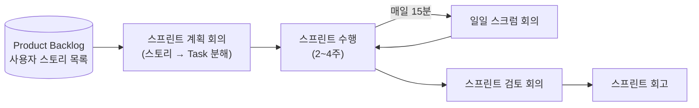

| 프로세스 | 내용 |
|---|---|
| **스프린트 계획 회의**<br>(Sprint Planning Meeting) | 제품 백로그에서 이번 스프린트에 처리할 작업을 골라 **단기 일정을 수립**하는 회의 |
| **스프린트**<br>(Sprint) | 실제 개발이 이뤄지는 구간. 보통 **2~4주** 안에서 잡음. |
| **일일 스크럼 회의**<br>(Daily Scrum Meeting) | 팀원 전원이 매일 정해진 시각에 **약 15분**간 진행 상황을 점검하는 회의.<br>남은 작업 시간은 **소멸 차트(Burn-down Chart)** 로 표시. |
| **스프린트 검토 회의**<br>(Sprint Review) | 부분 또는 전체 완성 제품이 요구사항에 맞는지 **테스팅**하는 회의 |
| **스프린트 회고**<br>(Sprint Retrospective) | 정해 둔 **규칙을 지켰는지, 개선할 점은 무엇인지**를 확인하고 기록하는 활동 |

> **제품 백로그(Product Backlog)** : 필요한 모든 요구사항(User Story)을 우선순위순으로 나열한 목록.
> 개발 도중 새 요구사항이 나오면 계속 갱신됨. 여기 작성된 사용자 스토리는
> 전체 일정 계획인 **릴리즈 계획(Release Plan)** 을 세울 때 근거가 됨.
>
> **소멸 차트(Burn-down Chart)** : 시간이 갈수록 남은 작업 시간이 줄어드는(Burn-down) 모습을 그린 그래프

> 📌 암기: **"계획하여 진행(스프린트)한 후 회의와 검토를 거쳐 회고한다."**

---

## (3) XP(eXtreme Programming) 기법

### XP 개요

시도 때도 없이 바뀌는 고객 요구에 유연하게 맞서기 위해, **고객의 참여**와 **개발 과정의 반복**을
극단까지 밀어붙여 생산성을 높이는 방법.

- **짧고 반복적인 개발 주기**, **단순한 설계**, **고객의 적극적인 참여**로 빠르게 개발하는 것이 목적.
- 릴리즈 주기를 짧게 가져가 요구사항이 반영되는 모습을 고객이 눈으로 확인하게 함(**가시성**).

**XP의 5대 핵심 가치** ★

1. **의사소통**(Communication)
2. **단순성**(Simplicity)
3. **용기**(Courage)
4. **존중**(Respect)
5. **피드백**(Feedback)

### XP 개발 프로세스


| 프로세스 | 내용 |
|---|---|
| **릴리즈 계획 수립**<br>(Release Planning) | - 부분 또는 전체 개발이 끝나는 시점의 일정을 수립하는 단계<br>- 스토리 몇 개가 반영되어 기능이 일부 완성된 제품을 내보내는 것을 릴리즈라고 함. |
| **이터레이션**<br>(Iteration, 주기) | 실제 개발이 이뤄지는 구간. 보통 **1~3주**로 잡음. |
| **승인 검사**<br>(Acceptance Test, 인수 테스트) | 한 이터레이션 안에서 부분 완료 제품이 나오면 수행하는 테스트 |
| **소규모 릴리즈**<br>(Small Release) | 요구 변화에 민첩하게 대응하려고 릴리즈 단위를 잘게 쪼갠 것 |

> 📌 암기: **"계획하고 진행(이터레이션)한 후 검사하고 출시(릴리즈)한다."**
> 스크럼은 **2~4주**, XP는 **1~3주**. 주기 길이를 바꿔 내는 문제가 나옴.

### XP의 주요 실천 방법(Practice) ★

| 실천 방법 | 내용 |
|---|---|
| **Pair Programming**<br>(짝 프로그래밍) | 둘이 함께 프로그래밍해서 개발에 대한 책임을 **공동으로** 나눠 갖는 환경을 조성. |
| **Collective Ownership**<br>(공동 코드 소유) | 코드에 대한 **권한과 책임을 팀이 공동으로 소유**. |
| **Test-Driven Development**<br>(테스트 주도 개발) | - 실제 코드를 짜기 **전에 테스트 케이스를 먼저 작성**하므로 개발자가 자신이 무엇을 해야 하는지 정확히 파악하게 됨.<br>- 테스트가 끊이지 않고 돌아가도록 **자동화된 테스팅 도구(구조, 프레임워크)** 를 사용. |
| **Whole Team**<br>(전체 팀) | 개발에 참여하는 모든 구성원이 **고객을 포함해** 각자의 역할과 그에 따른 책임을 가짐. |
| **Continuous Integration**<br>(계속적인 통합) | 모듈 단위로 나눠 개발한 코드를 작업이 하나 끝날 때마다 **지속적으로 통합**. |
| **Refactoring**<br>(리팩토링) | - 프로그램의 **기능은 그대로 둔 채** 시스템 내부를 재구성.<br>- 목적은 이해하기 쉽고 고치기 쉬운 상태로 만들어 개발 속도를 유지하는 것. |
| **Small Release**<br>(소규모 릴리즈) | 릴리즈 간격을 짧게 반복해 고객의 요구 변화에 **신속히 대응**. |

> ⚠️ **영문 명칭까지 함께 외워야 .** 다만 의미는 서로 구분할 수 있을 정도면 충분함.

---

## (4) 현행 시스템 파악

새 시스템을 설계하기 전에 지금 돌아가고 있는 시스템이 어떤 모습인지부터 확인.
파악 순서는 **업무 → 아키텍처/소프트웨어 → 하드웨어/네트워크**로, 위쪽(논리)에서 아래쪽(물리)으로 내려감.

| 단계 | 파악 대상 | 내용 |
|---|---|---|
| **1단계** | 시스템 **구성** 파악 | 조직의 주요 업무를 담당하는 **기간 업무**와 이를 뒷받침하는 **지원 업무**로 나눠 기술. |
| | 시스템 **기능** 파악 | 현재 제공 중인 기능을 **주요 기능 / 하부 기능 / 세부 기능**으로 구분해 **계층형**으로 표시. |
| | 시스템 **인터페이스** 파악 | 단위 업무 시스템끼리 주고받는 데이터의 **종류, 형식, 프로토콜, 연계 유형, 주기**를 명시. |
| **2단계** | **아키텍처** 구성 파악 | **최상위 수준**에서 계층별로 표현한 아키텍처 구성도를 작성. |
| | **소프트웨어** 구성 파악 | 사용 중인 소프트웨어의 **제품명, 용도, 라이선스 적용 방식, 라이선스 수**를 명시. |
| **3단계** | **하드웨어** 구성 파악 | 단위 업무 시스템이 운용되는 서버의 **주요 사양과 수량, 이중화 적용 여부**를 명시. |
| | **네트워크** 구성 파악 | 서버의 위치와 서버 간 네트워크 **연결 방식**을 네트워크 구성도로 작성. |

---

## (5) 개발 기술 환경 파악

개발할 소프트웨어와 맞물릴 **운영체제(OS), DBMS, 미들웨어**를 고를 때 무엇을 따져야 하는지 정리하고,
**오픈 소스**를 쓸 경우의 주의점을 함께 제시하는 단계.

### 요구사항 식별 시 고려사항 비교표 ★

네 항목 모두 **가용성·성능·기술 지원·구축 비용**을 공통으로 봄.
시험은 **각 대상에만 붙는 항목**을 물음.

| 대상 | 고려사항 | 이것만 다름 |
|---|---|---|
| **운영체제(OS)** | 가용성 · 성능 · 기술 지원 · **주변 기기** · 구축 비용 | **주변 기기** |
| **DBMS** | 가용성 · 성능 · 기술 지원 · **상호 호환성** · 구축 비용 | **상호 호환성** |
| **WAS** | 가용성 · 성능 · 기술 지원 · 구축 비용 | 추가 항목 없음 |
| **오픈 소스** | **라이선스의 종류** · **사용자 수** · **기술의 지속 가능성** | 항목 자체가 별개 |

### 각 항목 정의

- **운영체제(OS)** : 컴퓨터 시스템의 자원을 효율적으로 관리하고, 사용자가 컴퓨터를 편리하게 쓸 수 있는
  환경을 제공하는 소프트웨어. 사용자와 하드웨어 사이의 **인터페이스**로 동작하는 시스템 소프트웨어.
- **DBMS** : 사용자와 데이터베이스 사이에서 요구에 맞는 정보를 만들어 주고 데이터베이스를 관리해 주는
  소프트웨어. 파일 시스템이 안고 있던 **데이터 종속성·중복성** 문제를 풀기 위해 제안됨.
- **WAS(Web Application Server)** : 요청에 따라 내용이 달라지는 **동적인 콘텐츠**를 처리하는 **미들웨어**.
  데이터 접근, 세션 관리, 트랜잭션 관리 라이브러리를 제공하며 주로 DB 서버와 연동.
- **오픈 소스** : 누구나 제한 없이 쓸 수 있도록 **소스 코드를 공개**한 소프트웨어. 오픈 소스 라이선스를 만족.

---

## (6) 요구사항 정의

### 요구사항

소프트웨어가 어떤 문제를 풀기 위해 제공하는 **서비스에 대한 설명**, 그리고 그것이 정상적으로
운영되는 데 필요한 **제약 조건**을 함께 가리킴.

- 개발과 유지보수 과정에서 판단의 **기준과 근거**가 됨.
- 이해관계자들 사이의 **의사소통**을 원활하게 해 줌.

### 요구사항의 유형 ★

두 축으로 나뉨. **무엇을 하느냐(기능/비기능)** 와 **누구의 시선이냐(사용자/시스템)**.

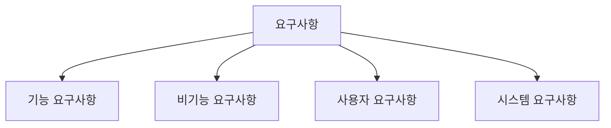

#### 기능 요구사항(Functional Requirements)

시스템이 **무엇을 하는지**에 관한 요구사항.

- 시스템의 **입력과 출력**으로 무엇이 오가야 하는지
- 어떤 **데이터를 저장하거나 어떤 연산**을 수행해야 하는지
- 시스템이 반드시 수행해야 하는 기능, 사용자가 제공받길 원하는 기능

#### 비기능 요구사항(Non-functional Requirements)

**품질이나 제약사항**에 관한 요구사항.

- 시스템 장비 구성, 성능, 인터페이스, 데이터 구축, 테스트, 보안 요구사항
- **품질 요구사항** : 가용성 · 정합성 · 상호 호환성 · 대응성 · 이식성 · 확장성 · 보안성
- 제약사항, 프로젝트 관리 요구사항, 프로젝트 자원 요구사항

> **구분 요령** ★ — "무엇을 할 수 있다"면 기능, "얼마나 잘 해야 한다"면 비기능.
> - **기능 요구사항** : "사용자는 회원ID와 비밀번호를 입력해 로그인할 수 있다." → *(기능)*
> - **비기능 요구사항** : "시스템은 1년 365일, 하루 24시간 운용이 가능해야 한다." → *(품질/제약사항)*

#### 사용자 요구사항 vs 시스템 요구사항

| 구분 | 사용자 요구사항 | 시스템 요구사항 |
|---|---|---|
| 관점 | **사용자 관점** | **개발자 관점** |
| 내용 | 시스템이 제공해야 할 요구사항 | 시스템 전체가 사용자와 다른 시스템에 제공해야 할 요구사항 |
| 표현 | 친숙한 표현으로 **이해하기 쉽게** 작성 | 전문적이고 **기술적인 용어**로 표현 |
| 별칭 | – | **소프트웨어 요구사항** |

---

## (7) 요구사항 개발 프로세스

개발 대상의 요구사항을 체계적으로 **도출**하고 **분석**한 뒤 명세서로 정리하고,
마지막에 **확인 및 검증**하는 구조화된 활동.

- 프로세스를 시작하기 전에 **타당성 조사(Feasibility Study)** 가 선행되어야 함.
- 요구사항 개발은 **요구공학(Requirement Engineering)** 을 이루는 한 요소.

### 프로세스 흐름

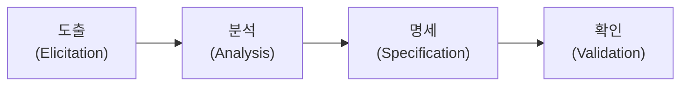

> 📌 암기: **"도분명확"** (도출 → 분석 → 명세 → 확인)

### ① 요구사항 도출(Elicitation, 요구사항 수집)

시스템·사용자·개발자 등 관계자들이 의견을 주고받으며 요구사항을
**어떻게 수집할지 식별하고 이해**하는 과정.

- 이 단계에서 개발자와 고객의 관계가 만들어지고 **이해관계자(Stakeholder)가 식별**됨.
- 소프트웨어 개발 생명 주기(SDLC) 내내 **지속적으로 반복**됨.

**주요 기법** ★

- 청취와 인터뷰
- 설문
- **브레인스토밍(Brain Storming)** : 3인 이상이 자유롭게 의견을 주고받으며 독창적인 아이디어를 도출해 내는 방법
- 워크샵
- **프로토타이핑(Prototyping)** : 견본품을 이용해 요구 분석을 효과적으로 수행하고 명세서를 산출하는 작업.
  가장 단순한 형태는 종이에 대략적인 순서나 화면 형태를 그려 보여 주는 것.
- **유스케이스(Use Case)** : 사용자의 요구사항을 **기능 단위**로 표현하는 것

### ② 요구사항 분석(Analysis)

요구사항 가운데 **불명확하거나 모호해 이해되지 않는 부분을 발견하고 걸러 내는** 과정.

- 요구사항의 **타당성**을 조사하고 비용·일정에 대한 제약을 설정.
- 서로 **상충되는 요구사항이 있으면 중재**.
- 대표적인 도구는 **자료 흐름도(DFD)** 와 **자료 사전(DD)**.

### ③ 요구사항 명세(Specification)

분석 결과를 바탕으로 **모델을 작성하고 문서화**하는 단계.

- **기능** 요구사항은 **빠짐없이** 기술.
- **비기능** 요구사항은 **필요한 것만** 기술.
- 더 구체적으로 적어야 할 때는 **소단위 명세서(Mini-Spec)** 를 사용.

### ④ 요구사항 확인(Validation, 요구사항 검증)

개발 자원을 요구사항에 배정하기 전에, 명세서가 **정확하고 완전하게** 작성됐는지 검토하는 활동.

- **이해관계자들**이 직접 검토해야 함.
- 요구사항 관리 도구로 요구사항 정의 문서에 대한 **형상 관리(SCM)** 를 수행.

### 요구공학(Requirement Engineering)

무엇을 개발해야 하는지를 **정의하고 분석 및 관리**하는 프로세스를 연구하는 학문.
요구사항 변경의 원인과 처리 방법을 이해하고 관리 프로세스의 품질을 높여
**소프트웨어 프로젝트의 실패를 최소화**하는 것이 목표.

### 요구사항 명세 기법 ★

| 구분 | **정형 명세 기법** | **비정형 명세 기법** |
|---|---|---|
| **기법** | 수학적 원리 기반, 모델 기반 | 상태/기능/객체 중심 |
| **작성 방법** | **수학적 기호**와 정형화된 표기법 | 명사·동사 등 **자연어** 서술 또는 다이어그램 |
| **특징** | - 요구사항을 **정확하고 간결**하게 표현<br>- 작성자가 달라도 **일관성**이 유지되어 **완전성 검증이 가능**<br>- 표기법이 어려워 **사용자가 이해하기 어려움** | - 자연어라 작성자에 따라 결과가 달라져 **일관성이 떨어지고 해석이 갈릴 수 있음**<br>- 대신 **이해가 쉬워 의사소통이 용이**함 |
| **종류** | **VDM, Z, Petri-net, CSP** | **FSM, Decision Table, ER 모델링, State Chart(SADT)** |

---

## (8) 요구사항 분석

### 요구사항 분석(Requirement Analysis)

소프트웨어 개발의 **실제적인 첫 단계**로, 사용자의 요구를 이해하고 **문서화(명세화)** 하는 활동.

- 사용자 요구의 **타당성**을 조사하고 비용·일정의 제약을 설정.
- 사용자의 요구를 정확히 추출해 목표를 확정.

### 구조적 분석 기법

**자료의 흐름과 처리**를 중심에 놓는 요구사항 분석 방법.

- **도형 중심**의 분석용 도구와 절차로 요구사항을 파악하고 문서화.
- **하향식** 방법으로 시스템을 세분화할 수 있음.
- 분석의 **중복을 배제**할 수 있음.

**주요 도구** ★ — 자료 흐름도(DFD) · 자료 사전(DD) · 소단위 명세서(Mini-Spec.) ·
개체 관계도(ERD) · 상태 전이도(STD) · 제어 명세서

### 자료 흐름도(DFD; Data Flow Diagram)

자료가 **어떻게 흘러가고 어떻게 변환되며 어떤 기능을 거치는지**를 **도형 중심**으로 기술하는 방법.

- **자료 흐름 그래프**, **버블 차트**라고도 함.
- 자료 흐름과 처리를 중심으로 하는 **구조적 분석 기법**에 이용됨.

#### 자료 흐름도 기본 기호 ★★

기호는 4가지뿐이고, 표기법은 **Yourdon/DeMarco** 와 **Gane/Sarson** 두 갈래가 있음.

| 기호 | 의미 | **Yourdon / DeMarco** | **Gane / Sarson** |
|---|---|---|---|
| **프로세스**<br>(Process) | 자료를 변환시키는 시스템의 한 부분(처리 과정).<br>**처리, 기능, 변환, 버블**이라고도 함. | **원(타원)** 안에 처리명 기입<br>`( 대출 확인 )` | **모서리가 둥근 사각형** 안에 처리명 기입<br>`▢ 대출 확인 ▢` |
| **자료 흐름**<br>(Data Flow) | 자료의 **이동(흐름)이나 연관관계**를 나타냄. | **화살표** 위에 자료명 기입<br>`──도서 코드──▶` | *(동일)* |
| **자료 저장소**<br>(Data Store) | 시스템 안의 자료 저장소(**파일, 데이터베이스**)를 나타냄. | **위·아래 두 개의 평행선** 사이에 저장소명 기입<br>`═ 도서대장 ═` | **오른쪽이 열린 사각형** + 왼쪽에 **ID 칸**<br>`[ID│ 도서대장` |
| **단말**<br>(Terminator) | 시스템과 교신하는 **외부 개체**.<br>입력 데이터를 만들고 출력 데이터를 받음. | **사각형** 안에 외부 개체명 기입<br>`[ 출판사 ]` | **그림자가 있는(겹쳐진) 사각형** |

> ⚠️ **기본 기호 4가지**는 단답형으로 출제될 수 있음. **종류와 명칭을 영문까지** 암기할 것.
> ⚠️ 실무·시험 모두 **Yourdon / DeMarco 표기법**이 주로 사용됨.

### 자료 사전(DD; Data Dictionary)

자료 흐름도에 등장하는 **자료를 더 자세히 정의하고 기록**한 것.
데이터를 설명하는 데이터이므로 **메타 데이터(Meta Data)** 라고도 함.

#### 자료 사전 표기 기호 ★★

| 기호 | 의미 |
|:---:|---|
| `=` | **자료의 정의** : ~로 구성되어 있다. (is composed of) |
| `+` | **자료의 연결** : 그리고 (and) |
| `( )` | **자료의 생략** : 생략 가능한 자료 (Optional) |
| `[ ]` | **자료의 선택** : 또는 (or) |
| `{ }` | **자료의 반복** : Iteration of<br>① `{ }ₙ` : **n번 이상** 반복<br>② `{ }ⁿ` : **최대 n번** 반복<br>③ `{ }ⁿₘ` : **m 이상 n 이하**로 반복 |
| `* *` | **자료의 설명** : 주석 (Comment) |

---

## (9) 요구사항 분석 CASE와 HIPO

### 요구사항 분석용 CASE(자동화 도구)

요구사항을 자동으로 분석하고 요구사항 분석 명세서를 기술하도록 개발된 도구.
**누가 만들었는지**와 **무엇에 특화됐는지**를 짝지어 외우면 헷갈리지 않음.

| 도구 | 개발 주체 | 설명 |
|---|---|---|
| **SADT** | **SoftTech 사** | - 시스템 정의, 소프트웨어 요구사항 분석, 시스템/소프트웨어 설계를 위한 도구<br>- 구조적 요구 분석을 위해 **블록 다이어그램**을 채택한 자동화 도구 |
| **SREM<br>(= RSL / REVS)** | **TRW 사** | - **실시간 처리** 소프트웨어 시스템의 요구사항을 명확히 기술하도록 개발한 도구<br>- **RSL** : 요소, 속성, 관계, 구조를 기술하는 **요구사항 기술 언어**<br>- **REVS** : RSL로 기술된 요구사항을 자동 분석해 명세서를 출력하는 **요구사항 분석기** |
| **PSL / PSA** | **미시간 대학** | - **PSL** : 문제(요구사항) **기술 언어**<br>- **PSA** : PSL로 기술한 요구사항을 분석해 보고서를 출력하는 **문제 분석기** |
| **TAGS** | – | - 시스템 공학 방법 응용에 대한 **자동 접근 방법**<br>- 개발 주기의 **전 과정**에 이용할 수 있는 **통합 자동화 도구** |

> 💡 **언어 + 분석기 쌍**이 두 개 나옴. **RSL↔REVS**, **PSL↔PSA**. 앞이 언어, 뒤가 분석기.

### HIPO(Hierarchy Input Process Output)

시스템의 분석·설계·문서화에 사용되는 기법으로, 시스템 실행 과정인 **입력 · 처리 · 출력**을 표현한 것.

- **하향식** 소프트웨어 개발을 위한 **문서화 도구**.
- **기능과 자료의 의존 관계**를 동시에 표현할 수 있음.
- 기호와 도표를 사용하므로 보기 쉽고 이해하기도 쉬움.
- **HIPO Chart** : 시스템 기능을 여러 **고유 모듈로 분할**하고 그 사이의 **인터페이스를 계층 구조**로 표현한 것

**종류** ★

1. **가시적 도표**(Visual Table of Contents, 도식 목차)
2. **총체적 도표**(Overview Diagram, 총괄 도표, 개요 도표)
3. **세부적 도표**(Detail Diagram, 상세 도표)

---

## (10) UML(Unified Modeling Language)의 개요

### UML

시스템 분석·설계·구현 과정에서 개발자와 고객, 또는 개발자끼리의 **의사소통이 원활하게** 이뤄지도록
**표준화**한 대표적인 **객체지향 모델링 언어**.

- **Rumbaugh(OMT), Booch, Jacobson** 의 객체지향 방법론에서 장점을 뽑아 통합.
- **OMG(Object Management Group)** 가 표준으로 지정.

### UML의 구성 요소 ★

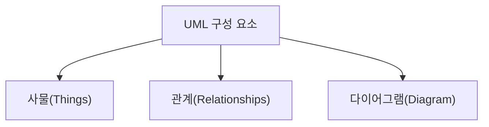

### 사물(Things)

다이어그램 안에서 **관계가 형성될 수 있는 대상들**이며, 모델을 구성하는 가장 중요한 **기본 요소**.

| 종류 | 설명 | 예 |
|---|---|---|
| **구조 사물**<br>(Structured Things) | 시스템의 **개념적, 물리적 요소**를 표현 | 클래스(Class), 유스케이스(Use Case), 컴포넌트(Component), 노드(Node) |
| **행동 사물**<br>(Behavioral Things) | **시간과 공간**에 따른 요소들의 **행위**를 표현 | 상호작용(Interaction), 상태 머신(State Machine) |
| **그룹 사물**<br>(Grouping Things) | 요소들을 **그룹으로 묶어서** 표현 | 패키지(Package) |
| **주해 사물**<br>(Annotation Things) | **부가적인 설명이나 제약조건**을 표현 | 노트(Note) |

---

## (11) UML — 관계(Relationship)

**관계(Relationships)** 는 사물과 사물 사이의 **연관성**을 표현. 종류는 여섯 가지.

> 📌 **연관 / 집합 / 포함 / 일반화 / 의존 / 실체화**
> 표기법은 **선(실선·점선)** 과 **끝 모양(화살표·마름모·삼각형)** 의 조합으로 결정됨.
> 이 두 축만 잡으면 6개가 한 번에 정리됨.

### ① 연관(Association) 관계

- **둘 이상의 사물이 서로 관련**되어 있는 관계
- 사물 사이를 **실선**으로 연결하여 표현.
- **방향성은 화살표**로 표현.
- **양방향** 관계이면 화살표를 생략하고 실선으로만 연결.
- 선 위에 **다중도**를 표기. (다중도 = 연관에 참여하는 객체의 개수)

**다중도 표기법** ★

| 다중도 | 의미 |
|:---:|---|
| `1` | 1개의 객체가 연관되어 있음 |
| `n` | n개의 객체가 연관되어 있음 |
| `0..1` | 연관된 객체가 **없거나 1개만** 존재함 |
| `0..*` 또는 `*` | 연관된 객체가 **없거나 다수**일 수 있음 |
| `1..*` | 연관된 객체가 **적어도 1개 이상**임 |
| `n..*` | 연관된 객체가 **적어도 n개 이상**임 |
| `n..m` | 연관된 객체가 **최소 n개에서 최대 m개**임 |

**예제 1 — 단방향 연관**

> 회원은 자신이 발급받은 대출카드를 알고 있지만, 대출카드는 자기 주인이 누구인지 모름.

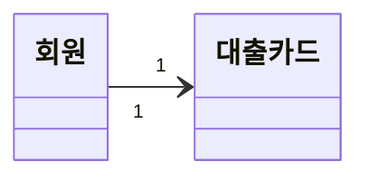

**해설**
- '회원' 쪽 다중도가 `1` → 대출카드는 **한 회원에게만** 발급됨.
- '대출카드' 쪽 다중도가 `1` → 회원은 **카드를 하나만** 가짐.

**예제 2 — 다대다 연관**

> 사서는 여러 회원의 업무를 처리하고, 회원도 여러 사서를 통해 도서를 빌림.

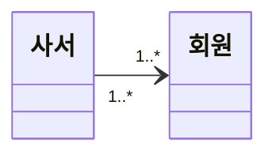

**해설**
- '사서' 쪽 다중도가 `1..*` → 회원은 **한 명 이상의 사서**를 상대.
- '회원' 쪽 다중도가 `1..*` → 사서는 **한 명 이상의 회원**을 담당.

> 💡 사물(객체)은 유스케이스·클래스·컴포넌트처럼 **고유한 표현 형태가 정해진 경우를 제외하면**
> 기본적으로 **사각형**으로 표현.

### ② 집합(Aggregation) 관계

- 한 사물이 다른 사물에 **포함**되어 있는 관계
- 포함하는 쪽(**전체, Whole**)과 포함되는 쪽(**부분, Part**)이 서로 **독립적**.
- 부분 → 전체 방향으로 **속이 빈 마름모(◇)** 를 연결하여 표현.

**예제**

> 도서는 특정 서가에 꽂혀 있지만, 다른 서가로 옮겨 꽂아도 도서 자체는 그대로 남음.

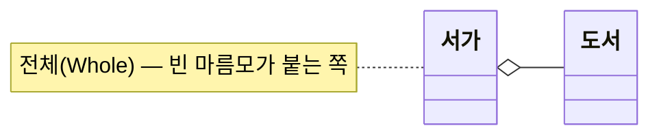
*(빈 마름모 ◇ 가 '서가'(전체) 쪽에 붙음)*

### ③ 포함(Composition) 관계

- **집합 관계의 특수한 형태**로, 포함하는 쪽의 변화가 포함되는 쪽에 **영향을 미치는** 관계
- 전체와 부분이 서로 **독립될 수 없고 생명주기를 함께함.**
- 부분 → 전체 방향으로 **속이 채워진 마름모(◆)** 를 연결하여 표현.

**예제**

> 바코드 라벨은 특정 도서 한 권에만 붙음. 그 도서가 폐기되면 라벨도 함께 의미를 잃음.

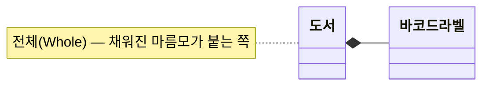
*(채워진 마름모 ◆ 가 '도서'(전체) 쪽에 붙음)*

> 💡 **집합 vs 포함** — 부분을 떼어내도 살아남으면 집합(◇), 함께 사라지면 포함(◆).

### ④ 일반화(Generalization) 관계

- 한 사물이 다른 사물보다 더 **일반적**이거나 더 **구체적**인 관계
- 일반적인 쪽이 **상위(부모)**, 구체적인 쪽이 **하위(자식)**
- 구체적(하위) → 일반적(상위) 방향으로 **속이 빈 삼각 화살표(△)** 를 연결하여 표현.

**예제**

> 도서와 정기간행물은 모두 도서관이 보유한 자료.

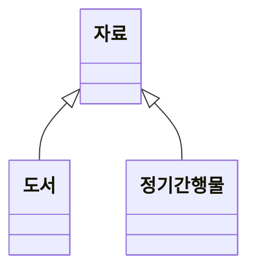

### ⑤ 의존(Dependency) 관계

- 연관 관계처럼 서로 관련은 있으나, 필요에 의해 **짧은 시간 동안만 연관을 유지**하는 관계
- **소유 관계는 아니지만** 한쪽의 변화가 다른 쪽에 영향을 미치는 관계
- 영향을 주는 쪽(**이용자**) → 영향을 받는 쪽(**제공자**)으로 **점선 화살표**를 연결하여 표현.

**예제**

> 연체일수가 늘어나면 연체료가 올라가고, 연체일수가 0이면 연체료도 발생하지 않음.

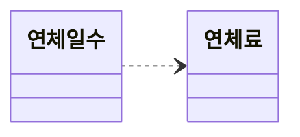

### ⑥ 실체화(Realization) 관계

- 사물이 **할 수 있거나 해야 하는 기능**을 기준으로 서로를 **그룹화**할 수 있는 관계
- 사물 → 기능 방향으로 **속이 빈 삼각 화살표가 달린 점선**을 연결하여 표현.

**예제**

> 도서도 대출할 수 있고 DVD도 대출할 수 있음. 둘은 '대출할 수 있다'는 행위로 묶임.

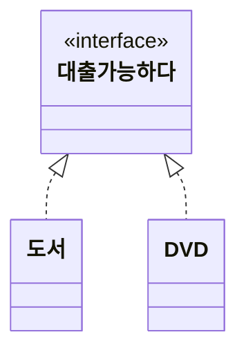

### 📌 관계 표기법 요약 (암기표)

| 관계 | 선 | 끝 모양 | 방향 |
|---|---|---|---|
| 연관(Association) | 실선 | 화살표(또는 없음) | 아는 쪽 → 알려지는 쪽 |
| 집합(Aggregation) | 실선 | **속이 빈 마름모 ◇** | 부분 → **전체** |
| 포함(Composition) | 실선 | **속이 찬 마름모 ◆** | 부분 → **전체** |
| 일반화(Generalization) | 실선 | **속이 빈 삼각 화살표 △** | 하위(자식) → **상위(부모)** |
| 의존(Dependency) | **점선** | 화살표 | 이용자 → 제공자 |
| 실체화(Realization) | **점선** | **속이 빈 삼각 화살표 △** | 사물 → 기능 |

> 💡 **점선은 둘뿐임** — 의존(화살표)과 실체화(빈 삼각형).
> **마름모도 둘뿐임** — 집합(빈 것)과 포함(찬 것).

---

## (12) UML — 다이어그램

### 다이어그램(Diagram)

사물과 관계를 **도형**으로 표현한 것.
여러 관점에서 시스템을 가시화한 **뷰(View)** 를 제공해 의사소통에 도움을 줌.

- **정적 모델링** → 주로 **구조적 다이어그램** 사용
- **동적 모델링** → 주로 **행위 다이어그램** 사용

### 구조적(Structural) 다이어그램 — 6종 ★

| 종류 | 내용 |
|---|---|
| **클래스 다이어그램**<br>(Class Diagram) | 클래스와 클래스가 가지는 속성, 클래스 사이의 관계를 표현. |
| **객체 다이어그램**<br>(Object Diagram) | - 클래스에 속한 사물, 즉 **인스턴스**를 **특정 시점의** 객체와 객체 사이 관계로 표현.<br>- **럼바우(Rumbaugh)** 분석 기법의 **객체 모델링**에 활용됨. |
| **컴포넌트 다이어그램**<br>(Component Diagram) | - 실제 **구현 모듈**인 컴포넌트 사이의 관계나 인터페이스를 표현.<br>- **구현 단계**에서 사용됨. |
| **배치 다이어그램**<br>(Deployment Diagram) | - 결과물, 프로세스, 컴포넌트 등 **물리적 요소의 위치**를 표현.<br>- **구현 단계**에서 사용됨. |
| **복합체 구조 다이어그램**<br>(Composite Structure Diagram) | 클래스나 컴포넌트가 **복합 구조**를 가질 때 그 **내부 구조**를 표현. |
| **패키지 다이어그램**<br>(Package Diagram) | 유스케이스나 클래스 등의 모델 요소를 **그룹화한 패키지들의 관계**를 표현. |

### 행위(Behavioral) 다이어그램 — 7종 ★

| 종류 | 내용 |
|---|---|
| **유스케이스 다이어그램**<br>(Use Case Diagram) | - 사용자의 요구를 분석하는 것으로 **기능 모델링**에 사용.<br>- **사용자(Actor)** 와 **사용 사례(Use Case)** 로 구성됨. |
| **시퀀스 다이어그램**<br>(Sequence Diagram) | 상호작용하는 시스템이나 객체가 주고받는 **메시지**를 표현. |
| **커뮤니케이션 다이어그램**<br>(Communication Diagram) | 동작에 참여하는 객체가 주고받는 **메시지와 객체 간 연관 관계**를 표현. |
| **상태 다이어그램**<br>(State Diagram) | - 객체가 자신이 속한 클래스의 **상태 변화** 또는 다른 객체와의 상호작용에 따라 어떻게 변하는지 표현.<br>- **럼바우(Rumbaugh)** 분석 기법의 **동적 모델링**에 활용됨. |
| **활동 다이어그램**<br>(Activity Diagram) | 객체의 **처리 로직이나 조건에 따른 처리 흐름을 순서대로** 표현. |
| **상호작용 개요 다이어그램**<br>(Interaction Overview Diagram) | 상호작용 다이어그램 사이의 **제어 흐름**을 표현. |
| **타이밍 다이어그램**<br>(Timing Diagram) | 객체의 상태 변화와 **시간 제약**을 명시적으로 표현. |

> 💡 **럼바우 두 개만 따로 챙길 것** — 객체 모델링은 **객체** 다이어그램, 동적 모델링은 **상태** 다이어그램.

### 스테레오 타입(Stereotype)

UML이 기본으로 제공하는 기능 **외에 추가적인 기능**을 표현하는 장치.
**길러멧(Guillemet)** 이라 부르는 **겹화살괄호 《 》** 사이에 표현할 형태를 기술.

| 표기 | 의미 |
|---|---|
| `《include》` | 연결된 다른 UML 요소와 **포함 관계**인 경우 |
| `《extend》` | 연결된 다른 UML 요소와 **확장 관계**인 경우 |
| `《interface》` | **인터페이스**를 정의하는 경우 |
| `《exception》` | **예외**를 정의하는 경우 |
| `《constructor》` | **생성자** 역할을 수행하는 경우 |

---

## (13) 유스케이스(Use Case) 다이어그램

### 기능 모델링

사용자의 요구사항을 분석해 시스템이 갖춰야 할 **기능을 정리**한 뒤,
그 내용을 사용자와 공유하기 위해 **그림으로 표현**하는 것.

- 개발할 시스템의 전반적인 형태를 **기능에 초점**을 맞춰 표현.
- **종류** : 유스케이스(Use Case) 다이어그램, 액티비티(Activity) 다이어그램

### 유스케이스 다이어그램

사용자와 외부 시스템이 개발 대상 시스템으로 무엇을 할 수 있는지를 **사용자 관점**에서 표현한 것.

- **외부 요소와 시스템 사이의 상호작용**을 확인할 수 있음.
- 사용자의 **요구사항을 분석**하기 위한 도구로 사용됨.
- **시스템의 범위**를 파악할 수 있음.

### 예제 : `<도서관 대출>` 시스템

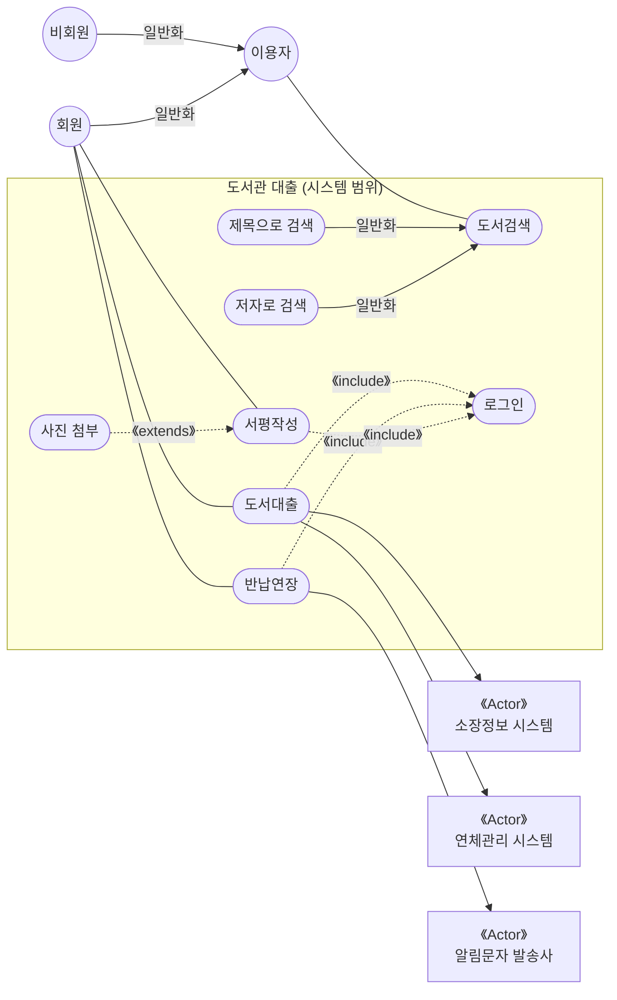

**해설** ★

1. 이용자는 **회원과 비회원으로 구분**됨. *(일반화 관계)*
2. 회원은 **도서검색, 도서대출, 반납연장, 서평작성** 기능을 사용할 수 있음.
3. 비회원은 **도서검색 기능만** 사용할 수 있음.
4. 이용자는 **제목이나 저자로** 도서를 검색할 수 있음. *(일반화 관계)*
5. 도서대출·반납연장·서평작성을 하려면 **반드시 로그인을 수행**해야 . → `《include》`
6. 서평작성 시 **필요한 경우** 사진을 첨부할 수 있음. → `《extends》`
7. 도서대출을 완료하려면 **소장정보 시스템**에서 보유 여부를 확인해야 . *(부액터)*
8. 도서대출을 완료하려면 **연체관리 시스템**에서 연체 여부를 확인받아야 . *(부액터)*
9. 반납연장 결과는 **알림문자 발송사**를 통해 회원에게 전달됨. *(부액터)*

> 💡 **include vs extend** — 반드시 거쳐야 하면 `《include》`, 조건이 맞을 때만 붙으면 `《extends》`.

### 유스케이스 다이어그램의 구성 요소

| 구성 요소 | 표현 방법 | 내용 |
|---|---|---|
| **시스템(System) /<br>시스템 범위(System Scope)** | **큰 사각형** 상단에 시스템명 표기 | 시스템 내부의 유스케이스들을 **사각형으로 묶어** 범위를 표현한 것 |
| **액터(Actor)** | 주액터: **막대 인간(사람 모양)**<br>부액터: **《Actor》 표기한 사각형** | - 시스템과 **상호작용**하는 모든 **외부 요소**로, 주로 사람이나 외부 시스템을 의미.<br>- **주액터** : 시스템을 사용함으로써 **이득을 얻는 대상**. 주로 **사람**이 해당됨.<br>- **부액터** : 주액터의 목적 달성을 위해 시스템에 **서비스를 제공하는 외부 시스템**. 조직이나 기관도 해당될 수 있음. |
| **유스케이스(Use Case)** | **타원** 안에 기능명 표기<br>`( 도서검색 )` | 사용자가 보는 관점에서 시스템이 액터에게 제공하는 **서비스나 기능**을 표현한 것 |
| **관계(Relationship)** | 포함: `- -《include》- ▶`<br>확장: `◀ - -《extends》- -`<br>일반화: `◀────` (속이 빈 삼각 화살표) | - **액터↔유스케이스**, **유스케이스↔유스케이스** 사이에 나타날 수 있음.<br>- 종류 : **포함(Include)**, **확장(Extend)**, **일반화(Generalization)** |

> **포함(Include) 관계** : 둘 이상의 유스케이스에 **공통으로 적용되는 기능을 별도로 분리**해
> 새로운 유스케이스로 만든 경우, 원래 유스케이스와 분리된 유스케이스 사이의 관계
>
> **확장(Extend) 관계** : 유스케이스가 **특정 조건에 부합되어 기능이 확장**될 때,
> 원래 유스케이스와 확장된 유스케이스 사이의 관계

---

## (14) 활동(Activity) 다이어그램

### 개요

**사용자 관점**에서 시스템이 수행하는 기능을 **처리 흐름에 따라 순서대로** 표현한 것.

- 유스케이스 하나 안에서, 또는 유스케이스 사이에서 발생하는 **복잡한 처리 흐름**을 명확하게 표현할 수 있음.
- **자료 흐름도(DFD)와 유사함.**

### 예제 : 회원의 도서 대출 처리

세로 **스윔레인 3개** — `연체관리` | `회원` | `소장정보`

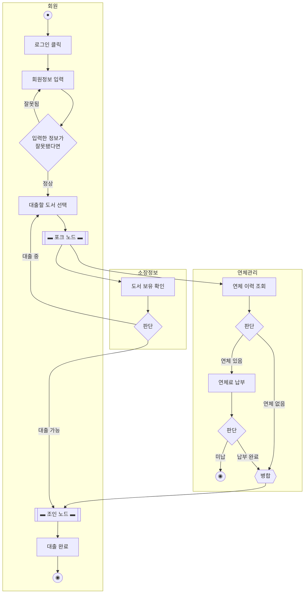

**해설**

**`<회원>`**
1. 도서를 빌리기 위해 **로그인 단추를 클릭**한 후 **회원 정보를 입력**.
2. 정보가 잘못됐으면 **다시 입력**받고, 정상이면 **'대출할 도서 선택'** 으로 이동.
3. 도서를 선택하면 흐름이 **'연체 이력 조회'와 '도서 보유 확인'으로 분할(포크)** 되어 진행됨.
4. 대출을 완료하고 액티비티를 종료.

**`<연체관리>`**
1. 회원의 **연체 이력을 조회**.
2. 연체가 없으면 곧바로, 있으면 **연체료 납부** 단계를 거침.
3. 납부가 완료되면 '대출 완료'로, 끝내 미납이면 **연체 확인에 대한 처리 흐름을 종료**.

**`<소장정보>`**
1. 선택한 도서의 **보유 상태를 확인**.
2. 대출 가능하면 흐름을 '대출 완료'로 이동하고, 이미 대출 중이면 다른 도서를 선택하도록 **'대출할 도서 선택'** 으로 이동.

### 활동 다이어그램의 구성 요소 ★★

| 구성 요소 | 표현 방법 | 내용 |
|---|---|---|
| **액션(Action) /<br>액티비티(Activity)** | **모서리가 둥근 사각형**<br>액션 예: `[로그인 클릭]`<br>액티비티 예: `[회원정보 입력]` | - **액션** : 더 이상 분해할 수 없는 **단일 작업**<br>- **액티비티** : 몇 개의 액션으로 **분리될 수 있는 작업** |
| **시작 노드** | **속이 꽉 찬 검은 원 ●** | 액션이나 액티비티가 **시작**됨을 표현한 것 |
| **종료 노드** | **검은 원을 둘러싼 원 ◉** (동심원) | 액티비티 안의 **모든 흐름이 종료**됨을 표현한 것 |
| **조건(판단) 노드** | **마름모(◇)** — 들어오는 화살표 1개 / 나가는 화살표 2개 이상 | - **조건**에 따라 제어 흐름이 **분리**됨을 표현<br>- 입력 **1개**, 출력 **여러 개** |
| **병합 노드** | **마름모(◇)** — 들어오는 화살표 2개 이상 / 나가는 화살표 1개 | - 여러 경로의 흐름이 **하나로 합쳐짐**을 표현<br>- 입력 **여러 개**, 출력 **1개** |
| **포크(Fork) 노드** | **굵은 가로 막대(▬)** — 위에서 1개 진입 / 아래로 2개 이상 진출 | - 액티비티의 흐름이 **분리되어 수행**됨을 표현<br>- 입력 **1개**, 출력 **여러 개** |
| **조인(Join) 노드** | **굵은 가로 막대(▬)** — 위에서 2개 이상 진입 / 아래로 1개 진출 | - 분리되어 수행되던 흐름이 **다시 합쳐짐**을 표현<br>- 입력 **여러 개**, 출력 **1개** |
| **스윔레인(Swim Lane)** | **하나의 세로 실선(│)** | - 액티비티 수행을 담당하는 **주체를 구분**하는 선<br>- **가로 또는 세로 실선**을 그어 구분. |

> 💡 **모양이 같은 짝이 둘 있음.** 기호로는 구분되지 않고 **화살표의 입·출 개수**로만 갈림.
> - 마름모(◇) → 입1/출2 이상이면 **조건**, 입2 이상/출1이면 **병합**
> - 굵은 막대(▬) → 입1/출2 이상이면 **포크**, 입2 이상/출1이면 **조인**

---

## (15) 클래스(Class) 다이어그램

### 정적 모델링

사용자가 요구한 기능을 구현하는 데 필요한 **자료들의 논리적인 구조**를 표현한 것.

- 처리되거나 생성될 **객체 사이의 관련성**을 **구조적인 관점(View)** 에서 표현.
- 객체(Object)를 **클래스(Class)로 추상화**하여 표현.
- UML을 이용한 정적 모델링의 대표적인 것이 **클래스 다이어그램**.

### 클래스 다이어그램

- 클래스와 클래스가 가지는 속성, 클래스 사이의 관계를 표현한 것
- 시스템을 구성하는 요소를 이해할 수 있는 **구조적 다이어그램**
- 시스템 구성 요소를 **문서화**하는 데 사용됨.

### 예제 : 도서관 운영

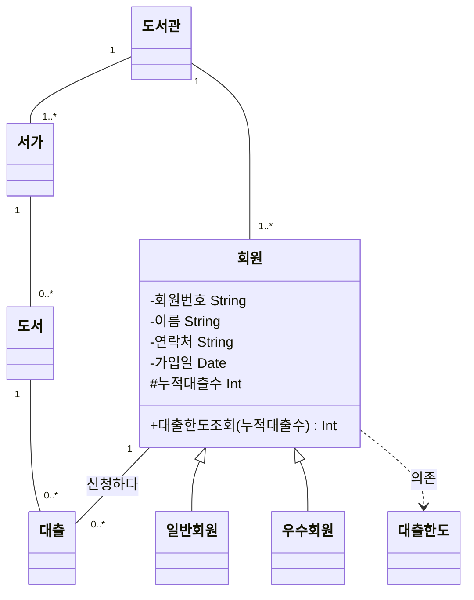

> 📌 **제약조건(노트)** — 클래스 옆에 접어 붙이는 메모다.
> 사전조건 : 누적대출수 **20 이상** · 사후조건 : 한도 = **기본한도 + 2**
>
> 📌 **다중도 읽는 법** — 선 양 끝의 숫자는 **반대쪽 객체가 몇 개인가**를 말한다.
> `도서관 1 — 1..* 서가` 는 *"도서관 하나에 서가가 1개 이상"* 이다.

**해설** ★

1. 한 도서관에는 **서가가 1개 이상** 있음. *(도서관 1 : 서가 1..\*)*
2. 한 도서관에는 **회원이 1명 이상** 등록되어 있음. *(도서관 1 : 회원 1..\*)*
3. 한 서가에는 **도서가 없을 수도, 여러 권일 수도** 있음. *(서가 1 : 도서 0..\*)*
4. 한 회원은 **대출을 한 건도 안 했거나 여러 건** 신청했을 수 있음. *(회원 1 : 대출 0..\*)*
5. 한 도서는 **대출된 적이 없거나 여러 번** 대출됐을 수 있음. *(도서 1 : 대출 0..\*)*
6. 회원은 **일반회원과 우수회원**으로 나뉨. *(일반화 관계)*
7. **누적대출수는 0 이상**이어야 . *(속성 제약조건)*
8. **누적대출수가 20 이상**인 회원은 대출 한도가 **기본 한도보다 2권 증가**. *(사전/사후조건 제약)*

### 클래스 다이어그램의 구성 요소

| 구성 요소 | 표현 방법 | 내용 |
|---|---|---|
| **클래스(Class)** | **3개의 구획으로 나뉜 사각형**<br>위에서부터 **이름 → 속성 → 오퍼레이션**<br>(아래 그림) | - 각각의 객체가 갖는 **속성**과 **오퍼레이션(동작)** 을 표현한 것<br>- 일반적으로 **3개의 구획(Compartment)** 으로 나눠 **클래스 이름 / 속성 / 오퍼레이션**을 표기.<br>- **속성(Attribute)** : 클래스의 **상태나 정보**를 표현.<br>- **오퍼레이션(Operation)** : 클래스가 수행할 수 있는 **동작**으로, **함수(메소드, Method)** 라고도 함. |
| **제약 조건** | **오른쪽 위 모서리가 접힌 사각형(노트 모양)** | - 속성에 입력될 값에 대한 제약, 또는 오퍼레이션 **수행 전후에 지정해야 할 조건**을 기술.<br>- 클래스 **안에** 기술할 때는 **중괄호 `{ }`** 를 이용. |
| **관계(Relationships)** | – | - 클래스와 클래스 사이의 **연관성**을 표현.<br>- 클래스 다이어그램에 표현하는 관계 : **연관, 집합, 포함, 일반화, 의존** |

**클래스 하나의 생김새**

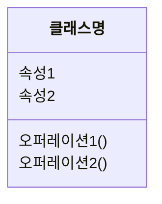

> 📌 **접근 제어자**는 속성·오퍼레이션 앞에 붙인다 —
> `+` 공개(public) · `-` 비공개(private) · `#` 보호(protected) · `~` 패키지.

### 연관 클래스

- **연관 관계에 있는 두 클래스에 추가적으로 표현해야 할 속성이나 오퍼레이션**이 있는 경우 생성하는 클래스
- 두 클래스의 연관 관계를 나타내는 선의 **가운데로부터 점선**을 연관 클래스로 이어 표시.
- 연관 클래스의 이름은 **연관 관계의 이름**을 이용해 지정.

**예제**

> 회원이 대출을 신청하는 상황에서 '대출일'과 '반납예정일' 속성을 어디에 두어야 할지 생각해 볼 것.
> - '회원' 클래스에 두면 → **어느 도서를** 빌린 것인지 모호해짐.
> - '도서' 클래스에 두면 → **누가** 빌린 것인지 모호해짐.
> → 이런 경우 **'신청하다'라는 연관 관계에 대한 연관 클래스**를 만들어 두 속성을 여기에 두면 됨.

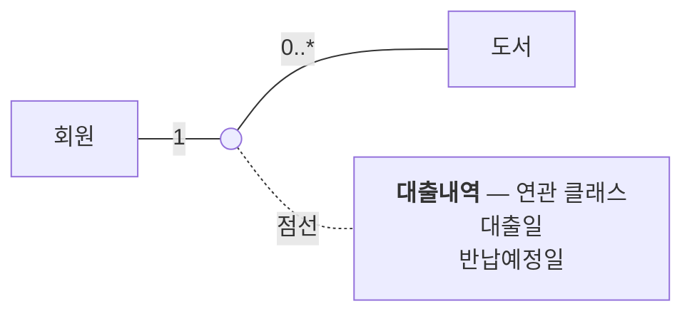

> 📌 **점선이 클래스가 아니라 「선의 가운데」에서 나온다.** 그것이 연관 클래스 표기다 —
> `대출내역` 은 회원의 것도 도서의 것도 아니고 **「신청하다」라는 관계 자체의 속성**이다.

---

## (16) 시퀀스(Sequence) 다이어그램

### 동적 모델링

시스템 내부 구성 요소의 **상태 변화 과정**과 그 과정에서 발생하는 **상호작용**을 표현한 것.

- 구성 요소 사이에서 이뤄지는 **동작이라는 관점(View)** 에서 표현.
- 시스템이 실행될 때 구성 요소 간 **메시지 호출**, 즉 **오퍼레이션을 통한 상호작용**에 초점을 둠.
- **종류** : 시퀀스 다이어그램 / 커뮤니케이션 다이어그램 / 상태 다이어그램

### 시퀀스 다이어그램

- 시스템이나 객체가 **메시지를 주고받으며 상호작용하는 과정**을 그림으로 표현한 것
- 상호작용 과정에서 주고받는 **메시지**를 표현.
- 각 동작에 참여하는 객체의 **수행 기간**을 확인할 수 있음.
- **클래스 내부의 객체를 기본 단위**로 하여 상호작용을 표현.

### 예제 : 회원의 도서 대출 과정

**프레임명** : `SD 도서대출`

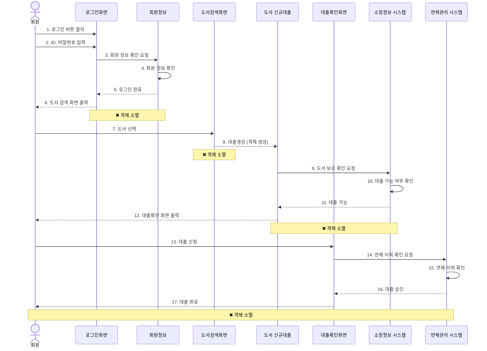

**해석**

| 참여 객체 | 동작 |
|---|---|
| **`<회원>` 액터** | ① 로그인 버튼을 클릭.<br>② ID와 비밀번호를 입력.<br>③ 로그인이 완료되면 검색 화면에서 대출할 도서를 선택.<br>④ 보유 확인이 완료되면 대출확인 화면에서 대출을 신청.<br>⑤ "대출 완료" 메시지를 확인한 후 **소멸**됨. |
| **`<로그인화면>` 객체** | ① `<회원>`이 입력한 ID·비밀번호가 올바른지 `<회원정보>`에 **확인 요청**.<br>② "로그인 완료" 메시지를 받으면 `<회원>`에게 **검색 화면을 출력**한 후 소멸. |
| **`<회원정보>` 객체** | ① 입력받은 ID·비밀번호를 **확인**. *(자기 자신에게 보내는 메시지)*<br>② "로그인 완료" 메시지를 전송한 후 소멸. |
| **`<도서검색화면>` 객체** | ① `<회원>`이 도서를 선택하면 그 도서에 대한 `<도서:신규대출>` **객체를 생성**한 후 소멸. |
| **`<도서:신규대출>` 객체** | ① "대출생성" 메시지를 받으면 **새로운 객체로 생성**됨.<br>② `<소장정보 시스템>`에 보유 확인을 요청.<br>③ "대출 가능" 메시지를 받으면 `<회원>`에게 대출확인 화면을 출력한 후 소멸. |
| **`<대출확인화면>` 객체** | ① `<회원>`이 대출을 신청하면 `<연체관리 시스템>`에 연체 이력 확인을 요청.<br>② "대출 승인" 메시지를 받으면 `<회원>`에게 "대출 완료"를 전송한 후 소멸. |
| **`<소장정보 시스템>` 액터** | ① 선택한 도서의 대출 가능 여부를 확인.<br>② `<도서:신규대출>`에 "대출 가능" 메시지를 전송한 후 소멸. |
| **`<연체관리 시스템>` 액터** | ① 회원의 연체 이력을 확인.<br>② `<대출확인화면>`에 "대출 승인" 메시지를 전송한 후 소멸. |

### 시퀀스 다이어그램의 구성 요소 ★

| 구성 요소 | 표현 방법 | 의미 |
|---|---|---|
| **액터(Actor)** | **막대 인간(사람 모양)** + 아래에 이름 `회원` | 시스템으로부터 서비스를 요청하는 **외부 요소**로, 사람이나 외부 시스템을 의미. |
| **객체(Object)** | **사각형** 안에 `: 로그인화면` (콜론 + 객체명) | **메시지를 주고받는 주체** |
| **생명선(Lifeline)** | **세로 점선** | - 객체가 **메모리에 존재하는 기간**으로, 객체 아래쪽에 점선을 그어 표현.<br>- **객체 소멸(✖)** 이 표시된 기간까지 존재. |
| **실행 상자<br>(Active Box, 활성 상자)** | 생명선 위에 겹쳐진 **가늘고 긴 사각형** | 객체가 메시지를 주고받으며 **구동되고 있음**을 표현. |
| **메시지(Message)** | **화살표** 위에 `1. 로그인 버튼 클릭` (번호 + 내용) | 객체가 상호작용을 위해 주고받는 메시지 |
| **객체 소멸** | **굵은 ✖ 표시** | 해당 객체가 **더 이상 메모리에 존재하지 않음**을 표현한 것 |
| **프레임(Frame)** | 좌측 상단 모서리가 잘린 라벨 `SD 도서대출` + 전체를 감싼 사각형 | 다이어그램의 **전체 또는 일부를 묶어** 표현한 것 |

> 💡 메시지에 번호가 없으면 **위쪽 메시지가 아래쪽보다 시간 순서상 먼저** 전달된 것으로 읽음.

---

## (17) 커뮤니케이션(Communication) 다이어그램

### 개요

시스템이나 객체가 **메시지를 주고받으며 상호작용하는 과정**과 **객체 사이의 연관**을 그림으로 표현한 것.

- 동작에 참여하는 **객체들 사이의 관계**를 파악하는 데 사용됨.
- 클래스 다이어그램에서 **관계가 빠짐없이 표현됐는지 점검**하는 용도로도 사용됨.
- 초기에는 **협업(Collaboration) 다이어그램**이라고 불렸음.

> 💡 **시퀀스 vs 커뮤니케이션** — 주고받는 메시지는 같음. 차이는 무엇을 보여 주느냐.
> **시퀀스**는 **시간 순서(세로 흐름)**, **커뮤니케이션**은 **객체 간 연관(링크)** 에 초점을 둠.

### 예제 : 회원의 도서 대출 과정

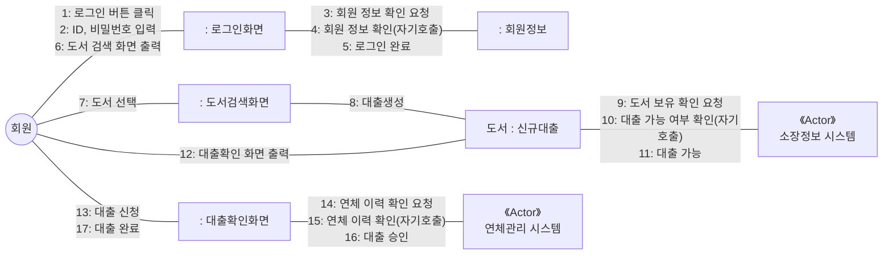

**해석 — 상호작용하는 객체들의 관계**

- `<회원>` 액터는 `<로그인화면>`, `<도서검색화면>`, `<도서:신규대출>`, `<대출확인화면>` 객체와 관계되어 있음.
- `<로그인화면>` 객체는 `<회원정보>` 객체와 관계되어 있음.
- `<도서검색화면>` 객체는 `<도서:신규대출>` 객체와 관계되어 있음.
- `<도서:신규대출>` 객체는 `<소장정보>` 시스템과 관계되어 있음.
- `<대출확인화면>` 객체는 `<연체관리>` 시스템과 관계되어 있음.

### 커뮤니케이션 다이어그램의 구성 요소

| 구성 요소 | 표현 방법 | 의미 |
|---|---|---|
| **액터(Actor)** | **막대 인간** + 이름 `회원` | 시스템으로부터 서비스를 요청하는 **외부 요소**로, 사람이나 외부 시스템을 의미. |
| **객체(Object)** | **사각형** 안에 `: 로그인화면` | **메시지를 주고받는 주체** |
| **링크(Link)** | **하나의 실선(─────)** | - 객체들 사이의 **관계**를 표현한 것<br>- **액터↔객체**, **객체↔객체** 사이에 **실선**을 그어 표현. |
| **메시지(Message)** | **화살표** 위에 `2 : ID, 비밀번호 입력` | - 객체가 상호작용을 위해 주고받는 내용<br>- **화살표의 방향은 메시지를 받는 쪽**으로 향하게 표현.<br>- 일정한 순서로 처리되는 메시지는 **숫자로 순서**를 표시. |

---

## (18) 상태(State) 다이어그램

### 개요

객체들 사이에 발생하는 **이벤트에 의한 객체의 상태 변화**를 그림으로 표현한 것.

- 객체의 **상태**란 객체가 갖는 **속성 값의 변화**를 의미.
- 특정 객체가 **어떤 이벤트에 의해 상태 변환 과정이 진행되는지** 확인하는 데 사용됨.
- 시스템에서 상태 변환 이벤트를 확인할 필요가 있는 **객체만을 대상**으로 그림.

### 예제 : 도서 객체의 상태 변화

**프레임명** : `도서상태`

```mermaid
stateDiagram-v2
    [*] --> 대출가능
    대출가능 --> 대출중 : 대출 승인
    대출중 --> 반납완료 : 기한 내 반납
    대출중 --> 연체 : 반납기한 초과
    연체 --> 반납완료 : 연체료 납부 후 반납
    반납완료 --> 대출가능 : 서가 배치
    반납완료 --> [*]
```

**해석**

| 상태 | 상태 변화 |
|---|---|
| **`<대출가능>`** | - 도서가 서가에 배치되면 `<대출가능>` 상태로 전환됨.<br>- **'대출 승인'** 이벤트에 의해 `<대출중>` 상태로 전환됨. |
| **`<대출중>`** | - **'기한 내 반납'** 이벤트에 의해 `<반납완료>` 상태로 전환됨.<br>- **'반납기한 초과'** 이벤트에 의해 `<연체>` 상태로 전환됨. |
| **`<연체>`** | - **'연체료 납부 후 반납'** 이벤트에 의해 `<반납완료>` 상태로 전환됨. |
| **`<반납완료>`** | - **'서가 배치'** 이벤트에 의해 다시 `<대출가능>` 상태로 전환되거나 → **종료**됨. |

### 상태 다이어그램의 구성 요소

| 구성 요소 | 표현 방법 | 의미 |
|---|---|---|
| **상태(State)** | **모서리가 둥근 사각형** 안에 상태명 `대출가능` | 객체의 **상태**를 표현한 것 |
| **시작 상태** | **속이 꽉 찬 검은 원 ●** | 상태의 **시작**을 표현한 것 |
| **종료 상태** | **검은 원을 둘러싼 원 ◉** (동심원) | 상태의 **종료**를 표현한 것 |
| **상태 전환** | **화살표** 위에 이벤트명 `대출 승인` | 상태 사이의 **흐름, 변화**를 화살표로 표현한 것 |
| **이벤트(Event)** | 화살표 위에 표기된 **텍스트** `대출 승인` | - **상태에 변화를 주는 현상**<br>- 이벤트에는 **조건, 외부 신호, 시간의 흐름** 등이 있음. |
| **프레임(Frame)** | 좌측 상단 모서리가 잘린 라벨 `도서상태` + 전체를 감싼 사각형 | 상태 다이어그램의 **범위**를 표현한 것 |

> 💡 활동 다이어그램과 기호가 겹침. **시작 ●**, **종료 ◉** 는 두 다이어그램이 동일하게 사용.

---

## (19) 패키지(Package) 다이어그램

### 개요

유스케이스나 클래스 등의 요소를 **그룹화한 패키지 간의 의존 관계**를 표현한 것.

- 패키지는 **또 다른 패키지의 요소**가 될 수 있음.
- **대규모 시스템**에서 주요 요소 간의 **종속성을 파악**하는 데 사용.

### 예제 : 도서 대출 시 패키지 의존 관계

```mermaid
graph RL
    subgraph 이용자패키지["이용자"]
        로그인["로그인"]
        도서대출["도서 대출"]
    end
    subgraph 연체패키지["연체관리"]
        연체조회["연체 조회"]
        연체정산["연체료 정산"]
    end
    도서대출 -.->|"《import》"| 로그인
    도서대출 -.->|"《access》"| 연체조회
```

**해석**

**패키지 구성**
- `<이용자>`, `<로그인>`, `<도서 대출>`, `<연체관리>` 패키지가 존재.
- `<이용자>` 패키지는 `<로그인>`과 `<도서 대출>` 패키지를 **포함**하고 있음.
- `<연체관리>` 패키지는 **'연체 조회'와 '연체료 정산' 객체**를 포함하고 있음.

**의존 관계** ★
- `<도서 대출>` ↔ `<로그인>` : 대출 신청자를 확인하기 위해 `<로그인>` 패키지를 이용.
  → **`《import》` 관계**이므로 패키지에 포함된 객체들을 **직접 가져와서** 이용할 수 있는 관계
- `<도서 대출>` ↔ `<연체관리>`의 '연체 조회' : 대출 전 연체 여부를 확인하기 위해 이용.
  → **`《access》` 관계**이므로 **인터페이스를 통해 접근**하여 이용할 수 있는 관계

### 패키지 다이어그램의 구성 요소

| 구성 요소 | 표현 방법 | 의미 |
|---|---|---|
| **패키지(Package)** | **탭(폴더) 모양 사각형** (좌측 상단에 작은 사각형이 붙은 큰 사각형) | - 객체들을 **그룹화**한 것<br>- **단순 표기법** : 패키지 **안에 패키지 이름만** 표현<br>- **확장 표기법** : 패키지 **안에 요소까지** 표현 |
| **객체(Object)** | **단순한 사각형** | 유스케이스, 클래스, 인터페이스, 테이블 등 패키지에 포함될 수 있는 **다양한 요소들** |
| **의존 관계(Dependency)** | **점선 화살표( - - - ▶ )** | - **패키지↔패키지**, **패키지↔객체** 사이를 **점선 화살표**로 연결하여 표현.<br>- **스테레오타입**을 이용해 의존 관계를 구체적으로 표현할 수 있음.<br>- 표현 형태는 사용자가 **임의로 작성** 가능하며, 대표적으로 **import** 와 **access** 가 사용됨.<br>- **`《import》`** : 패키지에 포함된 객체들을 **직접 가져와서** 이용하는 관계<br>- **`《access》`** : **인터페이스를 통해** 패키지 내 객체에 접근하여 이용하는 관계 |

### 단순 표기법 vs 확장 표기법

| 단순 표기법 | 확장 표기법 |
|---|---|
| 탭 모양 사각형 안에 **패키지 이름만** 기재.<br>안에 무엇이 들었는지는 **안 보여 준다** | 탭에 패키지명, **몸통 안에 포함 요소들**을 사각형으로 나열 |

**확장 표기법** — 몸통 안에 포함 요소를 늘어놓는다

```mermaid
flowchart TB
    subgraph 연체관리["연체관리"]
        E1["연체 조회"]
        E2["연체료 정산"]
    end
```

> 📌 **단순 표기법은 이 상자에서 안쪽을 지운 것**이다 — 이름만 남는다.
> 안을 보여 줄 필요가 없으면 단순 표기법으로 두고, **의존 관계를 따질 때** 확장 표기법을 쓴다.

---

## (20) 소프트웨어 개발 방법론

**소프트웨어 개발 방법론** : 소프트웨어 개발·유지보수 등에 필요한 여러 일들의 **수행 방법**과,
이를 효율적으로 수행하는 데 필요한 각종 **기법 및 도구를 체계적으로 정리하여 표준화**한 것.

**목적** : 소프트웨어의 **생산성과 품질 향상**

**주요 방법론** : 구조적 / 정보공학 / 객체지향 / 컴포넌트 기반(CBD) / 제품 계열 / 애자일

> 💡 **무엇을 중심에 두느냐**로 갈림. 구조적은 **처리**, 정보공학은 **자료**, 객체지향은 **객체**,
> CBD는 **컴포넌트**, 제품 계열은 **공통 기능**.

### ① 구조적 방법론

- 정형화된 분석 절차에 따라 사용자 요구사항을 파악하고 문서화하는 **처리(Process) 중심**의 방법론
- **1960년대**까지 가장 많이 적용됐음.
- 이해하기 쉽고 **검증이 가능한 프로그램 코드**를 생성하는 것이 목적.
- 복잡한 문제를 다루기 위해 **분할과 정복(Divide and Conquer)** 원리를 적용.

**개발 절차**

```mermaid
flowchart LR
    A[타당성 검토 단계] --> B[계획 단계] --> C[요구사항 단계] --> D[설계 단계] --> E[구현 단계] --> F[시험 단계] --> G[운용/유지보수 단계]
```

### ② 정보공학 방법론

- 정보 시스템 개발을 위해 **계획, 분석, 설계, 구축**에 정형화된 기법들을 상호 연관성 있게
  통합 및 적용하는 **자료(Data) 중심**의 방법론
- 정보 시스템 개발 주기를 이용해 **대규모 정보 시스템**을 구축하는 데 적합함.

**개발 절차**

```mermaid
flowchart LR
    A[정보 전략 계획<br/>수립 단계] --> B[업무 영역<br/>분석 단계] --> C[업무 시스템<br/>설계 단계] --> D[업무 시스템<br/>구축 단계]
```

### ③ 객체지향 방법론

- 현실 세계의 **개체(Entity)** 를 기계 부품처럼 하나의 **객체(Object)** 로 만들고,
  부품을 조립하듯 **객체들을 조립**해 필요한 소프트웨어를 구현하는 방법론
- **구조적 기법의 문제점**으로 인한 **소프트웨어 위기의 해결책**으로 채택됨.

**구성 요소** ★

| 요소 | 설명 |
|---|---|
| **객체(Object)** | **데이터**와 데이터를 처리하는 **함수**를 묶어 놓은 하나의 소프트웨어 모듈 |
| **클래스(Class)** | **공통된 속성과 연산**을 갖는 객체의 집합으로, 객체의 일반적인 **타입(Type)** |
| **메시지(Message)** | 객체 간 **상호작용**에 사용되는 수단으로, 객체에게 어떤 행위를 하도록 지시하는 **명령 또는 요구 사항** |

**기본 원칙** ★★

| 원칙 | 설명 |
|---|---|
| **캡슐화**(Encapsulation) | 데이터와 데이터를 처리하는 **함수를 하나로 묶는 것** |
| **정보 은닉**(Information Hiding) | **캡슐화에서 가장 중요한 개념**으로, 다른 객체에게 **자신의 정보를 숨기고** 자신의 연산을 통해서만 접근을 허용하는 것 |
| **추상화**(Abstraction) | 불필요한 부분을 생략하고 객체의 속성 중 **가장 중요한 것에 중점**을 두어 개략화하는 것 |
| **상속성**(Inheritance) | 이미 정의된 **상위 클래스의 모든 속성과 연산을 하위 클래스가 물려받는 것** |
| **다형성**(Polymorphism) | 메시지에 의해 객체가 연산을 수행할 때, **하나의 메시지에 대해 각 객체가 고유한 방법으로 응답**할 수 있는 능력 |

**개발 절차**

```mermaid
flowchart LR
    A[요구 분석<br/>단계] --> B[설계 단계] --> C[구현 단계] --> D[테스트 및 검증<br/>단계] --> E[인도 단계]
```

### ④ 컴포넌트 기반(CBD; Component Based Design) 방법론

- 기존 시스템이나 소프트웨어를 구성하는 **컴포넌트를 조합**해 새로운 애플리케이션을 만드는 방법론
- 컴포넌트의 **재사용(Reusability)** 이 가능해 **시간과 노력을 절감**할 수 있음.
- 새로운 기능 추가가 간단해 **확장성**이 보장됨.
- **유지 보수 비용을 최소화**하고 생산성 및 품질을 향상시킬 수 있음.

**개발 절차**

```mermaid
flowchart LR
    A[개발 준비<br/>단계] --> B[분석 단계] --> C[설계 단계] --> D[구현 단계] --> E[테스트 단계] --> F[전개 단계] --> G[인도 단계]
```

### ⑤ 제품 계열 방법론

- **특정 제품에 적용하고 싶은 공통된 기능**을 정의해 개발하는 방법론
- **임베디드 소프트웨어**를 만드는 데 적합함.

| 구분 | 내용 |
|---|---|
| **영역공학** | **영역 분석, 영역 설계, 핵심 자산**을 구현하는 영역 |
| **응용공학** | **제품 요구 분석, 제품 설계, 제품**을 구현하는 영역 |

> 영역공학과 응용공학의 **연계**를 위해 제품의 **요구사항, 아키텍처, 조립 생산**이 필요함.

---

## (21) S/W 공학의 발전적 추세

### 소프트웨어 재사용(Software Reuse)

이미 개발되어 **인정받은 소프트웨어**를 다른 소프트웨어 개발이나 유지에 사용하는 것.

- 소프트웨어 개발의 **품질과 생산성**을 높이기 위한 방법.
- 기존에 개발된 소프트웨어와 **경험, 지식** 등을 새로운 소프트웨어에 적용.

**방법** ★

| 방법 | 설명 |
|---|---|
| **합성 중심**<br>(Composition-Based) | 전자 칩과 같은 소프트웨어 **부품(블록)** 을 만들어 **끼워 맞춰** 소프트웨어를 완성시키는 방법.<br>→ **블록 구성 방법**이라고도 함. |
| **생성 중심**<br>(Generation-Based) | **추상화 형태로 쓰인 명세를 구체화**하여 프로그램을 만드는 방법.<br>→ **패턴 구성 방법**이라고도 함. |

### 소프트웨어 재공학(Software Reengineering)

새로운 요구에 맞도록 **기존 시스템을 이용**해 더 나은 시스템을 구축하고,
새로운 기능을 추가해 소프트웨어 성능을 향상시키는 것.

- 유지보수 비용이 개발 비용의 대부분을 차지하므로, **유지보수의 생산성 향상**을 통해
  **소프트웨어 위기를 해결**하는 방법.
- 기존 소프트웨어의 데이터와 기능을 **개조 및 개선**해 유지보수성과 품질을 향상시킴.

**이점** : 품질 향상 · 생산성 증가 · **수명 연장** · 오류 감소

### CASE(Computer Aided Software Engineering)

소프트웨어 개발 과정에서 사용되는 **요구 분석, 설계, 구현, 검사 및 디버깅** 과정의 전체 또는 일부를
**컴퓨터와 전용 소프트웨어 도구를 사용해 자동화**하는 것.

- 객체지향 시스템, 구조적 시스템 등 다양한 시스템에서 활용되는 **자동화 도구(CASE Tool)**.
- 소프트웨어 생명 주기의 **전체 단계를 연결하고 자동화**하는 통합 도구를 제공.
- 소프트웨어 **개발 도구와 방법론이 결합**된 것으로, 정형화된 구조 및 방법을 적용해 **생산성 향상**을 구현.

**주요 기능** : ① 소프트웨어 생명 주기 **전 단계의 연결** ② 다양한 소프트웨어 **개발 모형 지원** ③ **그래픽 지원**

---

## (22) 비용 산정 기법

### 소프트웨어 비용 산정

개발에 소요되는 **인원, 자원, 기간** 등으로 소프트웨어의 규모를 확인해
개발 계획 수립에 필요한 **비용을 산정**하는 것.

- **너무 높게 산정** → 예산 낭비와 일의 효율성 저하
- **너무 낮게 산정** → 개발자의 부담 가중, 품질 문제 발생

**기법** : 하향식 비용 산정 기법 / 상향식 비용 산정 기법

### 소프트웨어 비용 결정 요소 ★

| 요소 | 내용 |
|---|---|
| **프로젝트 요소** | - **제품 복잡도** : 소프트웨어의 종류에 따라 발생할 수 있는 문제점들의 난이도<br>- **시스템 크기** : 소프트웨어의 규모에 따라 개발해야 할 시스템의 크기<br>- **요구되는 신뢰도** : 일정 기간 내 주어진 조건하에 프로그램이 필요한 기능을 수행하는 정도 |
| **자원 요소** | - **인적 자원** : 소프트웨어 개발 관련자들이 갖춘 능력 혹은 자질<br>- **하드웨어 자원** : 개발 시 필요한 장비와 워드프로세서, 프린터 등의 보조 장비<br>- **소프트웨어 자원** : 개발 시 필요한 언어 분석기, 문서화 도구 등의 개발 지원 도구 |
| **생산성 요소** | - **개발자 능력** : 개발자가 갖춘 전문지식, 경험, 이해도, 책임감, 창의력 등<br>- **개발 기간** : 소프트웨어를 개발하는 기간 |

> 💡 소프트웨어 개발 비용은 **시스템의 크기가 크고 신뢰도가 높을수록 많이 들며,
> 개발 후기로 갈수록 적게 듦.**

---

## (23) 비용 산정 기법 — 하향식

- **과거의 유사한 경험**을 바탕으로 전문 지식이 많은 개발자들이 참여한 **회의**를 통해
  비용을 산정하는 **비과학적인** 방법
- 프로젝트의 **전체 비용을 산정한 후** 각 작업별로 비용을 **세분화**.

| 기법 | 설명 |
|---|---|
| **전문가 감정 기법** | - 조직 내에 있는 **경험이 많은 두 명 이상의 전문가**에게 비용 산정을 의뢰하는 기법<br>- 가장 **편리하고 신속**하게 비용을 산정할 수 있음.<br>- 의뢰자로부터 **믿음**을 얻을 수 있음.<br>- ⚠️ **개인적이고 주관적**일 수 있음. |
| **델파이 기법** | - 전문가 감정 기법의 **주관적인 편견을 보완**하기 위해 **많은 전문가의 의견을 종합**해 산정하는 기법<br>- 전문가들의 편견이나 분위기에 지배되지 않도록 **한 명의 조정자와 여러 전문가**로 구성됨. |

---

## (24) 비용 산정 기법 — 상향식

- 프로젝트의 **세부적인 작업 단위별로 비용을 산정한 후 집계**해 전체 비용을 산정하는 방법
- **주요 기법** : LOC 기법 / 개발 단계별 인월수 기법 / 수학적 산정 기법

### LOC(원시 코드 라인 수, source Line Of Code) 기법 ★★

소프트웨어 각 기능의 원시 코드 라인 수에 대한 **비관치, 낙관치, 기대치**를 측정해 **예측치**를 구하고,
이를 이용해 비용을 산정하는 기법.

| 용어 | 의미 |
|---|---|
| **비관치** | 가장 **많이** 측정된 코드 라인 수 |
| **낙관치** | 가장 **적게** 측정된 코드 라인 수 |
| **기대치** | 측정된 모든 코드 라인 수의 **평균** |

- **측정이 용이하고 이해하기 쉬워** 가장 많이 사용됨.
- 예측치를 이용해 **생산성, 노력, 개발 기간** 등의 비용을 산정.

**예측치 계산 공식**

<div class="formula"><span class="lhs">예측치 =</span><span class="frac"><span class="num">a + 4m + b</span><span class="den">6</span></span><span class="cond">a : 낙관치 · b : 비관치 · m : 기대치(중간치)</span></div>

**산정 공식** ★★

| 항목 | 공식 |
|---|---|
| **노력(인월)** | 개발 기간 × 투입 인원 = **LOC ÷ 1인당 월평균 생산 코드 라인 수** |
| **개발 비용** | 노력(인월) × **단위 비용**(1인당 월평균 인건비) |
| **개발 기간** | **노력(인월) ÷ 투입 인원** |
| **생산성** | **LOC ÷ 노력(인월)** |

> **예제** : LOC 기법으로 예측한 총 라인 수가 **30,000라인**, 투입 프로그래머가 **5명**,
> 프로그래머들의 평균 생산성이 **월간 300라인**일 때 개발 소요 기간은?
>
> - 노력(인월) = LOC ÷ 1인당 월평균 생산 코드 라인 수 = 30,000 ÷ 300 = **100 인월**
> - 개발 기간 = 노력(인월) ÷ 투입 인원 = 100 ÷ 5 = **20개월**

### 개발 단계별 인월수(Effort Per Task) 기법

- **LOC 기법을 보완**하기 위한 기법으로, 각 기능을 구현하는 데 필요한 노력을
  **생명 주기의 각 단계별로** 산정.
- LOC 기법보다 **더 정확함.**

---

## (25) 수학적 산정 기법

- **상향식** 비용 산정 기법.
- **경험적 추정 모형, 실험적 추정 모형**이라고 함.
- 개발 비용 산정의 **자동화**를 목표로 함.
- 비용 자동 산정에 사용되는 공식은 **과거의 유사한 프로젝트**를 기반으로 유도된 것.
- **주요 기법** : COCOMO 모형 / Putnam 모형 / 기능 점수(FP) 모형

### COCOMO(COnstructive COst MOdel) 모형

- 원시 프로그램의 규모인 **LOC**에 의한 비용 산정 기법
- 개발할 소프트웨어의 **규모(LOC)를 예측**한 후, 소프트웨어 종류에 따라 다르게 책정되는
  **비용 산정 방정식**에 대입해 비용을 산정.
- 비용 산정 결과는 프로젝트 완성에 필요한 **노력(Man-Month)** 으로 나타남.
- **보헴(Boehm)** 이 제안.

#### COCOMO의 소프트웨어 개발 유형 ★★

| 유형 | 특징 |
|---|---|
| **조직형**<br>(Organic Mode) | - 기관 **내부**에서 개발된 **중소 규모**의 소프트웨어<br>- 일괄 자료 처리나 과학기술 계산용, 비즈니스 자료 처리용 등의 **5만(50 KDSI) 라인 이하**<br>- **사무 처리용, 업무용, 과학용** 응용 소프트웨어 개발에 적합함. |
| **반분리형**<br>(Semi-Detached Mode) | - 조직형과 내장형의 **중간형**<br>- 트랜잭션 처리 시스템이나 운영체제, DBMS 등의 **30만(300 KDSI) 라인 이하**<br>- **컴파일러, 인터프리터**와 같은 유틸리티 개발에 적합함. |
| **내장형**<br>(Embedded Mode) | - **초대형 규모**의 소프트웨어<br>- 트랜잭션 처리 시스템이나 운영체제 등의 **30만(300 KDSI) 라인 이상**<br>- **신호기 제어 시스템, 미사일 유도 시스템, 실시간 처리 시스템** 등 시스템 프로그램 개발에 적합함. |

> **KDSI(Kilo Delivered Source Instruction)** : 전체 라인 수를 **1,000라인 단위**로 묶은 것으로,
> **KLOC(Kilo LOC)** 과 같은 의미.

#### COCOMO 모형의 종류

| 유형 | 특징 |
|---|---|
| **기본형(Basic) COCOMO** | 소프트웨어의 **크기와 개발 유형만**을 이용해 비용을 산정. |
| **중간형(Intermediate) COCOMO** | 기본형 COCOMO의 공식을 토대로 하되, 다음 **4가지 특성**을 반영해 비용을 산정.<br>① **제품**의 특성 ② **컴퓨터**의 특성 ③ **개발 요원**의 특성 ④ **프로젝트** 특성 |
| **발전형(Detailed) COCOMO** | - 중간형 COCOMO를 **보완**해 만들어진 모형<br>- **개발 공정별**로 더 자세하고 정확하게 노력을 산출해 비용을 산정.<br>- 소프트웨어 환경과 구성 요소가 **사전에 정의**되어 있어야 하며, 개발 과정의 **후반부**에 주로 적용. |

### Putnam 모형

- 소프트웨어 생명 주기의 **전 과정 동안 사용될 노력의 분포**를 예상하는 모형
- **푸트남(Putnam)** 이 제안한 것으로, **생명 주기 예측 모형**이라고도 함.
- 시간에 따른 함수로 표현되는 **Rayleigh-Norden 곡선**의 노력 분포도를 기초로 함.
- **대형 프로젝트**의 노력 분포 산정에 이용됨.
- 개발 기간이 늘어날수록 프로젝트 적용 인원의 **노력이 감소**.

### 기능 점수(FP; Function Point) 모형

- 소프트웨어의 **기능을 증대시키는 요인별로 가중치를 부여**하고, 요인별 가중치를 합산해
  **총 기능 점수**를 산출하며, 총 기능 점수와 **영향도**를 이용해 **기능 점수(FP)** 를 구한 후
  이를 이용해 비용을 산정하는 기법
- **총 기능 점수** : 소프트웨어 개발의 **규모, 복잡도, 난이도** 등을 하나의 수치로 집약시킨 것
- **알브레히트(Albrecht)** 가 제안.

**소프트웨어 기능 증대 요인** ★

1. **자료 입력** (입력 양식)
2. **정보 출력** (출력 보고서)
3. **명령어** (사용자 질의수)
4. **데이터 파일**
5. 필요한 **외부 루틴과의 인터페이스**

### 비용 산정 자동화 추정 도구

| 도구 | 설명 |
|---|---|
| **SLIM** | **Rayleigh-Norden 곡선**과 **Putnam 예측 모델**을 기초로 개발된 자동화 추정 도구 |
| **ESTIMACS** | 다양한 프로젝트와 개인별 요소를 수용하도록 **FP 모형**을 기초로 개발된 자동화 추정 도구 |

> 💡 **SLIM은 Putnam, ESTIMACS는 FP.** 짝만 외우면 됨.

---

## (26) 프로젝트 일정 계획

**프로젝트 일정(Scheduling) 계획** : 프로젝트의 프로세스를 이루는 **소작업을 파악**하고,
예측된 **노력을 각 소작업에 분배**해 소작업의 **순서와 일정**을 정하는 것.

**사용되는 기능** ★

| 도구 | 설명 |
|---|---|
| **WBS**<br>(Work Breakdown Structure, 업무 분류 구조) | 개발 프로젝트를 여러 개의 **작은 관리 단위로 분할**해 **계층적**으로 기술한 업무 구조 |
| **PERT / CPM** | 프로젝트의 **지연을 방지**하고 계획대로 진행되도록 일정을 계획하는 것.<br>대단위 계획의 조직적인 추진을 위해 **비용을 적게 사용하면서 최단시간 내 계획 완성**을 목표로 하는 일정 방법 |
| **간트 차트** | 작업 일정을 **막대 도표**로 표시하는 프로젝트 일정표 |

### PERT(Program Evaluation and Review Technique)

- 프로젝트에 필요한 **전체 작업의 상호 관계**를 표시하는 **네트워크**
- 각 작업별로 **낙관적인 경우 / 가능성이 있는 경우 / 비관적인 경우**로 나누어 **종료시기를 결정**.
- **개발 경험이 없어 소요 기간 예측이 어려운** 프로젝트의 일정 계획에 사용.
- **노드와 간선**으로 구성되며, **원 노드에는 작업**을, **간선에는 낙관치·기대치·비관치**를 표시.

| 용어 | 의미 |
|---|---|
| **낙관치** | 모든 상황이 좋아서 **최대로 빨리** 진행될 때 걸리는 시간 |
| **기대치** | 모든 상황이 **정상적으로** 진행될 때 걸리는 시간 |
| **비관치** | 많은 장애가 생겨 **가장 늦게** 진행될 때 걸리는 시간 |

- **결정 경로**, **작업에 대한 경계 시간**, **작업 간의 상호 관련성** 등을 알 수 있음.

**작업 예측치 계산 공식** ★★

<div class="formula"><span class="lhs">작업 예측치 =</span><span class="frac"><span class="num">비관치 + 4 × 기대치 + 낙관치</span><span class="den">6</span></span></div>

<div class="formula"><span class="lhs">평방 편차 =</span><span class="brk">[</span><span class="frac"><span class="num">비관치 − 낙관치</span><span class="den">6</span></span><span class="brk">]</span><span class="sup">2</span></div>

**PERT 네트워크 예시** — 간선에 `낙관치, 기대치, 비관치` 표기

```mermaid
graph LR
    A((A)) -->|"2, 5, 14"| B((B))
    B -->|"5, 14, 17"| C((C))
    C -->|"2, 6, 8"| E((E))
    A -->|"3, 12, 21"| D((D))
    D -->|"6, 14, 28"| E
    E -->|"1, 4, 7"| F((F))
    F -->|"2, 4, 8"| G((G))
```

| 간선 | 낙관치 | 기대치 | 비관치 |
|---|---:|---:|---:|
| A → B | 2 | 5 | 14 |
| B → C | 5 | 14 | 17 |
| C → E | 2 | 6 | 8 |
| A → D | 3 | 12 | 21 |
| D → E | 6 | 14 | 28 |
| E → F | 1 | 4 | 7 |
| F → G | 2 | 4 | 8 |

### CPM(Critical Path Method, 임계 경로 기법)

- 프로젝트 완성에 필요한 **작업을 나열**하고 작업에 필요한 **소요 기간을 예측**하는 데 사용하는 기법
- **노드와 간선**으로 구성된 네트워크.
  - **노드** : 작업
  - **간선** : 작업 사이의 **전후 의존 관계**
- **원형 노드**는 각각의 **작업**을 의미하며, **작업 이름과 소요 시간**을 표시.
- **박스 노드**는 **이정표**를 의미하며, **이정표 이름과 예상 완료 시간**을 표시.
- 간선을 나타내는 화살표의 흐름에 따라 작업이 진행되며,
  **전 작업이 완료되어야 다음 작업을 진행**할 수 있음.

**CPM 네트워크 예시**

```mermaid
graph LR
    A(("A")) --> B(("B<br/>13일"))
    A --> C(("C<br/>7일"))
    A --> D(("D<br/>11일"))
    B --> M1["이정표 1<br/>7일"]
    C --> M2["이정표 2<br/>13일"]
    D --> M2
    D --> M3["이정표 3<br/>11일"]
    M1 --> E(("E<br/>14일"))
    M2 --> F(("F<br/>4일"))
    M3 --> G(("G<br/>12일"))
    E --> M4["이정표 4<br/>21일"]
    F --> M5["이정표 5<br/>17일"]
    M4 --> H(("H<br/>16일"))
    H --> M6["이정표 6<br/>37일"]
    M6 --> I(("I"))
    M5 --> I
    I --> M7["이정표 7<br/>46일"]
    M7 --> J(("J"))
    G --> J
```

| 노드(원형 = 작업) | 소요 시간 | 노드(박스 = 이정표) | 예상 완료 시간 |
|---|---:|---|---:|
| B | 13일 | 이정표 1 | 7일 |
| C | 7일 | 이정표 2 | 13일 |
| D | 11일 | 이정표 3 | 11일 |
| E | 14일 | 이정표 4 | 21일 |
| F | 4일 | 이정표 5 | 17일 |
| G | 12일 | 이정표 6 | 37일 |
| H | 16일 | 이정표 7 | 46일 |
| I | 9일 | | |

### 간트 차트

- 각 작업이 **언제 시작하고 언제 종료되는지**에 대한 작업 일정을 **막대 도표**로 표시하는 프로젝트 일정표
- **시간선(Time-Line) 차트**라고도 함.
- **중간 목표 미달성 시** 그 이유와 기간을 예측할 수 있게 함.
- 사용자와의 문제점이나 **예산의 초과 지출** 등도 관리할 수 있게 함.
- **자원 배치와 인원 계획**에 유용하게 사용됨.
- **이정표, 작업 일정, 작업 기간, 산출물**로 구성됨.
- **수평 막대의 길이**는 각 작업(Task)의 **기간**을 나타냄.

---

## (27) 소프트웨어 개발 방법론 결정과 프로젝트 관리

### 소프트웨어 개발 방법론 결정

**프로젝트 관리와 재사용 현황**을 소프트웨어 개발 방법론에 반영하고,
확정된 **소프트웨어 생명 주기와 개발 방법론에 맞춰** 개발 **단계, 활동, 작업, 절차**를 정의하는 것.

**결정 절차**

1. 프로젝트 관리와 재사용 현황을 소프트웨어 개발 방법론에 **반영**.
2. 개발 단계별 **작업 및 절차**를 소프트웨어 생명 주기에 맞춰 **수립**.
3. 결정된 개발 방법론의 단계별 **활동 목적, 작업 내용, 산출물**에 대한 **매뉴얼을 작성**.

### 프로젝트 관리(Project Management)

주어진 **기간 내에 최소의 비용**으로 사용자를 만족시키는 시스템을 개발하기 위한 전반적인 활동.

| 관리 유형 | 주요 내용 |
|---|---|
| **일정 관리** | 작업 순서, 작업 기간 산정, 일정 개발, 일정 통제 |
| **비용 관리** | 비용 산정, 비용 예산 편성, 비용 통제 |
| **인력 관리** | 프로젝트 팀 편성, 자원 산정, 프로젝트 조직 정의, 프로젝트 팀 개발, 자원 통제, 프로젝트 팀 관리 |
| **위험 관리** | 위험 식별, 위험 평가, 위험 대처, 위험 통제 |
| **품질 관리** | 품질 계획, 품질 보증 수행, 품질 통제 수행 |

---

## (28) 소프트웨어 개발 표준

**소프트웨어 개발 표준** : 소프트웨어 개발 단계에서 수행하는 **품질 관리**에 사용되는 **국제 표준**.

**주요 표준** : ISO/IEC 12207 / CMMI / SPICE(ISO/IEC 15504)

### ISO/IEC 12207

- **ISO(국제표준화기구)** 가 만든 **표준 소프트웨어 생명 주기 프로세스**
- 소프트웨어의 **개발, 운영, 유지보수** 등을 체계적으로 관리하기 위한 생명 주기 표준을 제공.

| 구분 | 프로세스 |
|---|---|
| **기본 생명 주기 프로세스** | **획득, 공급, 개발, 운영, 유지보수** 프로세스 |
| **지원 생명 주기 프로세스** | **품질 보증, 검증, 확인, 활동 검토, 감사, 문서화, 형상 관리, 문제 해결** 프로세스 |
| **조직 생명 주기 프로세스** | **관리, 기반 구조, 훈련, 개선** 프로세스 |

### CMMI(Capability Maturity Model Integration, 능력 성숙도 통합 모델)

- 소프트웨어 개발 조직의 **업무 능력 및 조직의 성숙도**를 평가하는 모델
- 미국 **카네기멜론 대학교의 소프트웨어 공학연구소(SEI)** 에서 개발.

**CMMI의 소프트웨어 프로세스 성숙도 — 5단계** ★★

| 단계 | 프로세스 | 특징 |
|---|---|---|
| **초기**(Initial) | 정의된 프로세스 **없음** | **작업자 능력**에 따라 성공 여부가 결정됨. |
| **관리**(Managed) | **규칙화**된 프로세스 | **특정한 프로젝트 내**의 프로세스를 정의하고 수행. |
| **정의**(Defined) | **표준화**된 프로세스 | **조직의 표준 프로세스**를 활용해 업무를 수행. |
| **정량적 관리**(Quantitatively Managed) | **예측 가능**한 프로세스 | 프로젝트를 **정량적으로** 관리 및 통제. |
| **최적화**(Optimizing) | **지속적 개선** 프로세스 | 프로세스 역량 향상을 위해 지속적으로 프로세스를 개선. |

### SPICE(Software Process Improvement and Capability dEtermination)

- 정보 시스템 분야에서 소프트웨어의 **품질 및 생산성 향상**을 위해 소프트웨어 프로세스를
  **평가 및 개선**하는 국제 표준
- 공식 명칭은 **ISO/IEC 15504**.

**SPICE의 구성 — 5개 범주 (총 40개 프로세스)** ★

| 범주 | 특징 |
|---|---|
| **고객-공급자**<br>(Customer-Supplier) 프로세스 | - 소프트웨어를 개발해 **고객에게 전달**하는 것을 지원하고, 소프트웨어의 정확한 **운용 및 사용**을 위한 프로세스<br>- 구성 요소 : **인수, 공급, 요구 도출, 운영**<br>- 프로세스 수 : **10개** |
| **공학**<br>(Engineering) 프로세스 | - 시스템과 소프트웨어 제품의 **명세화, 구현, 유지보수**에 사용되는 프로세스<br>- 구성 요소 : **개발, 소프트웨어 유지보수**<br>- 프로세스 수 : **9개** |
| **지원**<br>(Support) 프로세스 | - 소프트웨어 생명 주기에서 **다른 프로세스에 의해 이용**되는 프로세스<br>- 구성 요소 : **문서화, 형상, 품질 보증, 검증, 확인, 리뷰, 감사, 품질 문제 해결**<br>- 프로세스 수 : **8개** |
| **관리**<br>(Management) 프로세스 | - 소프트웨어 생명 주기에서 **프로젝트 관리자**에 의해 사용되는 프로세스<br>- 구성 요소 : **관리, 프로젝트 관리, 품질 및 위험 관리**<br>- 프로세스 수 : **4개** |
| **조직**<br>(Organization) 프로세스 | - 조직의 **업무 목적 수립**과 **업무 목표 달성**을 위한 프로세스<br>- 구성 요소 : **조직 배치, 개선 활동 프로세스, 인력 관리, 기반 관리, 측정 도구, 재사용**<br>- 프로세스 수 : **9개** |

**SPICE의 프로세스 수행 능력 단계 — 6단계** ★★

| 단계 | 특징 |
|---|---|
| **불완전**(Incomplete) | 프로세스가 **구현되지 않았거나 목적을 달성하지 못한** 단계 |
| **수행**(Performed) | 프로세스가 **수행되고 목적이 달성**된 단계 |
| **관리**(Managed) | **정의된 자원의 한도 내**에서 그 프로세스가 **작업 산출물을 인도**하는 단계 |
| **확립**(Established) | **소프트웨어 공학 원칙에 기반**해 정의된 프로세스가 수행되는 단계 |
| **예측**(Predictable) | 프로세스가 목적 달성을 위해 **통제**되고, **양적인 측정**을 통해 **일관되게 수행**되는 단계 |
| **최적화**(Optimizing) | 프로세스 수행을 **최적화**하고, **지속적인 개선**을 통해 업무 목적을 만족시키는 단계 |

> 💡 **CMMI(5단계)** : 초기 → 관리 → 정의 → 정량적 관리 → 최적화
> 💡 **SPICE(6단계)** : 불완전 → 수행 → 관리 → 확립 → 예측 → 최적화
> 둘 다 **최적화**로 끝남. 단계 수(5 / 6)로 구분할 것.

---

## (29) 소프트웨어 개발 방법론 테일러링

**정의** : **프로젝트 상황 및 특성에 맞도록** 정의된 소프트웨어 개발 방법론의
**절차, 사용기법** 등을 **수정 및 보완**하는 작업.

### 수행 절차

```mermaid
flowchart LR
    A[프로젝트 특징 정의] --> B[표준 프로세스 선정<br/>및 검증] --> C[상위 수준의<br/>커스터마이징] --> D[세부 커스터마이징] --> E[테일러링 문서화]
```

### 테일러링 고려사항 ★★

| 기준 | 내용 |
|---|---|
| **내부적 기준** | - **목표 환경** : 시스템의 **개발 환경과 유형**이 서로 다른 경우 테일러링이 필요함.<br>- **요구사항** : 프로젝트 생명 주기 활동에서 개발·운영·유지보수 등 **우선적으로 고려할 요구사항**이 서로 다른 경우 필요함.<br>- **프로젝트 규모** : **비용, 인력, 기간** 등 프로젝트의 규모가 서로 다른 경우 필요함.<br>- **보유 기술** : **프로세스, 개발 방법론, 산출물, 구성원의 능력** 등이 서로 다른 경우 필요함. |
| **외부적 기준** | - **법적 제약사항** : 프로젝트별로 적용될 **IT Compliance**가 서로 다른 경우 필요함.<br>- **표준 품질 기준** : **금융, 제도** 등 분야별 표준 품질 기준이 서로 다른 경우 필요함. |

> 💡 **내부 4개 / 외부 2개.** 외부는 **법적 제약사항**과 **표준 품질 기준** 둘뿐.

---

## (30) 소프트웨어 개발 프레임워크

### 개요

소프트웨어 개발에 공통적으로 사용되는 **구성 요소와 아키텍처를 일반화**해 손쉽게 구현할 수 있도록
여러 기능을 제공해 주는 **반제품 형태**의 소프트웨어 시스템.

- 선행 사업자의 기술에 의존하지 않는 **표준화된 개발 기반**이므로 **사업자 종속성이 해소**됨.

### 주요 기능

예외 처리 · 트랜잭션 처리 · 메모리 공유 · 데이터 소스 관리 · 서비스 관리 · 쿼리 서비스 ·
로깅 서비스 · 사용자 인증 서비스

### 종류 ★

| 프레임워크 | 설명 |
|---|---|
| **스프링 프레임워크**<br>(Spring Framework) | - **자바 플랫폼**을 위한 **오픈 소스 경량형** 애플리케이션 프레임워크<br>- **동적인 웹 사이트** 개발을 위해 다양한 서비스를 제공.<br>- **전자정부 표준 프레임워크의 기반 기술**로 사용되고 있음. |
| **전자정부 프레임워크** | - **대한민국의 공공부문 정보화 사업** 시 효율적인 정보 시스템 구축을 지원하기 위해 필요한 기능 및 아키텍처를 제공하는 프레임워크<br>- 개발 프레임워크의 **표준 정립**으로 응용 소프트웨어의 **표준화, 품질 및 재사용성 향상**이 목적.<br>- **오픈 소스 기반의 범용화**를 이룰 수 있음.<br>- 공개된 기술을 활용해 **특정 업체의 종속성을 배제**하고 사업별 **공통 컴포넌트의 중복 개발을 방지**. |
| **닷넷 프레임워크**<br>(.NET Framework) | - **Windows 프로그램**의 개발 및 실행 환경을 제공하는 프레임워크<br>- **Microsoft 사**에서 통합 인터넷 전략을 위해 개발.<br>- 코드 실행을 관리하는 **CLR(Common Language Runtime, 공용 언어 런타임)** 이라는 **가상머신** 위에서 작동. |

### 소프트웨어 개발 프레임워크의 특성 ★★

| 특성 | 내용 |
|---|---|
| **모듈화**<br>(Modularity) | - **캡슐화**를 통해 모듈화를 강화하고 **설계 및 구현의 변경에 따른 영향을 최소화**해 품질을 향상시킴.<br>- **개발 표준에 의한 모듈화**로 **유지 보수가 용이**함. |
| **재사용성**<br>(Reusability) | **재사용 가능한 모듈**들을 제공해 **예산 절감, 생산성 향상, 품질 보증**이 가능함. |
| **확장성**<br>(Extensibility) | **다형성(Polymorphism)** 을 통한 **인터페이스 확장**이 가능해 다양한 형태와 기능의 애플리케이션을 개발할 수 있음. |
| **제어의 역흐름**<br>(Inversion of Control) | 개발자가 관리하고 통제해야 하는 **객체들의 제어를 프레임워크에 넘김**으로써 **생산성을 향상**시킴. |

---

## 📌 부록 — 핵심 암기 요약

| 구분 | 암기 포인트 |
|---|---|
| **생명 주기 모형 4가지** | 폭포수 / 프로토타입 / 나선형(보헴) / 애자일 |
| **나선형 4활동** | **계획**하고 **분석**한 후 **개발**하고 **평가**한다 |
| **애자일 4대 가치** | 개인·상호작용 / 실행 SW / 고객 협업 / 변화 반응 |
| **스크럼 팀 3역할** | PO(백로그 작성) · SM(가이드) · DT(개발) |
| **스크럼 프로세스 5단계** | 계획 → 스프린트 → (일일)회의 → 검토 → **회고** |
| **스프린트 vs 이터레이션 — 주기** | 스크럼 **2~4주** / XP **1~3주** |
| **XP 5대 가치** | **의사소통 · 단순성 · 용기 · 존중 · 피드백** |
| **XP 프로세스 4단계** | 계획 → 이터레이션 → 승인검사 → 소규모 릴리즈 |
| **요구사항 개발 프로세스 4단계** | **도**출 → **분**석 → **명**세 → **확**인 (**도분명확**) |
| **DFD 4기호** | 프로세스(Process) · 자료 흐름(Data Flow) · 자료 저장소(Data Store) · 단말(Terminator) |
| **자료 사전 기호 6가지** | `=` 정의, `+` 연결, `()` 생략, `[]` 선택, `{}` 반복, `**` 주석 |
| **정형 명세 기법 4가지** | **VDM**(비엔나 개발 기법) · **Z**(Z 표기법) · **Petri-net**(페트리 넷) · **CSP**(통신 순차 프로세스) |
| **비정형 명세 기법 4가지** | **FSM**(유한 상태 기계) · **Decision Table**(결정표) · **ER 모델링** · **State Chart**(상태 차트) |
| **요구사항 분석 CASE — 기술 언어와 분석기 짝** | **RSL**(요구사항 기술 언어) ↔ **REVS**(분석기) — SREM, TRW 사<br>**PSL**(문제 기술 언어) ↔ **PSA**(분석기) — 미시간 대학<br>**SADT** — SoftTech 사 |
| **HIPO 3종** | 가시적 도표 · 총체적 도표 · 세부적 도표 |
| **UML 구성 3요소** | 사물(Things) · 관계(Relationships) · 다이어그램(Diagram) |
| **UML 관계 6종** | 연관 · 집합(빈 마름모) · 포함(찬 마름모) · 일반화(빈 화살표) · 의존(점선) · 실체화(점선+빈 화살표) |
| **구조적 다이어그램 6종** | 클래스 · 객체 · 컴포넌트 · 배치 · 복합체 구조 · 패키지 |
| **행위 다이어그램 7종** | 유스케이스 · 시퀀스 · 커뮤니케이션 · 상태 · 활동 · 상호작용 개요 · 타이밍 |
| **럼바우 모델링 — 단계와 그 단계가 쓰는 다이어그램** | 객체 모델링 → **객체** 다이어그램 / 동적 모델링 → **상태** 다이어그램 |
| **활동 다이어그램 — 모양이 같은 기호 쌍** | **마름모 ◇** — 들어오는 화살표 1개·나가는 화살표 여러 개면 **조건**, 여러 개·1개면 **병합**<br>**굵은 가로 막대 ▬** — 1개·여러 개면 **포크**, 여러 개·1개면 **조인** |
| **객체지향 5원칙** | 캡슐화 · 정보 은닉 · 추상화 · 상속성 · 다형성 |
| **개발 방법론별 중심축 5가지** | 구조적=처리 · 정보공학=자료 · 객체지향=객체 · CBD=컴포넌트 · 제품 계열=공통 기능 |
| **재사용 방법 2가지** | 합성 중심(블록) · 생성 중심(패턴) |
| **하향식 비용 산정 기법 2가지** | 전문가 감정 · 델파이 |
| **상향식 비용 산정 기법 3가지** | LOC · 개발 단계별 인월수 · 수학적(COCOMO/Putnam/FP) |
| **LOC 예측치 공식** | (낙관치 + 4×기대치 + 비관치) ÷ 6 |
| **LOC 기반 노력·기간·생산성 공식** | 노력=LOC÷1인당 생산성 · 기간=노력÷인원 · 생산성=LOC÷노력 |
| **COCOMO 개발 유형 3가지** | 조직형(50K↓) · 반분리형(300K↓) · 내장형(300K↑) — 보헴 |
| **COCOMO 모형 3가지** | 기본형(크기·유형) · 중간형(4가지 특성) · 발전형(개발 공정별, 후반부) |
| **Putnam** | Rayleigh-Norden 곡선, 생명 주기 예측 모형 |
| **FP 를 제안한 사람** | 알브레히트(Albrecht) 제안 |
| **자동화 추정 도구 2가지와 근거 모형** | **SLIM** — Putnam 모형 기반 · **ESTIMACS** — FP(기능 점수) 기반 |
| **일정 계획 도구 3가지** | **WBS**(작업 분해도) · **PERT/CPM**(일정 네트워크) · **간트 차트** |
| **PERT 예측치 공식** | (비관치 + 4×기대치 + 낙관치) ÷ 6 |
| **ISO/IEC 12207 프로세스 3분류** | 기본 · 지원 · 조직 생명 주기 프로세스 |
| **CMMI 5단계** | 초기 → 관리 → 정의 → 정량적 관리 → 최적화 |
| **SPICE 6단계** | 불완전 → 수행 → 관리 → 확립 → 예측 → 최적화 |
| **SPICE 5범주** | 고객-공급자(10) · 공학(9) · 지원(8) · 관리(4) · 조직(9) |
| **테일러링 절차 5단계** | 특징 정의 → 표준 프로세스 선정·검증 → 상위 커스터마이징 → 세부 커스터마이징 → 문서화 |
| **테일러링 기준 — 내부 4개 · 외부 2개** | 내부 4개(목표 환경·요구사항·프로젝트 규모·보유 기술) / 외부 2개(법적 제약사항·표준 품질 기준) |
| **프레임워크 특성 4가지** | 모듈화 · 재사용성 · 확장성 · **제어의 역흐름(IoC)** |
