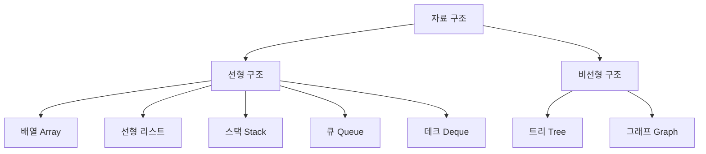
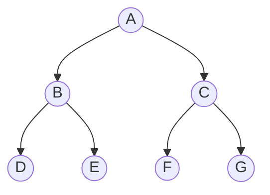
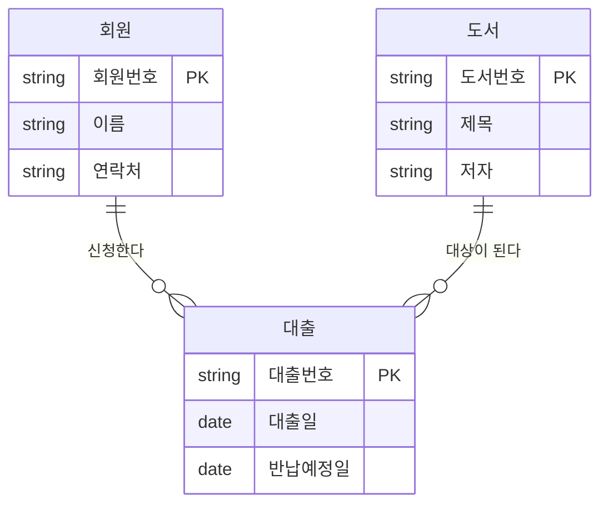
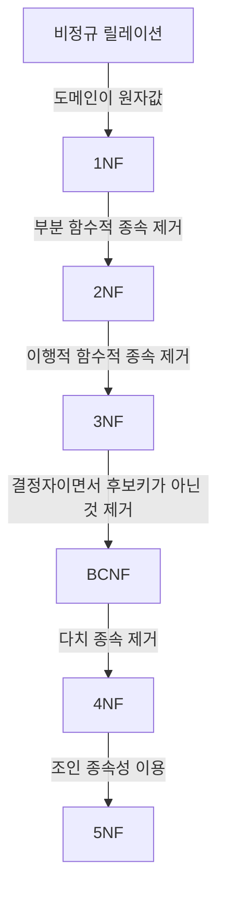
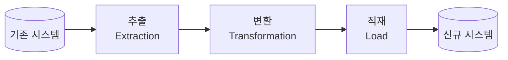

# 정보처리기사 실기 — 02. 데이터 입·출력 구현

> 이 챕터는 **데이터를 어떻게 담고 꺼낼 것인가**를 다룸. 출제기준의 세부항목 순서를 따름.
> 앞부분은 데이터를 담는 그릇 자체(자료 구조 · 트리 · 정렬),
> 가운데는 논리 설계(모델링 → 키·무결성 → 정규화)에서 물리 설계(인덱스·파티션·이중화)로,
> 뒷부분은 그렇게 설계한 곳으로 기존 데이터를 옮기는 일(전환·검증·정제).
>
> 📌 **출제 비중이 가장 높은 곳은 정규화·키·무결성·관계대수**.
> 이 넷은 단답형으로도, 약술형으로도 나옴.

---

## (1) 자료 구조

### 자료 구조(Data Structure)

프로그램에서 사용하기 위한 **자료를 기억 장치의 공간 내에 저장하는 방법**과
자료 간의 **관계, 처리 방법** 등을 연구·분석하는 것.

### 자료 구조의 분류 ⭐



| 구분 | 종류 |
|---|---|
| **선형 구조** | 배열(Array), 선형 리스트(연속·연결 리스트), **스택(Stack)**, **큐(Queue)**, 데크(Deque) |
| **비선형 구조** | **트리(Tree)**, **그래프(Graph)** |

### 주요 자료 구조

| 구조 | 특징 |
|---|---|
| **배열**(Array) | 크기와 형(Type)이 같은 원소들이 **순서대로 나열된** 집합. **첨자**로 접근 |
| **선형 리스트** | **연속 리스트**(배열처럼 연속 저장, 삽입·삭제 시 이동 필요)와 **연결 리스트**(포인터로 연결, 삽입·삭제 용이하나 접근 속도 느림) |
| **스택**(Stack) | **LIFO**(Last In First Out, 후입선출). 삽입 = **Push**, 삭제 = **Pop**. 자료가 없는데 꺼내면 **Underflow**, 공간이 없는데 넣으면 **Overflow** |
| **큐**(Queue) | **FIFO**(First In First Out, 선입선출). **Front** 에서 삭제, **Rear** 에서 삽입 |
| **데크**(Deque) | 양쪽 끝에서 **삽입과 삭제가 모두 가능**한 구조 |
| **그래프**(Graph) | 정점(Vertex)과 간선(Edge)의 집합. **방향/무방향 그래프**로 나뉨 |

**그래프의 최대 간선 수**

| 종류 | 최대 간선 수 |
|---|---|
| **무방향 그래프** | n(n−1) / 2 |
| **방향 그래프** | n(n−1) |

**스택의 응용 분야** — 부프로그램 호출 시 복귀 주소 저장, **재귀 호출**, **후위 표기법(Postfix) 연산**, 인터럽트 처리

---

## (2) 트리와 이진 트리

### 트리(Tree)

정점(Node)과 선분(Branch)을 이용해 사이클을 이루지 않도록 구성한
**비선형 계층 구조**.

### 트리 관련 용어 ⭐

| 용어 | 의미 |
|---|---|
| **노드**(Node) | 트리의 기본 요소 |
| **근 노드**(Root Node) | 트리의 **맨 위에 있는** 노드 |
| **디그리**(Degree, 차수) | **각 노드에서 뻗어 나온 가지의 수** |
| **단말 노드**(Terminal / Leaf) | 자식이 하나도 없는 노드. **디그리가 0** |
| **비단말 노드** | 자식이 하나 이상 있는 노드 |
| **조상 노드** | 임의의 노드에서 **근 노드에 이르는 경로상의** 노드들 |
| **자식 노드** | 어떤 노드에 **연결된 다음 레벨**의 노드들 |
| **부모 노드** | 어떤 노드에 **연결된 이전 레벨**의 노드 |
| **형제 노드**(Sibling) | **같은 부모**를 가진 노드들 |
| **트리의 디그리** | 노드들의 디그리 중 **가장 많은 수** |

### 이진 트리(Binary Tree)

모든 노드의 **차수를 2 이하로 제한**한 트리.

| 종류 | 설명 |
|---|---|
| **정 이진 트리**(Full) | 단말 노드를 제외한 모든 노드의 **차수가 2** |
| **완전 이진 트리**(Complete) | 노드가 **왼쪽부터 빠짐없이 채워진** 트리 |
| **포화 이진 트리**(Perfect) | 모든 레벨이 **완전히 채워진** 트리. 노드 수는 **2^h − 1** |

### 이진 트리의 운행법(순회) ⭐⭐

**Root(D)를 언제 방문하느냐**로 이름이 정해짐. Left = L, Right = R.

| 운행법 | 순서 | 외우는 법 |
|---|---|---|
| **전위 운행**(Preorder) | **D → L → R** | Root 가 **앞**에 |
| **중위 운행**(Inorder) | **L → D → R** | Root 가 **가운데** |
| **후위 운행**(Postorder) | **L → R → D** | Root 가 **뒤**에 |

**예제**



| 운행법 | 결과 |
|---|---|
| 전위(Preorder) | **A B D E C F G** |
| 중위(Inorder) | **D B E A F C G** |
| 후위(Postorder) | **D E B F G C A** |

### 수식의 표기법

| 표기법 | 형태 | 예 (`A + B`) |
|---|---|---|
| **전위**(Prefix) | 연산자 → 피연산자 | **+ A B** |
| **중위**(Infix) | 피연산자 → 연산자 → 피연산자 | **A + B** |
| **후위**(Postfix) | 피연산자 → 연산자 | **A B +** |

---

## (3) 정렬(Sort)

### 정렬

자료를 특정 기준에 따라 **순서대로 나열하는 것**.

### 주요 정렬 알고리즘 ⭐⭐

| 정렬 | 방식 | 평균 시간 복잡도 | 최악 시간 복잡도 |
|---|---|---|---|
| **삽입 정렬**<br>(Insertion Sort) | 이미 정렬된 부분에 **새 자료의 위치를 찾아 삽입** | O(n²) | O(n²) |
| **선택 정렬**<br>(Selection Sort) | n 개 중 **최솟값을 찾아 첫 번째와 교환**하는 과정을 반복 | O(n²) | O(n²) |
| **버블 정렬**<br>(Bubble Sort) | **인접한 두 원소를 비교해 교환**하는 과정을 반복 | O(n²) | O(n²) |
| **쉘 정렬**<br>(Shell Sort) | 삽입 정렬을 개선. **일정한 간격(Gap)** 으로 나눠 정렬 | O(n^1.5) | O(n²) |
| **퀵 정렬**<br>(Quick Sort) | **피벗(Pivot)** 을 기준으로 분할해 정렬. **분할 정복** | **O(n log₂n)** | O(n²) |
| **힙 정렬**<br>(Heap Sort) | **완전 이진 트리(힙)** 를 이용 | **O(n log₂n)** | **O(n log₂n)** |
| **합병 정렬**<br>(Merge Sort) | 자료를 **반씩 나눈 뒤 정렬하며 합병** | **O(n log₂n)** | **O(n log₂n)** |
| **기수 정렬**<br>(Radix Sort) | **자릿수를 기준**으로 버킷에 분배해 정렬 | O(dn) | O(dn) |

> ⚠️ **퀵 정렬은 평균 O(n log₂n) 이지만 최악은 O(n²)**. 이 대비가 자주 나옴.
> 💡 **항상 O(n log₂n)** 인 것은 **힙 정렬과 합병 정렬** 둘뿐.

### 검색 알고리즘

| 검색 | 설명 | 시간 복잡도 |
|---|---|---|
| **선형 검색**(Linear) | 처음부터 **순차적으로** 비교 | O(n) |
| **이진 검색**(Binary) | **정렬된** 자료를 반씩 나눠 비교 | O(log₂n) |

**이진 검색의 중간 위치** = (초기 위치 + 최종 위치) ÷ 2 (소수점 이하 버림)

### 해싱(Hashing)

**해시 함수**를 이용해 키 값으로부터 레코드가 저장될 주소를 **직접 계산**하는 방식.

| 용어 | 의미 |
|---|---|
| **버킷**(Bucket) | 하나의 주소를 갖는 파일의 한 구역. 여러 개의 슬롯으로 구성 |
| **슬롯**(Slot) | 한 개의 레코드를 저장할 수 있는 공간 |
| **충돌**(Collision) | 서로 다른 키가 **같은 주소로 계산**되는 현상 |
| **동의어**(Synonym) | 충돌이 발생한 **키들의 집합** |
| **오버플로**(Overflow) | 버킷에 **더 이상 빈 슬롯이 없는** 상태 |

**해시 함수의 종류** — 제산법(Division), 제곱법(Mid-Square), 폴딩법(Folding),
기수 변환법(Radix), 대수적 코딩법, 계수 분석법(Digit Analysis), 무작위법(Random)

---

## (4) 데이터베이스 개요

### 데이터베이스(Database)

특정 조직의 여러 사용자가 **공동으로 사용할 수 있도록 통합해 저장한 운영 데이터의 집합**.

**네 가지 정의** ⭐

| 정의 | 의미 |
|---|---|
| **통합된 데이터**<br>(Integrated Data) | 자료의 **중복을 배제**한 데이터의 모임 |
| **저장된 데이터**<br>(Stored Data) | 컴퓨터가 접근할 수 있는 **저장 매체에 저장**된 자료 |
| **운영 데이터**<br>(Operational Data) | 조직의 **고유 기능을 수행하는 데 없어서는 안 될** 자료 |
| **공용 데이터**<br>(Shared Data) | **여러 응용 시스템이 공동으로 소유하고 유지**하는 자료 |

### 데이터베이스의 특징 ⭐

| 특징 | 의미 |
|---|---|
| **실시간 접근성**<br>(Real-Time Accessibility) | 수시적이고 비정형적인 질의에 대해 **실시간으로 응답** |
| **계속적인 변화**<br>(Continuous Evolution) | 삽입·삭제·갱신으로 **항상 최신 데이터를 유지** |
| **동시 공용**<br>(Concurrent Sharing) | 여러 사용자가 **동시에 같은 데이터를 이용** |
| **내용에 의한 참조**<br>(Content Reference) | 데이터의 **위치나 주소가 아니라 내용으로** 참조 |

### DBMS(DataBase Management System)

사용자와 데이터베이스 사이에서 사용자의 요구에 따라 정보를 만들어 주고
데이터베이스를 관리해 주는 소프트웨어. 파일 시스템의 **데이터 종속성·중복성** 문제를 풀기 위해 나옴.

**필수 기능 3가지** ⭐⭐

| 기능 | 내용 |
|---|---|
| **정의**(Definition) | 데이터의 **형(Type)과 구조**, 데이터가 DB에 저장될 때의 **제약 조건**을 명시 |
| **조작**(Manipulation) | 데이터 **검색·갱신·삽입·삭제**를 체계적으로 처리하기 위한 **인터페이스 수단**을 제공 |
| **제어**(Control) | 데이터의 **무결성, 보안, 권한 검사, 병행 제어**를 담당 |

> 📌 암기: **"정의하고 조작하고 제어한다."**

**장점과 단점**

| 장점 | 단점 |
|---|---|
| 데이터 **중복 및 종속성 최소화** | 데이터베이스 **전문가 부족** |
| 데이터의 **일관성·무결성 유지** | 전산화 비용 증가 |
| **보안 유지**, 데이터 **표준화** | 대용량 디스크로의 **집중적인 접근으로 과부하 발생** |
| 데이터의 **논리적·물리적 독립성** | 파일의 **예비(Backup)와 회복(Recovery)이 어려움** |
| 실시간 처리 가능 | 시스템이 **복잡함** |

### 스키마(Schema)

데이터베이스의 **구조와 제약 조건에 관한 전반적인 명세**를 기술한 것.

| 스키마 | 관점 | 내용 |
|---|---|---|
| **외부 스키마**<br>(External Schema) | **사용자·응용 프로그래머** | 개인의 입장에서 필요로 하는 DB의 **논리적 구조**. **서브 스키마**라고도 하며 여러 개 존재 |
| **개념 스키마**<br>(Conceptual Schema) | **기관·조직 전체** | DB의 **전체적인 논리 구조**. **단 하나만** 존재. 그냥 '스키마'라고 하면 이것을 뜻함 |
| **내부 스키마**<br>(Internal Schema) | **저장 장치** | **물리적 저장 장치 입장**에서 본 DB 구조. 실제 저장될 레코드의 형식, 순서, 접근 경로 등 |

> 💡 **외부는 여럿, 개념은 하나, 내부는 하나.** 개념 스키마가 유일하다는 점이 자주 나옴.

---

## (5) 데이터베이스 설계

### 설계 순서 ⭐⭐


| 단계 | 하는 일 | 산출물 |
|---|---|---|
| **요구 조건 분석** | 사용자의 요구 조건을 수집·분석해 **요구 조건 명세서** 작성 | 요구 조건 명세서 |
| **개념적 설계**<br>(정보 모델링, 개념화) | 현실 세계를 **정보 구조로 추상화**. 트랜잭션 모델링을 병행 | **E-R 다이어그램**, 개념 스키마 |
| **논리적 설계**<br>(데이터 모델링) | 개념 세계의 데이터를 **DBMS가 지원하는 논리적 자료 구조로 변환** | **테이블(관계) 스키마**, 논리 스키마 |
| **물리적 설계**<br>(데이터 구조화) | 논리 구조를 **저장 장치에 저장할 물리적 구조로 변환** | 물리 스키마, 저장 레코드 형식 |
| **구현** | DDL 로 DB 를 생성하고 트랜잭션을 작성 | 실제 데이터베이스 |

> 📌 암기: **"요구를 분석하고 개념·논리·물리로 설계한 뒤 구현한다."**

**물리적 설계에서 고려할 사항** — **반응 시간(Response Time)**, **공간 활용도(Space Utilization)**,
**트랜잭션 처리량(Transaction Throughput)**

---

## (6) 데이터 모델의 개념

### 데이터 모델(Data Model)

현실 세계의 정보를 컴퓨터에 표현하기 위해 **단순화·추상화해 체계적으로 표현한 개념적 모형**.

**구성 요소 3가지** ⭐⭐

| 요소 | 의미 |
|---|---|
| **구조**(Structure) | 논리적으로 표현된 **개체 타입 간의 관계**. 데이터 구조 및 정적 성질을 표현 |
| **연산**(Operation) | DB 에 저장된 실제 데이터를 **처리하는 작업에 대한 명세**. DB 를 조작하는 기본 도구 |
| **제약 조건**(Constraint) | DB 에 저장될 수 있는 **실제 데이터의 논리적인 제약 조건** |

> 📌 암기: **"구조·연산·제약조건"** — 세 글자로 **"구연제"**.

### 데이터 모델의 종류

| 종류 | 단계 | 내용 |
|---|---|---|
| **개념적 데이터 모델** | 개념적 설계 | 현실 세계의 인간이 이해할 수 있는 정보 구조로 **모델링**. 대표적으로 **E-R 모델** |
| **논리적 데이터 모델** | 논리적 설계 | 개념적 구조를 **DBMS 가 지원하는 논리적 자료 구조로 변환**. 관계·계층·네트워크 모델 |

**논리적 데이터 모델의 종류** ⭐

| 모델 | 구조 |
|---|---|
| **관계형 데이터 모델**<br>(Relational) | **2차원 표(테이블)** 형태. 상호 관계를 **기본키와 외래키**로 표현 |
| **계층형 데이터 모델**<br>(Hierarchical) | **트리(Tree)** 구조. **1:N 관계**만 가능하며 **개체 간 사이클 불가** |
| **네트워크형 데이터 모델**<br>(Network) | **그래프(망)** 구조. **N:M 관계** 표현 가능. **CODASYL DBTG 모델**이라고도 함 |

---

## (7) 데이터 모델의 구성 요소

| 요소 | 의미 |
|---|---|
| **개체**(Entity) | 데이터베이스에 표현하려는 것으로, 서로 구별되는 **하나하나의 대상**. 파일 시스템의 **레코드**에 대응 |
| **속성**(Attribute) | 데이터의 **가장 작은 논리적 단위**. 개체를 구성하는 항목. 파일 시스템의 **필드**에 대응 |
| **관계**(Relationship) | 개체와 개체 사이의 **연관성** |

### 개체(Entity)

- 실세계에 **독립적으로 존재**하는 유형·무형의 정보 대상
- 하나 이상의 **속성으로 구성**됨
- 다른 개체와 하나 이상의 **관계**를 가짐

### 속성(Attribute)

**속성의 분류** ⭐

| 기준 | 종류 | 설명 |
|---|---|---|
| **특성** | **기본 속성** | 업무 분석을 통해 **원래 갖고 있는** 속성 |
| | **설계 속성** | 원래는 없었으나 설계 과정에서 **업무를 규칙화하려고 새로 만든** 속성 |
| | **파생 속성** | **다른 속성으로부터 계산·변형되어 생성**되는 속성 (가급적 적게 정의) |
| **개수** | **단일 속성** | 하나의 의미로만 구성된 속성 (예: 회원번호) |
| | **복합 속성** | **여러 의미가 합쳐진** 속성 (예: 주소 → 시·구·동) |
| | **다중값 속성** | 속성에 **여러 개의 값**이 들어갈 수 있는 속성 |
| **개체 구성** | **기본키 속성** | 개체를 **유일하게 식별**할 수 있는 속성 |
| | **외래키 속성** | 다른 개체와의 **관계에서 포함된** 속성 |
| | **일반 속성** | 개체에 속해 있고 기본키·외래키가 **아닌** 속성 |

### 관계(Relationship)

| 관계 | 의미 |
|---|---|
| **일대일(1:1)** | 개체 A 하나가 개체 B 하나에 대응 |
| **일대다(1:N)** | 개체 A 하나가 개체 B 여럿에 대응 |
| **다대다(N:M)** | 개체 A 여럿이 개체 B 여럿에 대응 |

---

## (8) 식별자(Identifier)

### 식별자

여러 개의 집합체를 담고 있는 관계형 데이터베이스에서
**각각의 구성원(개체)을 유일하게 구분할 수 있는 논리적인 이름**.

### 식별자의 분류 ⭐⭐

| 기준 | 종류 | 설명 |
|---|---|---|
| **대표성** | **주 식별자**(Primary Identifier) | 개체를 대표하는 식별자. **유일성과 최소성**을 만족하며 **타 개체와 참조 관계로 연결**될 수 있음 |
| | **보조 식별자**(Alternate Identifier) | 개체를 **식별할 수는 있지만 대표성을 갖지 못해** 참조 관계로 연결되지 못함 |
| **스스로 생성 여부** | **내부 식별자**(Internal Identifier) | 개체 **내에서 스스로 만들어지는** 식별자 |
| | **외부 식별자**(Foreign Identifier) | **다른 개체와의 관계로 인해 만들어지는** 식별자 |
| **속성 수** | **단일 식별자**(Single Identifier) | **하나의 속성**으로 구성된 식별자 |
| | **복합 식별자**(Composite Identifier) | **둘 이상의 속성**으로 구성된 식별자 |
| **대체 여부** | **원조 식별자**(Original Identifier) | 업무에 의해 **자연적으로 만들어지는** 식별자. **본질 식별자**라고도 함 |
| | **대리 식별자**(Surrogate Identifier) | 주 식별자가 복잡할 때 **인위적으로 만든** 식별자. **인조 식별자**라고도 함 |

> 💡 **주 식별자의 조건** — ① 유일성 ② 최소성 ③ **불변성**(값이 자주 바뀌지 않을 것) ④ **존재성**(NULL 불가)

---

## (9) E-R(개체-관계) 모델

### E-R 모델(Entity-Relationship Model)

개념적 데이터 모델의 대표 격으로, 현실 세계를 **개체(Entity)** 와 **관계(Relationship)** 로 표현한 모델.

- **1976년 피터 첸(Peter Chen)** 이 제안.
- 특정 DBMS 를 고려한 것이 **아님**.
- 개체 타입과 관계 타입을 이용해 현실 세계를 표현.
- 표기법으로 **E-R 다이어그램**을 사용.

### E-R 다이어그램 표기법 ⭐⭐

| 기호 | 의미 |
|:---:|---|
| **사각형 □** | **개체(Entity) 타입** |
| **마름모 ◇** | **관계(Relationship) 타입** |
| **타원 ○** | **속성(Attribute)** |
| **이중 타원 ◎** | **다중값 속성**(복합 속성) |
| **밑줄 친 타원** | **기본키 속성** |
| **선 —** | 개체 타입과 속성을 연결 |
| **이중 마름모** | **의존 관계** (약한 개체와의 관계) |
| **이중 사각형** | **약한 개체 타입** |

> ⚠️ 기호와 의미를 **짝지어 쓰는 단답형**으로 자주 나옴. 특히 **마름모=관계**, **타원=속성**.

**예제 — 도서관 대출**



---

## (10) 관계형 데이터베이스의 구조

### 관계형 데이터베이스

**2차원 표(Table)** 를 이용해 데이터를 정의하고 설명한 데이터베이스.
**1970년 코드(E. F. Codd)** 가 제안.

- 개체와 관계를 모두 **릴레이션**이라는 표로 표현.
- 구조가 단순하고 사용이 편리함.
- 다른 데이터베이스로 **변환이 용이**함.
- 단점은 **성능이 다소 떨어질 수 있다**는 점.

### 릴레이션의 구조 ⭐⭐

```
              ← 속성(Attribute) = 열(Column) = 필드 →
          ┌──────────┬──────────┬──────────┬──────────┐
  스키마   │  회원번호  │   이름    │   등급    │  가입일   │  ← 릴레이션 스키마
          ├──────────┼──────────┼──────────┼──────────┤
    ↑     │  M001    │  김하늘   │   일반    │ 2024-03  │  ← 튜플(Tuple) = 행(Row) = 레코드
  인스턴스 │  M002    │  이바다   │   우수    │ 2024-05  │
    ↓     │  M003    │  박구름   │   일반    │ 2025-01  │
          └──────────┴──────────┴──────────┴──────────┘
             ↑ 도메인(Domain) : 각 속성이 가질 수 있는 값의 집합
```

| 용어 | 의미 | 같은 말 |
|---|---|---|
| **튜플**(Tuple) | 릴레이션을 구성하는 각각의 **행** | 레코드, 행(Row) |
| **속성**(Attribute) | 릴레이션을 구성하는 각각의 **열**. 데이터베이스를 구성하는 **가장 작은 논리적 단위** | 필드, 열(Column) |
| **도메인**(Domain) | 하나의 속성이 취할 수 있는 **같은 타입의 원자값들의 집합** | – |
| **릴레이션 스키마** | 릴레이션의 **구조**(속성 이름들). **내포(Intension)** 라고도 함 | – |
| **릴레이션 인스턴스** | 어느 시점의 **실제 값(튜플)들**. **외연(Extension)** 이라고도 함 | – |

| 개수 용어 | 의미 |
|---|---|
| **차수**(Degree) | **속성(열)의 개수** |
| **카디널리티**(Cardinality) | **튜플(행)의 개수**. **기수**라고도 함 |

> ⚠️ **차수 = 열 개수, 카디널리티 = 행 개수.** 위 표는 차수 4, 카디널리티 3.

### 릴레이션의 특징 ⭐

| 특징 | 의미 |
|---|---|
| **튜플의 유일성** | 한 릴레이션에 **같은 튜플이 존재할 수 없음** |
| **튜플의 무순서성** | 한 릴레이션에서 **튜플 사이의 순서는 의미가 없음** |
| **속성의 무순서성** | 한 릴레이션에서 **속성 사이의 순서는 의미가 없음** |
| **속성의 원자성** | 속성값은 **원자값(더 이상 분해할 수 없는 값)** 만 가짐 |

---

## (11) 키(Key)

### 키

데이터베이스에서 조건에 맞는 **튜플을 찾거나 순서대로 정렬할 때 기준이 되는 속성**.

### 키의 종류 ⭐⭐

| 키 | 의미 | 조건 |
|---|---|---|
| **후보키**<br>(Candidate Key) | 튜플을 **유일하게 식별**할 수 있는 속성들의 부분집합 | **유일성 + 최소성** |
| **기본키**<br>(Primary Key) | 후보키 중에서 **대표로 선정된** 키 | 유일성 + 최소성 + **NULL 불가** + **중복 불가** |
| **대체키**<br>(Alternate Key) | 후보키 중에서 **기본키를 제외한 나머지** 키 | **보조키**라고도 함 |
| **슈퍼키**<br>(Super Key) | 릴레이션 내 속성들의 집합으로 구성된 키 | **유일성 O, 최소성 X** |
| **외래키**<br>(Foreign Key) | 다른 릴레이션의 **기본키를 참조**하는 속성 | 참조 무결성을 지켜야 함 |

> 💡 **유일성과 최소성으로 정리**
> - 슈퍼키 : 유일성만 만족 (최소성 X)
> - 후보키 : 유일성 + 최소성
> - 기본키 : 후보키 중 대표 하나
> - 대체키 : 기본키가 되지 못한 나머지 후보키

| 성질 | 의미 |
|---|---|
| **유일성**(Unique) | 하나의 키 값으로 **하나의 튜플만 식별**할 수 있어야 함 |
| **최소성**(Minimality) | 키를 구성하는 속성이 **꼭 필요한 최소한**이어야 함 |

---

## (12) 무결성(Integrity)

### 무결성

데이터베이스에 저장된 데이터 값과 그것이 표현하는 **현실 세계의 실제값이 일치하는 정확성**.

### 무결성의 종류 ⭐⭐

| 무결성 | 의미 |
|---|---|
| **개체 무결성**<br>(Entity Integrity) | 기본키를 구성하는 속성은 **NULL 값이나 중복값을 가질 수 없음** |
| **참조 무결성**<br>(Referential Integrity) | 외래키 값은 **NULL 이거나 참조 릴레이션의 기본키 값과 같아야 함** |
| **도메인 무결성**<br>(Domain Integrity) | 속성의 값은 **정의된 도메인에 속한 값**이어야 함 |
| **사용자 정의 무결성** | 속성 값들이 **사용자가 정의한 제약 조건**에 만족해야 함 |
| **NULL 무결성** | 특정 속성 값에 **NULL 이 올 수 없다**는 조건이 주어지면 이를 지켜야 함 |
| **고유 무결성** | 특정 속성에 대해 **값이 서로 달라야 한다**는 조건이 주어지면 이를 지켜야 함 |
| **키 무결성** | 한 릴레이션에는 **최소한 하나의 키**가 존재해야 함 |
| **관계 무결성** | 튜플의 삽입 가능 여부, 릴레이션 간 관계에 대한 적절성 여부를 지정 |

> ⚠️ **개체 무결성 = 기본키 / 참조 무결성 = 외래키.** 이 대응이 핵심.

---

## (13) 관계대수와 관계해석

### 관계대수(Relational Algebra)

원하는 정보와 그 정보를 **어떻게(How) 얻을 것인지**를 기술하는 **절차적 언어**.

### 순수 관계 연산자 ⭐⭐

| 연산자 | 기호 | 의미 |
|---|:---:|---|
| **Select** | **σ**(시그마) | 릴레이션에서 **조건에 맞는 튜플(행)** 을 추출. **수평 연산** |
| **Project** | **π**(파이) | 릴레이션에서 **속성(열)** 을 추출. **수직 연산** (중복 제거) |
| **Join** | **⋈**(보타이) | **공통 속성을 이용해 두 릴레이션을 합쳐** 새 릴레이션을 만듦 |
| **Division** | **÷** | X ⊃ Y 인 두 릴레이션에서, **Y의 모든 조건을 만족하는** X의 튜플을 반환 |

> 📌 암기: **"셀렉트는 가로(행), 프로젝트는 세로(열)."**

### 일반 집합 연산자 ⭐

| 연산자 | 기호 | 의미 | 카디널리티 |
|---|:---:|---|---|
| **합집합**(UNION) | **∪** | 두 릴레이션의 튜플을 합침 (중복 제거) | 각 릴레이션 카디널리티의 **합보다 크지 않음** |
| **교집합**(INTERSECTION) | **∩** | 두 릴레이션에 **공통으로 있는** 튜플 | 두 릴레이션 중 **작은 쪽보다 크지 않음** |
| **차집합**(DIFFERENCE) | **−** | 첫 릴레이션에는 있고 두 번째에는 **없는** 튜플 | 첫 릴레이션보다 **크지 않음** |
| **교차곱**(CARTESIAN PRODUCT) | **×** | 두 릴레이션의 **모든 튜플 조합** | 두 카디널리티의 **곱**, 차수는 **합** |

### 관계해석(Relational Calculus)

- **코드(E. F. Codd)** 가 제안한 **비절차적 언어**
- 원하는 정보가 **무엇(What)** 인지만 기술하고, 어떻게 얻는지는 기술하지 않음
- **수학의 술어 해석(Predicate Calculus)** 에 기반함
- **튜플 관계해석**과 **도메인 관계해석**으로 구분됨

> 💡 **관계대수 = 절차적(How), 관계해석 = 비절차적(What).** 표현 능력은 동등함.

---

## (14) 이상과 함수적 종속

### 이상(Anomaly)

테이블에서 일부 속성들의 **종속으로 인해 데이터의 중복이 발생**하고,
이 중복 때문에 테이블 조작 시 **불합리한 현상**이 생기는 것.

| 이상 | 의미 |
|---|---|
| **삽입 이상**<br>(Insertion Anomaly) | 테이블에 데이터를 삽입할 때 **원하지 않는 값들도 함께 삽입**되는 현상 |
| **삭제 이상**<br>(Deletion Anomaly) | 한 튜플을 삭제할 때 **삭제하고 싶지 않은 값까지 함께 삭제**되는 연쇄 삭제 현상 |
| **갱신 이상**<br>(Update Anomaly) | 일부 튜플의 값만 갱신되어 **정보에 모순이 생기는** 현상 |

> 📌 암기: **"삽입·삭제·갱신"** 세 가지뿐.

### 함수적 종속(Functional Dependency) ⭐⭐

어떤 릴레이션 R 에서 X 와 Y 를 각각 속성의 부분집합이라고 할 때,
**X 의 값을 알면 Y 의 값을 유일하게 알 수 있는** 경우
"Y 는 X 에 함수적으로 종속되었다"고 하며 **X → Y** 로 표기.

- **X** : 결정자(Determinant)
- **Y** : 종속자(Dependent)

| 종류 | 의미 |
|---|---|
| **완전 함수적 종속** | Y 가 X **전체**에 종속되고, **X 의 어떤 진부분집합에도 종속되지 않는** 경우 |
| **부분 함수적 종속** | Y 가 X 의 **일부분(진부분집합)에만 종속**되는 경우 |
| **이행적 함수적 종속** | X → Y 이고 Y → Z 일 때 **X → Z** 가 성립하는 경우 |

**예시** — `(학번, 과목코드) → 성적` 에서
- `성적` 은 `(학번, 과목코드)` 전체가 있어야 결정됨 → **완전 함수적 종속**
- `학생이름` 은 `학번` 만 알아도 결정됨 → **부분 함수적 종속**

---

## (15) 정규화(Normalization)

### 정규화

테이블의 속성들이 **상호 종속적인 관계를 갖는 특성을 이용**해,
테이블을 **무손실 분해**하는 과정.

**목적**

- 데이터 구조의 **안정성 및 무결성 유지**
- **이상(Anomaly) 발생 방지**
- 어떠한 릴레이션이라도 데이터베이스 내에서 **표현 가능하게** 함
- 효과적인 검색 알고리즘 생성 가능
- 데이터 **중복 배제**로 인한 갱신 이상 발생 방지
- 데이터 **삽입 시 릴레이션 재구성의 필요성 감소**

> ⚠️ **정규화를 수행하면 릴레이션이 분해되므로 조인 연산이 많아져 응답 시간이 느려질 수 있음.**

### 정규화 단계 ⭐⭐⭐



| 단계 | 제거 대상 |
|---|---|
| **1NF**(제1정규형) | 모든 도메인이 **원자값**만으로 구성 |
| **2NF**(제2정규형) | **부분 함수적 종속** 제거 (완전 함수적 종속 만족) |
| **3NF**(제3정규형) | **이행적 함수적 종속** 제거 |
| **BCNF**(보이스-코드 정규형) | **결정자이면서 후보키가 아닌 것** 제거 |
| **4NF**(제4정규형) | **다치 종속(다중값 종속)** 제거 |
| **5NF**(제5정규형) | **조인 종속성** 이용 |

> 📌 암기: **"두부이걸다조"**
> **도**메인 원자값 → **부**분적 종속 제거 → **이**행적 종속 제거 → **결**정자 → **다**치 종속 → **조**인 종속

---

## (16) 반정규화(Denormalization)

### 반정규화

시스템의 **성능 향상**과 **개발·운영의 편의성**을 위해
정규화된 데이터 모델을 **의도적으로 통합·중복·분리**하는 과정.

- 정규화의 **역과정**이며 **비정규화**라고도 함.
- 수행하면 시스템의 **성능은 향상되지만**, 데이터의 **일관성·정합성은 저하될 수 있음**.

### 반정규화 방법 ⭐

| 방법 | 세부 기법 |
|---|---|
| **테이블 통합** | 1:1 관계 통합, 1:N 관계 통합, **슈퍼타입/서브타입 통합** |
| **테이블 분할** | **수평 분할**(레코드 단위로 나눔), **수직 분할**(속성 단위로 나눔) |
| **중복 테이블 추가** | **집계 테이블**, **진행 테이블**, **특정 부분만 포함하는 테이블** 추가 |
| **중복 속성 추가** | 조인해서 가져와야 하는 속성을 **미리 해당 테이블에 추가** |

**중복 테이블을 추가하는 경우**

- 여러 테이블에서 데이터를 추출해 사용해야 할 때
- 다른 서버에 저장된 테이블을 이용해야 할 때
- 특정 범위의 데이터만 자주 이용할 때

---

## (17) 시스템 카탈로그

### 시스템 카탈로그(System Catalog)

시스템 그 자체에 관련이 있는 다양한 객체에 관한 정보를 포함하는
**시스템 데이터베이스**.

- 시스템 카탈로그 내의 각 테이블은 **DBMS 가 스스로 생성하고 유지**.
- **데이터 사전(Data Dictionary)** 이라고도 함.
- 저장되는 정보를 **메타 데이터(Meta-Data)** 라고 함.
- 사용자가 **SQL 을 이용해 내용을 검색할 수는 있음**.
- ⚠️ 사용자가 **직접 갱신할 수는 없음**. DBMS 가 자동으로 갱신.

**저장되는 메타 데이터**

- 릴레이션 스키마, 뷰, 인덱스, 사용자, 접근 권한
- 데이터베이스 구조, 무결성 제약 조건
- 통계 정보(테이블 크기, 인덱스 정보 등)

### 데이터 디렉터리(Data Directory)

**데이터 사전에 수록된 데이터에 실제로 접근하는 데 필요한 정보**를 관리하는 시스템.

| 구분 | 시스템 카탈로그(데이터 사전) | 데이터 디렉터리 |
|---|---|---|
| 사용자 접근 | **검색 가능** | **접근 불가** |
| 갱신 주체 | DBMS | DBMS |

---

## (18) 데이터베이스 저장 공간 설계

### 테이블 종류 ⭐

| 테이블 | 내용 |
|---|---|
| **슬림 테이블**<br>(Slim Table) | 인덱스를 생성하지 않은 테이블 |
| **클러스터드 인덱스 테이블** | **기본키를 기준으로 데이터가 물리적으로 정렬**된 테이블. 검색은 빠르나 입력·수정·삭제는 느림 |
| **클러스터드 인덱스가 없는 테이블** | 데이터가 **입력된 순서대로** 저장됨 |
| **파티셔닝 테이블** | 대용량 테이블을 **여러 개의 논리적 단위로 나눈** 테이블 |
| **외부 테이블**<br>(External Table) | **데이터베이스 외부의 파일**을 마치 테이블처럼 이용하는 것. 데이터 웨어하우스나 ETL 에서 활용 |
| **임시 테이블**<br>(Temporary Table) | **트랜잭션이나 세션 동안만** 존재하는 테이블 |

### 컬럼 설계 시 고려사항

- 자주 사용되는 컬럼을 **앞쪽에 배치**
- **NULL 값이 많은 컬럼은 뒤쪽에 배치**
- 가변 길이 컬럼은 뒤쪽에 배치

---

## (19) 트랜잭션 분석과 CRUD 분석

### 트랜잭션(Transaction)

데이터베이스의 상태를 변환시키는 **하나의 논리적 기능을 수행하기 위한 작업의 단위**,
또는 **한꺼번에 모두 수행되어야 할 일련의 연산들**.

### 트랜잭션의 특성(ACID) ⭐⭐

| 특성 | 의미 |
|---|---|
| **원자성**<br>(Atomicity) | 트랜잭션의 연산은 **모두 반영되도록 완료되든지, 전혀 반영되지 않도록 복구**되어야 함 |
| **일관성**<br>(Consistency) | 트랜잭션이 성공적으로 완료된 후에도 **일관성 있는 데이터베이스 상태로 변환**되어야 함 |
| **독립성 / 격리성**<br>(Isolation) | 둘 이상의 트랜잭션이 동시에 실행될 때, **다른 트랜잭션의 연산이 끼어들 수 없음** |
| **영속성 / 지속성**<br>(Durability) | 성공적으로 완료된 트랜잭션의 결과는 **영구적으로 반영**되어야 함 |

> 📌 암기: **"원일독영"** (원자성·일관성·독립성·영속성) = **ACID**

### CRUD 분석

프로세스와 테이블 간에 **CRUD 매트릭스**를 만들어
프로세스의 **트랜잭션이 테이블에 발생시키는 변화를 분석**하는 것.

| 표기 | 의미 |
|:---:|---|
| **C** | Create (생성) |
| **R** | Read (읽기) |
| **U** | Update (갱신) |
| **D** | Delete (삭제) |

**CRUD 매트릭스 예시**

| 프로세스 \ 테이블 | 회원 | 도서 | 대출 |
|---|:---:|:---:|:---:|
| 회원 가입 | **C** | | |
| 도서 검색 | | **R** | |
| 대출 신청 | R | RU | **C** |
| 반납 처리 | U | U | **UD** |

> 💡 하나의 셀에 여러 값이 들어가면 **우선순위는 C > D > U > R** 순으로 표기.

---

## (20) 인덱스(Index)

### 인덱스

데이터 레코드를 빠르게 접근하기 위해
**<키 값, 포인터>** 쌍으로 구성되는 데이터 구조.

- 레코드가 저장된 **물리적 구조에 접근하는 방법을 제공**.
- 검색 속도를 향상시키지만, **삽입·삭제·갱신 시에는 인덱스도 갱신해야 하므로 느려질 수 있음**.
- 기본키는 자동으로 인덱스가 생성됨.

### 인덱스의 종류 ⭐

| 종류 | 설명 |
|---|---|
| **트리 기반 인덱스** | 인덱스를 **트리 구조**로 구성. **B 트리 인덱스**가 대표적 |
| **비트맵 인덱스** | 인덱스 컬럼의 데이터를 **비트 값 0 또는 1** 로 변환해 저장. **분포도가 좋은(값 종류가 적은) 컬럼**에 적합 |
| **함수 기반 인덱스** | 컬럼 값 대신 **컬럼에 특정 함수나 수식을 적용해** 만든 인덱스 |
| **비트맵 조인 인덱스** | 다수의 조인된 객체로 구성된 **단일 객체에 대해** 만든 인덱스 |
| **도메인 인덱스** | 개발자가 **직접 만들어 사용하는** 인덱스 |

**B 트리 인덱스**

- 가장 일반적인 인덱스. **루트 노드 → 브랜치 노드 → 리프 노드** 구조
- 리프 노드에 **키와 레코드 주소(ROWID)** 가 저장됨
- **동등 조건(=)** 과 **범위 조건(BETWEEN, >, <)** 검색 모두에 적합

---

## (21) 뷰와 클러스터

### 뷰(View)

하나 이상의 기본 테이블로부터 유도되는 **가상 테이블(논리 테이블)**.

**특징** ⭐

- **물리적으로 구현되어 있지 않음**. 필요할 때마다 정의를 참조해 만들어짐.
- 데이터의 **논리적 독립성**을 제공.
- 사용자의 데이터 관리를 **간단하게** 해 줌.
- 접근 제어를 통한 **자동 보안**이 제공됨.
- 기본 테이블처럼 **DDL 로 정의**하고, 조작도 기본 테이블과 유사함.
- 뷰가 정의된 **기본 테이블이 제거되면 뷰도 자동으로 제거**됨.

**단점**

- **독립적인 인덱스를 가질 수 없음**
- **정의를 변경할 수 없음** (변경하려면 삭제 후 재생성)
- **삽입·삭제·갱신 연산에 제약**이 따름

### 클러스터(Cluster)

**데이터 저장 시 데이터 액세스 효율을 향상시키기 위해**
같은 성격의 데이터를 **동일한 데이터 블록에 저장**하는 물리적 저장 방법.

- 클러스터링된 테이블은 **데이터 조회 속도는 향상**되지만 **입력·수정·삭제 속도는 저하**됨.
- **분포도가 넓을수록** 유리함. (인덱스는 분포도가 좁을 때 유리)
- 처리 범위가 넓은 경우 **단일 테이블 클러스터링**을, 조인이 많은 경우 **다중 테이블 클러스터링**을 사용.

> 💡 **인덱스 vs 클러스터** — 인덱스는 **분포도가 좁을 때**, 클러스터는 **분포도가 넓을 때** 효과적.

---

## (22) 파티션(Partition)

### 파티션

대용량의 테이블이나 인덱스를 **작은 논리적 단위인 파티션으로 나누는 것**.

**장점**

- 데이터 접근 시 **엑세스 범위를 줄여** 쿼리 성능이 향상됨
- 파티션별로 **독립적으로 백업·복구**가 가능함
- 디스크 **I/O 성능이 향상**됨
- 파티션 단위로 **입출력을 분산**할 수 있음

**단점**

- 테이블 간 **조인 비용이 증가**함
- 용량이 작은 테이블에 파티셔닝을 하면 **성능이 오히려 저하**됨

### 파티션의 종류 ⭐⭐

| 종류 | 기준 |
|---|---|
| **범위 분할**<br>(Range Partitioning) | 지정한 **열의 값을 기준으로 범위**를 나눔 (예: 날짜, 지역) |
| **해시 분할**<br>(Hash Partitioning) | **해시 함수를 적용한 결과 값**에 따라 분할. 특정 파티션에 데이터가 몰리는 것을 방지 |
| **조합 분할**<br>(Composite Partitioning) | **범위 분할 후 해시 함수를 적용**해 다시 분할 |
| **목록 분할**<br>(List Partitioning) | 지정한 열의 값에서 **특정 값을 목록으로 지정**해 분할 |
| **라운드 로빈 분할**<br>(Round Robin Partitioning) | 데이터를 **균등하게 순차적으로** 배분 |

---

## (23) 분산 데이터베이스 설계

### 분산 데이터베이스

**논리적으로는 하나의 시스템**에 속하지만
**물리적으로는 네트워크를 통해 분산된** 여러 개의 데이터베이스.

### 분산 데이터베이스의 목표(투명성) ⭐⭐

| 투명성 | 의미 |
|---|---|
| **위치 투명성**<br>(Location Transparency) | 데이터의 **실제 저장 위치를 알 필요 없이** 논리적인 명칭만으로 접근 |
| **중복 투명성**<br>(Replication Transparency) | 동일 데이터가 **여러 곳에 중복되어 있어도** 사용자는 하나의 데이터처럼 사용 |
| **병행 투명성**<br>(Concurrency Transparency) | 여러 트랜잭션이 **동시에 수행되어도 결과에 이상이 없음** |
| **장애 투명성**<br>(Failure Transparency) | 장애가 발생해도 **트랜잭션을 정확하게 처리**함 |

> 📌 암기: **"위중병장"** (위치·중복·병행·장애)

**장점과 단점**

| 장점 | 단점 |
|---|---|
| 지역 자치성, 점증적 시스템 용량 확장 | DBMS 가 수행할 **기능이 복잡** |
| **신뢰성과 가용성**이 높음 | 데이터베이스 **설계가 어려움** |
| 효용성과 융통성이 높음 | 소프트웨어 **개발 비용이 증가** |
| 빠른 응답 속도와 통신 비용 절감 | **오류의 잠재성이 증대**, 처리 비용 증가 |

---

## (24) 데이터베이스 이중화와 서버 클러스터링

### 데이터베이스 이중화(Replication)

시스템 오류로 인한 데이터베이스 서비스 중단이나 물리적 손상 발생 시
이를 복구하기 위해 **동일한 데이터베이스를 복제해 관리하는 것**.

### 이중화 분류 ⭐

| 종류 | 설명 |
|---|---|
| **Eager 기법** | 트랜잭션 수행 중 **데이터 변경이 발생하면 즉시** 모든 이중화 서버에 반영 |
| **Lazy 기법** | 트랜잭션의 **커밋이 완료된 후** 별도의 트랜잭션으로 이중화 서버에 반영 |

### 이중화 구성 방법

| 구성 | 설명 |
|---|---|
| **활동-대기**<br>(Active-Standby) | 한 DB 가 활성 상태로 서비스하고 있으면 **다른 DB 는 대기**하다가 장애 시 서비스를 이어받음. 구성과 관리가 쉬움 |
| **활동-활동**<br>(Active-Active) | **두 DB 가 모두 서비스**하다가 하나에 장애가 발생하면 다른 DB 가 모두 처리. 부하 분산 효과가 있으나 구성이 복잡 |

### 클러스터링(Clustering)

두 대 이상의 서버를 하나의 서버처럼 운영하는 기술.

| 종류 | 설명 |
|---|---|
| **고가용성 클러스터링**<br>(High Availability) | 하나의 서버에 장애가 발생하면 **다른 서버가 즉시 대체**해 서비스 중단을 방지 |
| **병렬 처리 클러스터링** | 하나의 작업을 **여러 서버가 나눠 처리**해 성능을 향상 |

### RTO / RPO

| 지표 | 의미 |
|---|---|
| **RTO**(Recovery Time Objective) | **목표 복구 시간**. 장애 발생 시점부터 복구까지 허용되는 시간 |
| **RPO**(Recovery Point Objective) | **목표 복구 시점**. 데이터 손실을 감내할 수 있는 시점 |

---

## (25) 데이터베이스 보안

### 데이터베이스 보안

데이터베이스의 일부 또는 전체에 대해 **권한이 없는 사용자가 접근하는 것을 금지**하기 위해
사용되는 기술.

### 암호화 기법 ⭐

| 방식 | 설명 | 알고리즘 |
|---|---|---|
| **개인키 암호 방식**<br>(Private Key, 대칭키) | 동일한 키로 **암호화와 복호화를 모두** 수행. 속도가 빠르지만 **키 관리가 어려움** | DES, AES, SEED, ARIA, RC4 |
| **공개키 암호 방식**<br>(Public Key, 비대칭키) | **암호화 키(공개키)와 복호화 키(비밀키)가 다름**. 키 관리가 쉽지만 속도가 느림 | **RSA**, ECC, Rabin |

**개인키 암호화 기법의 종류**

| 종류 | 설명 |
|---|---|
| **스트림 암호화 방식** | **평문과 같은 길이의 키를 생성해 비트 단위로** 암호화 (RC4, LFSR) |
| **블록 암호화 방식** | 한 번에 **하나의 데이터 블록**을 암호화 (DES, AES, SEED, ARIA, IDEA) |

### 접근통제 ⭐⭐

| 기법 | 의미 |
|---|---|
| **임의 접근통제**<br>(DAC; Discretionary Access Control) | **데이터에 접근하는 사용자의 신원**에 따라 접근 권한을 부여. **데이터 소유자가 권한을 부여**함 |
| **강제 접근통제**<br>(MAC; Mandatory Access Control) | **주체와 객체의 등급(보안 레이블)** 을 비교해 접근 권한을 부여. **제3자(관리자)가 권한을 부여**함 |
| **역할기반 접근통제**<br>(RBAC; Role Based Access Control) | 사용자의 **역할**에 따라 접근 권한을 부여. **중앙 관리자가 권한을 부여**함 |

> 💡 **DAC = 신원, MAC = 등급, RBAC = 역할.** 이 세 단어만 잡으면 됨.

---

## (26) 데이터베이스 백업

### 백업

전산 장비의 장애에 대비해 데이터베이스에 저장된 데이터를 **다른 저장 장치에 저장하는 것**.

### 로그 파일

데이터베이스의 처리 내용이나 이용 상황 등 **상태 변화를 시간의 흐름에 따라 기록한 파일**.
데이터베이스 복구를 위해 필수적.

### 데이터베이스 회복 기법 ⭐⭐

| 기법 | 설명 |
|---|---|
| **로그 기반 회복 기법** | – |
| ├ **지연 갱신 회복 기법**<br>(Deferred Update) | 트랜잭션이 **완료(Commit)될 때까지 변경 내용을 로그에만 기록**하고 DB 에는 반영하지 않음. 장애 발생 시 **로그를 폐기**하면 되므로 **Undo 가 필요 없음** |
| └ **즉각 갱신 회복 기법**<br>(Immediate Update) | 트랜잭션 수행 중 **변경 내용을 즉시 DB 에 반영**. 장애 시 **Undo 와 Redo 모두 필요** |
| **검사점 회복 기법**<br>(Checkpoint) | 트랜잭션 수행 중 **검사점(Checkpoint)** 을 만들어 두고, 장애 발생 시 **검사점 이후의 트랜잭션만** 회복 |
| **그림자 페이징 회복 기법**<br>(Shadow Paging) | 트랜잭션 수행 시 **복제본(그림자 페이지)을 별도로 보관**해 두고, 장애 시 이를 이용해 복구. **로그를 사용하지 않음** |
| **미디어 회복 기법** | 디스크와 같은 **저장 장치의 손상**에 대비해 **덤프(Dump)** 를 이용 |

| 연산 | 의미 |
|---|---|
| **REDO**(재실행) | 로그를 이용해 **트랜잭션을 다시 수행**. 이미 **완료된** 트랜잭션이 대상 |
| **UNDO**(취소) | 로그를 이용해 **변경 내용을 취소**. **완료되지 못한** 트랜잭션이 대상 |

### 백업 종류

| 종류 | 설명 |
|---|---|
| **전체 백업**(Full) | 데이터 **전체**를 백업 |
| **차등 백업**(Differential) | **마지막 전체 백업 이후** 변경된 모든 데이터를 백업 |
| **증분 백업**(Incremental) | **마지막 백업(종류 무관) 이후** 변경된 데이터만 백업 |

---

## (27) 스토리지(Storage)

### 스토리지

단일 디스크로 처리할 수 없는 **대용량의 데이터를 저장하기 위해**
서버와 저장 장치를 연결하는 기술.

### 스토리지의 종류 ⭐⭐

| 종류 | 연결 방식 | 특징 |
|---|---|---|
| **DAS**<br>(Direct Attached Storage) | 서버와 저장 장치를 **전용 케이블로 직접 연결** | - 속도가 빠르고 설치·운영이 쉬움<br>- **다른 서버에서 접근 불가**, 확장성·유연성이 낮음<br>- 소규모 시스템에 적합 |
| **NAS**<br>(Network Attached Storage) | 서버와 저장 장치를 **네트워크(LAN)를 통해 연결** | - **파일 단위**로 데이터 전송<br>- 별도의 파일 서버가 필요 없고 접속 증가 시 성능 저하<br>- 파일 공유가 쉬움 |
| **SAN**<br>(Storage Area Network) | **별도의 광 채널(Fibre Channel) 네트워크**로 연결 | - **블록 단위**로 데이터 전송<br>- DAS 의 속도와 NAS 의 확장성을 모두 가짐<br>- 초기 구축 비용이 높음 |

> 💡 **NAS = 파일 단위, SAN = 블록 단위.** 이 대비가 자주 나옴.

---

## (28) 논리 데이터 모델의 물리 데이터 모델 변환

### 변환 항목 ⭐

| 논리 데이터 모델 | → | 물리 데이터 모델 |
|---|:---:|---|
| **개체**(Entity) | → | **테이블**(Table) |
| **속성**(Attribute) | → | **컬럼**(Column) |
| **주 식별자**(Primary Identifier) | → | **기본키**(Primary Key) |
| **외부 식별자**(Foreign Identifier) | → | **외래키**(Foreign Key) |
| **관계**(Relationship) | → | **관계**(Relationship) |

### 슈퍼타입 / 서브타입 변환 방법

| 방법 | 설명 | 적합한 경우 |
|---|---|---|
| **1:1 타입 변환** | 슈퍼타입과 서브타입을 **각각의 테이블로** 변환 | 서브타입에 **속성이 많은** 경우 |
| **슈퍼타입 기준 변환** | 서브타입을 **슈퍼타입에 통합**해 하나의 테이블로 | 서브타입의 **속성이 적은** 경우 |
| **서브타입 기준 변환** | 슈퍼타입 속성을 **서브타입에 추가**해 서브타입별 테이블로 | 서브타입별 **처리가 다른** 경우 |

### 반정규화 수행

성능 향상을 위해 **테이블·속성·관계**에 대해 반정규화를 수행.

---

## (29) 물리 데이터 모델 품질 검토

### 품질 검토

물리 데이터 모델을 **DB 에 반영하기 전에** 오류를 찾아내
**개발 및 운영 단계에서의 문제를 예방**하는 활동.

### 품질 기준 ⭐

| 기준 | 의미 |
|---|---|
| **정확성** | 데이터 모델이 **표기법에 따라 정확하게** 표현되었는가 |
| **완전성** | 데이터 모델의 **구성 요소를 누락 없이** 정의하고 요구사항을 반영했는가 |
| **준거성** | 데이터 **표준, 표준화 규칙 등을 준수**했는가 |
| **최신성** | 데이터 모델이 **현행 시스템의 최신 상태**를 반영하고 있는가 |
| **일관성** | 여러 영역에서 공통으로 사용되는 데이터 요소가 **일관되게 정의**되었는가 |
| **활용성** | 작성된 모델이 **활용도가 높은가**, 설계 변경이 최소화되도록 되어 있는가 |

### CRUD 매트릭스를 이용한 검토

- 모든 테이블에 **CRUD 가 한 번 이상** 나타나는지
- 모든 테이블에 **C 가 한 번 이상** 나타나는지
- 모든 테이블에 **R 이 한 번 이상** 나타나는지
- 모든 프로세스가 **한 개 이상의 테이블에** 접근하는지

---

## (30) 데이터 전환

### 데이터 전환(Data Migration)

기존에 쓰던 정보 시스템에 쌓인 데이터를 **추출(Extraction)** 해
새 시스템이 요구하는 형태로 **변환(Transformation)** 한 뒤 **적재(Loading)** 하는 일련의 과정.

- 영문 머리글자를 따 **ETL(Extraction, Transformation, Load)** 이라 부름.
- **데이터 이행**, **데이터 이관**이라고도 함.



> 📌 암기: **"뽑아서(E) 바꿔서(T) 넣는다(L)."**

### 데이터 전환 계획서

데이터 전환을 어떻게 수행할지 정리한 문서. 아래 항목이 들어감.

| 항목 | 내용 |
|---|---|
| **데이터 전환 개요** | 목표, 대상 범위, 전제 조건, 제약 사항 |
| **데이터 전환 대상 및 범위** | 어떤 시스템의 어떤 데이터를 옮길 것인지 |
| **데이터 전환 환경 구성** | 원천·목적 시스템의 구성, 전환에 쓸 서버와 도구 |
| **데이터 전환 조직 및 역할** | 참여자와 담당 업무 |
| **데이터 전환 일정** | 단계별 수행 일정 |

### 데이터 전환 절차


- **원천 시스템(Source System)** : 데이터를 꺼내 오는 기존 시스템
- **목적 시스템(Target System)** : 데이터를 받아 넣을 새 시스템

---

## (31) 데이터 검증

### 데이터 검증

원천 시스템에서 추출한 데이터가 목적 시스템에 **정확히 반영됐는지 확인**하는 작업.

### 검증 방법 ⭐

**어느 단계에서 보느냐**로 나눔.

| 검증 방법 | 설명 |
|---|---|
| **로그 검증** | 전환 과정에서 생성되는 **추출·전환·적재 로그**를 확인 |
| **기본 항목 검증** | 로그 검증 외에 별도로 **필수 항목**을 정해 검증 |
| **응용 프로그램 검증** | 응용 프로그램을 이용해 데이터 전환의 정합성을 검증 |
| **응용 데이터 검증** | 사전에 정의된 업무 규칙을 기준으로 데이터 정합성을 검증 |
| **값 검증** | 숫자 항목의 **합계 검증**, 데이터 값 **범위 검증** |

### 검증 단계 ⭐

**전환 흐름을 따라가며** 단계마다 검증.

| 단계 | 검증 내용 |
|---|---|
| **추출** | 원천 시스템 데이터 → 추출 데이터 |
| **전환** | 추출 데이터 → 전환 데이터 |
| **DB 적재** | 전환 데이터 → 적재 로그 |
| **DB 적재 후** | 적재 로그 → 목적 시스템 데이터 |
| **전환 완료 후** | 목적 시스템 데이터 → 데이터 전환 결과 |

---

## (32) 오류 데이터 측정 및 정제

### 오류 데이터 측정

데이터 품질 분석을 통해 원천 및 목적 시스템 데이터의 **오류를 측정**하는 작업.


| 구분 | 내용 |
|---|---|
| **데이터 품질 분석** | 원천·목적 시스템 데이터의 **품질을 확인**해 오류 데이터를 찾는 작업 |
| **오류 관리 목록** | 오류 위치, 유형, 심각도 등을 기록한 목록 |
| **오류 데이터 측정** | 오류 관리 목록을 기준으로 **오류 데이터를 세는** 작업 |

### 오류 상태별 분류 ⭐

| 상태 | 의미 |
|---|---|
| **Open** | 오류가 **보고만 되고** 분석되지 않은 상태 |
| **Assigned** | 오류의 영향 분석 및 수정을 위해 **개발자에게 할당**된 상태 |
| **Fixed** | 개발자가 **오류를 수정한** 상태 |
| **Closed** | 수정된 오류에 대해 **재검사를 마쳐 종료**된 상태 |
| **Deferred** | 오류 수정을 **연기**한 상태 |
| **Classified** | 보고된 오류를 **테스트 팀이 검토한 결과 오류가 아니라고 분류**한 상태 |

### 오류 심각도별 분류

**높음 · 보통 · 낮음** 또는 **상 · 중 · 하** 로 나눔.

### 데이터 정제

오류 데이터를 **분석해 원인을 찾고 수정**하는 작업.

- **정제 요청서** : 오류 원인 분석 결과와 정제 방안을 기록한 문서
- **정제 보고서** : 정제 요청서를 근거로 정제 작업을 수행한 결과를 기록한 문서

---

## 📌 부록 — 핵심 암기 요약

| 구분 | 암기 포인트 |
|---|---|
| **데이터 전환 ETL 3단계** | **ETL** — 추출(Extraction) → 변환(Transformation) → 적재(Load) |
| **데이터 전환 오류 상태 변화** | Open → Assigned → Fixed → Closed / Deferred / Classified |
| **DB 정의 — 4가지 데이터** | 통합·저장·운영·공용 데이터 |
| **DB 특징 4가지** | 실시간 접근성 · 계속적인 변화 · 동시 공용 · 내용에 의한 참조 |
| **DBMS 필수 기능 3가지** | **정의 · 조작 · 제어** |
| **스키마 3층** | 외부(여럿) · **개념(하나)** · 내부 |
| **DB 설계 5단계** | 요구 조건 분석 → **개념 → 논리 → 물리** → 구현 |
| **개념적 설계 산출물** | **E-R 다이어그램** |
| **데이터 모델 구성 3요소** | **구조 · 연산 · 제약 조건** |
| **논리적 데이터 모델 3가지** | 관계형(표) · 계층형(트리, 1:N) · 네트워크형(그래프, N:M) |
| **E-R 다이어그램 기호 4가지** | □ 개체 · ◇ 관계 · ○ 속성 · 밑줄 타원 기본키 |
| **릴레이션 차수와 카디널리티** | 차수 = **열 개수**, 카디널리티 = **행 개수** |
| **릴레이션 특징 4가지** | 튜플 유일성 · 튜플 무순서 · 속성 무순서 · 속성 원자성 |
| **키 5종류** | 슈퍼(유일성) → 후보(유일+최소) → 기본(대표) → 대체(나머지) → 외래(참조) |
| **무결성 제약 4가지** | **개체=기본키(NULL 불가)**, **참조=외래키**, 도메인, 사용자 정의 |
| **순수 관계 연산자 4가지** | **σ Select(행)** · **π Project(열)** · ⋈ Join · ÷ Division |
| **관계대수 vs 해석** | 대수 = **절차적(How)**, 해석 = **비절차적(What)** |
| **이상(Anomaly) 3가지** | 삽입 · 삭제 · 갱신 |
| **함수 종속 3가지** | 완전 · 부분 · 이행적 |
| **정규화 단계 6가지** | **두부이걸다조** (도메인원자값·부분제거·이행제거·결정자·다치·조인) |
| **반정규화 방법 3가지** | 테이블 통합/분할 · 중복 테이블 추가 · 중복 속성 추가 |
| **시스템 카탈로그** | 데이터 사전. **검색은 가능, 직접 갱신 불가** |
| **트랜잭션 ACID** | **원자성 · 일관성 · 독립성 · 영속성** |
| **CRUD 우선순위** | **C > D > U > R** |
| **인덱스 vs 클러스터** | 인덱스 = 분포도 **좁을 때**, 클러스터 = 분포도 **넓을 때** |
| **뷰** | 가상 테이블. 인덱스 불가, 정의 변경 불가, 기본 테이블 삭제 시 자동 삭제 |
| **파티션 종류 5가지** | 범위 · 해시 · 조합 · 목록 · 라운드 로빈 |
| **분산 DB 투명성 4가지** | **위중병장** (위치·중복·병행·장애) |
| **DB 이중화 분류** | Eager(즉시) / Lazy(커밋 후) · Active-Standby / Active-Active |
| **접근통제 3가지 기준** | **DAC = 신원**, **MAC = 등급**, **RBAC = 역할** |
| **회복 기법 4가지** | 지연 갱신(Undo 불필요) · 즉각 갱신 · 검사점 · 그림자 페이징(로그 없음) |
| **REDO / UNDO** | REDO = 완료된 트랜잭션 재실행, UNDO = 미완료 트랜잭션 취소 |
| **스토리지 3가지** | **DAS**(직접 연결) · **NAS**(네트워크 연결, 파일 단위) · **SAN**(전용 네트워크, 블록 단위) |
| **논리→물리 변환** | 개체→테이블, 속성→컬럼, 주식별자→기본키, 외부식별자→외래키 |
| **자료 구조 분류** | 선형(배열·리스트·**스택**·**큐**·데크) / 비선형(**트리**·**그래프**) |
| **스택 / 큐** | 스택 = **LIFO**, 큐 = **FIFO** |
| **트리 운행 3가지** | 전위 **DLR** · 중위 **LDR** · 후위 **LRD** |
| **정렬 O(n log n)** | **힙 · 합병** (항상) / **퀵** (평균만, 최악 O(n²)) |
| **해싱 용어 5가지** | 버킷 · 슬롯 · 충돌 · 동의어 · 오버플로 |
