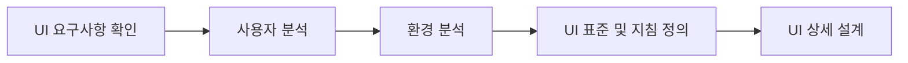
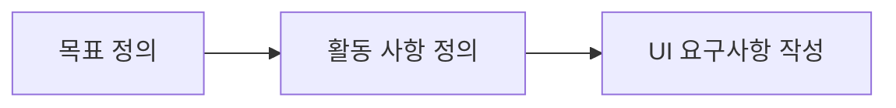

# 정보처리기사 실기 — 06. 화면 설계

> 이 챕터는 **사람이 시스템과 만나는 면**을 다룸.
> 분량은 12단원 중 가장 적지만, **UI 설계 원칙(직관성·유효성·학습성·유연성)** 과
> **품질 요구사항(ISO/IEC 9126)** 은 거의 매번 나옴.
>
> 📌 헷갈리기 쉬운 짝이 셋 있음 — **와이어프레임 vs 목업 vs 프로토타입**,
> **UI vs UX**, **CLI vs GUI vs NUI vs VUI**. 이 셋만 정확히 구분하면 절반은 끝남.

---

## (1) 사용자 인터페이스(UI)

### 사용자 인터페이스(UI; User Interface)

사용자와 시스템 간의 **상호작용이 원활하게 이뤄지도록 도와주는 장치나 소프트웨어**.

**세 가지 분야**

| 분야 | 내용 |
|---|---|
| **정보 제공과 전달을 위한 물리적 제어** | 하드웨어 부분 |
| **콘텐츠의 상세적인 표현과 전체적인 구성** | 디자인 부분 |
| **모든 사용자가 편리하고 간편하게 사용하도록 하는 기능** | 기능 부분 |

### UI 의 특징

- 사용자의 **만족도에 가장 큰 영향을 미치는 요소**로, 소프트웨어 영역 중 **변경이 가장 많이 발생**.
- 사용자의 **편리성과 가독성**을 높여 작업 시간을 단축하고 업무 이해도를 높여 줌.
- 최소한의 노력으로 **원하는 결과를 얻을 수 있게** 함.
- 사용자 중심으로 설계되어 **사용자 중심의 상호작용이 되도록** 해야 함.
- 수행 결과의 **오류를 줄임**.
- 정보 제공자와 공급자 간의 **매개 역할**을 수행.
- UI 를 설계하려면 **소프트웨어 아키텍처를 반드시 숙지**해야 함.

### UI 의 구분 ★★

| 구분 | 설명 |
|---|---|
| **CLI** (Command Line Interface) | **명령과 출력이 텍스트 형태**로 이뤄지는 인터페이스 |
| **GUI** (Graphical User Interface) | **아이콘이나 메뉴를 마우스로 선택**해 작업을 수행하는 그래픽 환경의 인터페이스 |
| **NUI** (Natural User Interface) | 사용자의 **말이나 행동(터치, 제스처)** 으로 조작하는 인터페이스 |
| **VUI** (Voice User Interface) | 사람의 **음성**으로 조작하는 인터페이스 |
| **OUI** (Organic User Interface) | **모든 사물과 사용자 간의 상호작용**을 위한 인터페이스. **입력과 출력이 하나로** 이뤄짐 |

> 💡 **NUI 는 터치·제스처를 포함하는 넓은 개념**, **VUI 는 음성만**을 가리킴.

### UI 의 기본 원칙 ★★★

| 원칙 | 의미 |
|---|---|
| **직관성**(Intuitiveness) | 누구나 **쉽게 이해하고 사용**할 수 있어야 함 |
| **유효성**(Efficiency) | 사용자의 목적을 **정확하고 완벽하게 달성**해야 함 |
| **학습성**(Learnability) | 누구나 **쉽게 배우고 익힐 수** 있어야 함 |
| **유연성**(Flexibility) | 사용자의 **요구사항을 최대한 수용**하고 **실수를 최소화**해야 함 |

> 📌 암기: **"직유학유"** — 직관성 · 유효성 · 학습성 · 유연성

### UI 설계 지침 ★

| 지침 | 내용 |
|---|---|
| **사용자 중심** | 사용자가 **쉽게 이해하고 편리하게 사용**할 수 있는 환경을 제공 |
| **일관성** | 버튼이나 조작 방법을 **일관성 있게** 제공해 쉽게 습득할 수 있게 함 |
| **단순성** | 조작 방법을 단순화해 **인지적 부담을 감소**시킴 |
| **결과 예측 가능** | 작동시킬 기능만 보고도 **결과를 미리 예측**할 수 있어야 함 |
| **가시성** | 주요 기능을 **메인 화면에 배치**해 쉽게 찾을 수 있도록 함 |
| **표준화** | 기능 구조와 디자인을 **표준화**해 쉽게 조작할 수 있도록 함 |
| **접근성** | 사용자의 **연령, 성별, 인종 등 다양한 계층이 사용**할 수 있도록 함 |
| **명확성** | 사용자가 개념적으로 **쉽게 인지**할 수 있어야 함 |
| **오류 발생 해결** | 오류가 발생하면 사용자가 **쉽게 인지**할 수 있도록 표시함 |

---

## (2) UI 표준 및 지침

### UI 표준

**전체 시스템에 포함된 모든 UI 에 공통으로 적용되는** 내용.
화면 구성이나 화면 이동 등이 포함됨.

### UI 지침

UI 개발 과정에서 **꼭 지켜야 할 조건이나 세부 사항**.

### UI 표준 및 지침 작성 순서

### 웹의 3요소

| 요소 | 내용 |
|---|---|
| **웹 표준**(Web Standards) | 웹에서 사용되는 **규칙 또는 기술**. 어떤 브라우저에서도 동일하게 보이도록 함 |
| **웹 접근성**(Web Accessibility) | **장애 여부나 사용 환경에 관계없이** 웹 사이트를 이용할 수 있도록 보장하는 것 |
| **웹 호환성**(Cross Browsing) | 하드웨어나 소프트웨어가 달라도 **동등한 서비스를 제공**하는 것 |

---

## (3) UI 설계 도구

### UI 설계 도구

사용자의 요구사항에 맞게 **UI 의 화면 구조나 화면 배치 등을 설계**할 때 사용하는 도구.
UI 설계 도구로 작성한 결과물은 **개발자가 최종 화면을 개발할 때 참고 자료**로 활용됨.

### 주요 설계 도구 ★★★

| 도구 | 설명 |
|---|---|
| **와이어프레임** (Wireframe) | **기획 단계의 초기**에 제작하는 것으로, **페이지에 대한 개략적인 레이아웃이나 UI 요소 등에 대한 뼈대를 설계**하는 것. 도구 : 손그림, 파워포인트, 키노트, 스케치, 일러스트, 포토샵 등 |
| **목업** (Mockup) | 디자인, 사용 방법 설명, 평가 등을 위해 **실제 화면과 유사하게 만든 정적인 형태의 모형**. **시각적으로만 구현**되며 **실제로 구현되지는 않음**. 도구 : 파워 목업, 발사믹 목업 등 |
| **스토리보드** (Story Board) | 와이어프레임에 **콘텐츠에 대한 설명, 페이지 간 이동 흐름 등을 추가**한 문서. **디자이너와 개발자가 최종적으로 참고하는 작업 지침서**. 도구 : 파워포인트, 키노트, 스케치, axure 등 |
| **프로토타입** (Prototype) | 와이어프레임이나 스토리보드 등에 **인터랙션을 적용**함으로써 실제 구현된 것처럼 **테스트가 가능한 동적인 형태의 모형**. 도구 : HTML/CSS, Axure, Flinto, 카카오 오븐 등 |
| **유스케이스** (Use Case) | 사용자 측면에서의 요구사항으로, 사용자가 원하는 **목표를 달성하기 위해 수행할 내용을 기술**한 것 |

> ⚠️ **가장 자주 나오는 구분**
> - **와이어프레임** : 뼈대만. 초기 단계
> - **목업** : 실제 화면과 유사한 **정적** 모형. 동작 안 함
> - **프로토타입** : **인터랙션이 있는 동적** 모형. 테스트 가능
> - **스토리보드** : 와이어프레임 + 설명 + 화면 이동 흐름 = **최종 작업 지침서**

---

## (4) UI 요구사항 확인

### UI 요구사항 확인

새로 개발할 시스템에 적용할 **UI 관련 요구사항을 조사해 작성**하는 단계.

### 확인 순서

| 단계 | 내용 |
|---|---|
| **목표 정의** | 사용자를 대상으로 **인터뷰를 진행**해 사업적·기술적 요구사항을 정확히 이해. 인터뷰 참여 인원이 많은 경우 **시간과 비용이 낭비**될 수 있음 |
| **활동 사항 정의** | 조사한 요구사항을 토대로 **앞으로 해야 할 활동을 정의**함 |
| **UI 요구사항 작성** | **요구사항 요소를 확인**하고, **정황 시나리오를 작성**한 후 **요구사항을 작성**함 |

### UI 요구사항 작성 세부 단계 ★

| 단계 | 내용 |
|---|---|
| **요구사항 요소 확인** | 데이터 요소, 기능 요소, 제품·서비스의 품질, 제약 사항을 확인 |
| **정황 시나리오 작성** | 사용자의 **요구사항을 도출하기 위한 시나리오**. **가장 기초적인 시나리오**로, 사용자가 목표를 달성하기 위해 수행하는 방법을 순차적으로 표현 |
| **요구사항 작성** | 정황 시나리오를 토대로 **요구사항을 작성** |

**정황 시나리오 작성 원칙**

- 사용자가 언제, 어떻게 제품이나 서비스를 **사용하는지 순서대로** 기술
- 다양한 경우의 수를 고려해 **작성**
- **육하원칙**에 따라 작성
- 간결하고 명확하게 작성

---

## (5) 품질 요구사항

### 품질 요구사항

소프트웨어의 **품질을 측정하는 기준이 되는 요구사항**.

**국제 표준** : **ISO/IEC 9126** (현재는 **ISO/IEC 25010** 으로 개정됨)

### ISO/IEC 9126 의 6가지 품질 특성 ★★★

| 특성 | 의미 | 하위 특성 |
|---|---|---|
| **기능성** (Functionality) | 소프트웨어가 **사용자의 요구사항을 정확하게 만족**하는 기능을 제공하는지 여부 | **적절성, 정밀성, 상호 운용성, 보안성, 준수성** |
| **신뢰성** (Reliability) | 소프트웨어가 요구된 기능을 **오류 없이 수행**하는 정도 | **성숙성, 고장 허용성, 회복성** |
| **사용성** (Usability) | 사용자가 소프트웨어를 **쉽게 배우고 사용**할 수 있는 정도 | **이해성, 학습성, 운용성, 친밀성** |
| **효율성** (Efficiency) | 할당된 시간 동안 **한정된 자원으로 얼마나 빨리 처리**하는지의 정도 | **시간 효율성, 자원 효율성** |
| **유지 보수성** (Maintainability) | 환경의 변화나 새로운 요구사항이 발생했을 때 **소프트웨어를 개선하거나 확장**할 수 있는 정도 | **분석성, 변경성, 안정성, 시험성** |
| **이식성** (Portability) | 소프트웨어가 **다른 환경에서도 얼마나 쉽게 적용**할 수 있는지의 정도 | **적용성, 설치성, 대체성, 공존성** |

> 📌 암기: **"기신사효유이"** (기능성·신뢰성·사용성·효율성·유지보수성·이식성)

**주요 하위 특성**

| 특성 | 의미 |
|---|---|
| **상호 운용성**(Interoperability) | 다른 시스템과 **정보를 교환**할 수 있는 정도 |
| **성숙성**(Maturity) | 결함으로 인한 **고장을 회피**할 수 있는 정도 |
| **고장 허용성**(Fault Tolerance) | 결함이 발생해도 **성능 수준을 유지**할 수 있는 정도 |
| **회복성**(Recoverability) | 고장 후 성능 수준을 **다시 회복**할 수 있는 정도 |
| **친밀성**(Attractiveness) | 사용자가 **다시 사용하고 싶은 정도** |
| **공존성**(Co-existence) | 다른 소프트웨어와 **자원을 공유하며 공존**할 수 있는 정도 |

### 기타 품질 관련 표준 ★

| 표준 | 내용 |
|---|---|
| **ISO/IEC 12119** | **패키지 소프트웨어의 품질 요구사항 및 테스트**에 대한 국제 표준 |
| **ISO/IEC 14598** | 소프트웨어 **품질의 측정과 평가에 필요한 절차**를 규정한 표준. **개발자, 구매자, 평가자별로** 다른 절차를 규정 |
| **ISO/IEC 25000** | 소프트웨어의 **품질 평가 통합 모델** 표준. **9126, 14598, 12119** 를 통합. **SQuaRE** 라고도 함 |

**ISO/IEC 14598 의 특성**

| 특성 | 의미 |
|---|---|
| **반복성**(Repeatability) | 같은 제품을 같은 사양으로 **반복 측정하면 같은 결과**가 나와야 함 |
| **재현성**(Reproducibility) | 다른 평가자가 **같은 사양으로 측정해도 유사한 결과**가 나와야 함 |
| **공정성**(Impartiality) | 평가가 **특정 결과에 편향되지 않아야** 함 |
| **객관성**(Objectivity) | 평가 결과는 **객관적 사실에 근거**해야 함 |

---

## (6) UI 설계

### UI 설계서

UI 화면의 **구성과 흐름 등을 문서로 정리**한 것.

### UI 설계서 작성 순서 ★

| 단계 | 내용 |
|---|---|
| **표지 작성** | 프로젝트 이름과 시스템 이름을 포함해 작성 |
| **개정 이력 작성** | UI 설계서가 **수정될 때마다 어떤 부분이 언제 수정됐는지** 정리. 최초 작성 시 **버전을 1.0** 으로 설정 |
| **요구사항 정의서 작성** | 사용자의 요구사항을 확인하고 **기능에 대한 정의**를 정리 |
| **시스템 구조 작성** | UI 요구사항과 UI 프로토타입에 기초해 **UI 시스템 구조**를 설계 |
| **사이트 맵 작성** | 시스템 구조를 바탕으로 사이트에 표시할 **콘텐츠를 한눈에 볼 수 있도록** 표 형태로 작성 |
| **프로세스 정의서 작성** | 사용자 관점에서 시스템이 처리해야 하는 **프로세스를 순서에 맞춰** 정리 |
| **화면 설계** | UI 프로토타입과 프로세스 정의서를 참고해 **각 페이지별로 화면 설계** |

### UI 상세 설계

UI 설계서를 바탕으로 **실제 구현을 위해 모든 화면에 대해 상세하게 설계**하는 단계.

**반드시 시나리오를 작성해야 함.**

### UI 시나리오 문서 작성 원칙 ★

| 원칙 | 내용 |
|---|---|
| **완전성**(Complete) | 누락되지 않도록 최대한 상세하게 기술 |
| **일관성**(Consistent) | 서비스에 대한 목표, 시스템과 사용자의 요구사항이 **일관성 있게** 기술 |
| **이해성**(Understandable) | 처음 접하는 사람도 **이해하기 쉽도록** 구성 |
| **가독성**(Readable) | **표준화된 템플릿**을 사용해 문서를 쉽게 읽을 수 있도록 함 |
| **수정 용이성**(Modifiable) | 쉽게 **변경**할 수 있어야 함 |
| **추적 용이성**(Traceable) | 변경 사항을 **쉽게 추적**할 수 있어야 함 |

### UI 시나리오 문서의 요건

- 기능 및 화면 간 **이동 흐름**을 파악할 수 있어야 함
- **예외 상황**에 대한 사례를 정의해야 함
- UI 일반 규칙을 지킬 것
- 대표 화면, 공통 적용 규칙, 화면 간 인터랙션 흐름 등을 정의

---

## (7) HCI · UX · 감성공학

### HCI(Human Computer Interaction or Interface) ★

사람이 **시스템을 보다 편리하고 안전하게 사용**할 수 있도록
**연구하고 개발하는 학문**.

- 최종 목표는 **시스템을 사용하는 데 있어 최적의 사용자 경험(UX)을 만드는 것**.
- 인간과 컴퓨터의 **상호작용**에 관한 학문.

### UX(User Experience) ★★

사용자가 시스템이나 서비스를 이용하면서 **느끼고 생각하는 총체적인 경험**.

- 단순히 기능이나 절차상의 만족뿐 아니라 **사용자가 참여, 사용, 관찰하고 상호 교감을 통해서 알 수 있는
  가치 있는 경험**을 말함.
- 기술을 **효용성 측면**에서만 보는 것이 아니라, 사용자의 삶의 **질을 향상시키는 하나의 방향**으로 보는 것.

**UX 의 특징**

| 특징 | 의미 |
|---|---|
| **주관성**(Subjectivity) | 사람들의 **개인적, 신체적, 인지적 특성에 따라 다름** |
| **정황성**(Contextuality) | 경험이 일어나는 **상황 또는 주변 환경에 영향**을 받음 |
| **총체성**(Holistic) | 개인이 느끼는 **총체적인 심리적, 감성적** 결과 |

> ⚠️ **UI vs UX** — **UI 는 사람과 시스템 사이의 상호작용을 돕는 장치나 소프트웨어(수단)**,
> **UX 는 그 UI 를 통해 사용자가 느끼는 총체적 경험(결과)**.
> **UI 는 UX 에 포함되는 개념**.

### 감성공학 ★

인간의 **특성과 감성을 제품 설계에 최대한 반영**시키는 기술.

- 인문사회과학, 공학, 의학 등 여러 분야의 학문이 공존하는 **종합 과학**.
- 인간에 대한 **이해와 공학적인 접근 방법**을 통해 인간이 쉽고 편하며 안전하게 사물을 이용하도록 함.
- **인간의 삶을 편리하고 안전하며 쾌적하게 만드는 데 목적**이 있음.
- **HCI 를 설계에 반영**하기 위해 인간의 특성과 감성을 정량적으로 측정·평가.

**감성공학의 접근 방법** ★

| 유형 | 설명 |
|---|---|
| **1류 접근 방법** | **관련 문화, 감성 어휘 등을 이용해 정성적으로 분석**하고, 이를 제품 설계에 반영하는 방법. **의미 미분법(SD법)** 을 통해 정량화 |
| **2류 접근 방법** | 개인의 **생활 및 인지 특성 등을 분석**해 이를 제품 설계에 반영하는 방법 |
| **3류 접근 방법** | 인간의 **생리적 감각을 측정**해 정량적으로 분석하고, 이를 제품 설계에 반영하는 방법 |

---

## 📌 부록 — 핵심 암기 요약

| 구분 | 암기 포인트 |
|---|---|
| **UI 구분 5가지** | **CLI**(텍스트) · **GUI**(그래픽) · **NUI**(말·행동) · **VUI**(음성) · **OUI**(입출력 일체) |
| **UI 기본 원칙 4가지** | **직유학유** — 직관성 · 유효성 · 학습성 · 유연성 |
| **웹 3요소** | 웹 표준 · 웹 접근성 · 웹 호환성 |
| **와이어프레임** | 기획 초기, **뼈대만** 설계 |
| **목업** | 실제 화면과 유사한 **정적 모형**. 동작 안 함 |
| **프로토타입** | **인터랙션 적용, 동적 모형**. 테스트 가능 |
| **스토리보드** | 와이어프레임 + 설명 + 화면 이동 흐름 = **최종 작업 지침서** |
| **정황 시나리오** | 가장 기초적인 시나리오. **육하원칙**에 따라 작성 |
| **ISO/IEC 9126 품질 특성 6가지** | **기신사효유이** — 기능성·신뢰성·사용성·효율성·유지보수성·이식성 |
| **ISO/IEC 9126 기능성 하위 특성 5가지** | 적절성 · 정밀성 · **상호 운용성** · 보안성 · 준수성 |
| **ISO/IEC 9126 신뢰성 하위 특성 3가지** | **성숙성 · 고장 허용성 · 회복성** |
| **ISO/IEC 12119** | **패키지 소프트웨어** 품질 요구사항 및 테스트 |
| **ISO/IEC 14598** | 품질 **측정·평가 절차**. 반복성·재현성·공정성·객관성 |
| **ISO/IEC 25000** | **SQuaRE**. 9126 + 14598 + 12119 **통합** |
| **UI 설계서 구성 순서** | 표지 → 개정 이력 → 요구사항 정의서 → 시스템 구조 → 사이트 맵 → 프로세스 정의서 → 화면 설계 |
| **UI 시나리오 작성 원칙 6가지** | 완전성 · 일관성 · 이해성 · 가독성 · 수정 용이성 · 추적 용이성 |
| **HCI** | 사람이 시스템을 편리·안전하게 쓰도록 연구하는 학문. 목표는 **최적의 UX** |
| **UX 특징 3가지** | **주관성 · 정황성 · 총체성** |
| **UI vs UX** | UI = **수단(장치·소프트웨어)**, UX = **총체적 경험**. **UI ⊂ UX** |
| **감성공학 접근 방법 3가지** | 1류(정성적, **SD법**) · 2류(생활·인지 특성) · 3류(**생리적 감각 측정**) |
