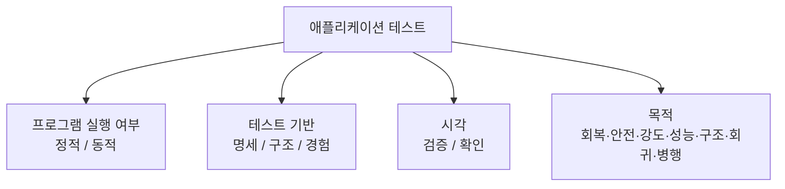
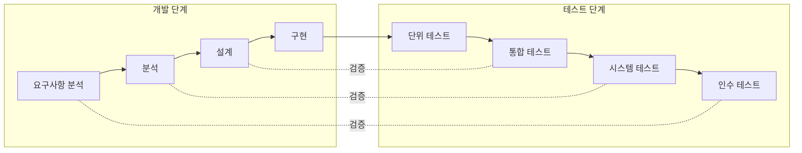
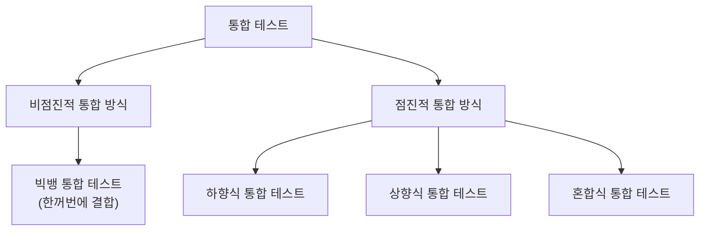
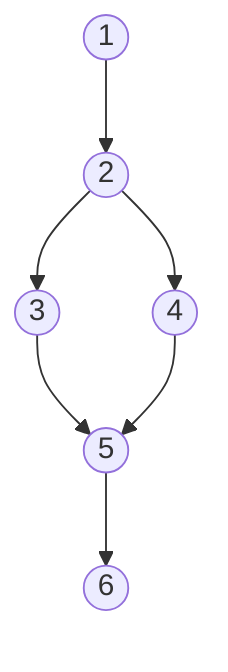

# 정보처리기사 실기 — 07. 애플리케이션 테스트 관리

> 이 챕터는 **만든 것이 제대로 도는지 확인하는 방법**을 다룸.
> 테스트를 네 가지 기준(시각·목적·기법·개발 단계)으로 갈라 보고,
> 결함을 관리하고, 성능을 재고, 코드를 다듬는 순서로 이어짐.
>
> 📌 이 챕터의 3대 고비 —
> **화이트박스 검증 기준의 순서**, **통합 테스트의 스텁/드라이버 구분**, **순환 복잡도 계산**.
> 셋 다 계산이나 순서를 뒤집어 내는 문제로 나옴.

---

## (1) 애플리케이션 테스트의 개요

### 애플리케이션 테스트

애플리케이션에 잠재되어 있는 **결함을 찾아내는 일련의 행위 또는 절차**.
개발된 소프트웨어가 고객의 요구사항을 만족시키는지 확인(Validation)하고,
소프트웨어가 기능을 정확히 수행하는지 검증(Verification).

### 확인과 검증 ★

| 구분 | 의미 | 관점 |
|---|---|---|
| **검증**(Verification) | **개발자의 시각**에서 제품의 생산 과정을 테스트. **명세서대로 만들었는가** | 올바르게 만들고 있는가 |
| **확인**(Validation) | **사용자의 시각**에서 만들어진 제품의 결과를 테스트. **요구를 만족하는가** | 올바른 것을 만들고 있는가 |

> 💡 **검증 = 제품을 올바르게(Right) 만들고 있는가**, **확인 = 올바른(Right) 제품을 만들고 있는가**.

### 애플리케이션 테스트의 필요성

- 프로그램 실행 전에 **오류를 발견**해 예방할 수 있음
- 프로그램이 사용자의 **요구사항이나 기대 수준을 충족**하는지 반복 테스트로 확인
- 새로운 오류의 유입을 **예방**할 수 있음
- 최소한의 시간과 노력으로 **많은 결함을 찾을 수 있음**

---

## (2) 애플리케이션 테스트의 기본 원리 ★★

| 원리 | 의미 |
|---|---|
| **완벽한 테스트 불가능** | 소프트웨어의 잠재적인 결함을 줄일 수는 있지만 **결함이 없다고 증명할 수는 없음** |
| **파레토 법칙** (Pareto Principle) | 애플리케이션의 **20% 에 해당하는 코드에서 전체 결함의 80% 가 발견**된다는 법칙 |
| **살충제 패러독스** (Pesticide Paradox) | **동일한 테스트 케이스로 반복 실행하면 더 이상 새로운 결함을 발견할 수 없음**. → 테스트 케이스를 **정기적으로 검토·개선**해야 함 |
| **테스팅은 정황(Context) 의존** | 소프트웨어의 **특징, 테스트 환경, 테스터 역량 등 정황에 따라** 테스트 결과가 달라짐 |
| **오류-부재의 궤변** (Absence of Errors Fallacy) | 결함을 모두 제거해도 **사용자의 요구사항을 만족시키지 못하면** 품질이 높다고 볼 수 없음 |
| **테스트와 위험은 반비례** | 테스트를 많이 하면 할수록 **위험은 줄어듦** |
| **테스트의 점진적 확대** | 테스트는 **작은 부분에서 시작해 점점 확대**하며 진행해야 함 |
| **테스트의 별도 팀 수행** | 개발자와 **별개의 팀**에서 수행해야 **결함 발견율이 높아짐** |

> 📌 가장 자주 나오는 둘 — **파레토 법칙(20% / 80%)** 과 **살충제 패러독스**.

---

## (3) 애플리케이션 테스트의 분류

테스트는 **네 가지 기준**으로 나눔.

### 프로그램 실행 여부에 따른 테스트 ★

| 종류 | 설명 |
|---|---|
| **정적 테스트** | 프로그램을 **실행하지 않고** 명세서나 소스 코드를 대상으로 분석. 종류 : **워크스루, 인스펙션, 코드 검사** |
| **동적 테스트** | 프로그램을 **실행해** 오류를 찾는 테스트. 개발의 모든 단계에서 수행. 종류 : **블랙박스 테스트, 화이트박스 테스트** |

### 테스트 기반에 따른 테스트 ★

| 종류 | 설명 |
|---|---|
| **명세 기반 테스트** | 사용자의 **요구사항에 대한 명세를 테스트 케이스로 만들어** 확인. 종류 : **동등 분할, 경계값 분석** |
| **구조 기반 테스트** | 소프트웨어 **내부의 논리 흐름에 따라** 테스트 케이스를 작성해 확인. 종류 : **구문 기반, 결정 기반, 조건 기반** |
| **경험 기반 테스트** | **테스터의 경험을 기반**으로 수행. 요구사항에 대한 명세가 **불충분하거나 시간에 제약이 있을 때** 효과적. 종류 : **에러 추정, 체크 리스트, 탐색적 테스팅** |

### 시각에 따른 테스트

| 종류 | 설명 |
|---|---|
| **검증(Verification) 테스트** | **개발자의 시각**에서 제품의 생산 과정을 테스트 |
| **확인(Validation) 테스트** | **사용자의 시각**에서 만들어진 제품의 결과를 테스트 |

### 목적에 따른 테스트 ★★

| 종류 | 설명 |
|---|---|
| **회복**(Recovery) 테스트 | 시스템에 **고의로 실패를 유도**하고 시스템이 정상적으로 **복귀하는지** 확인 |
| **안전**(Security) 테스트 | 시스템에 설치된 시스템 보호 도구가 **불법적인 침입으로부터 시스템을 보호**할 수 있는지 확인 |
| **강도**(Stress) 테스트 | 시스템에 **과도한 정보량이나 빈도 등을 부과**해 과부하 시에도 정상적으로 실행되는지 확인 |
| **성능**(Performance) 테스트 | 소프트웨어의 **실시간 성능이나 전체적인 효율성**을 진단. **응답 시간, 처리량** 등을 테스트 |
| **구조**(Structure) 테스트 | 시스템의 **내부 논리 경로, 소스 코드의 복잡도** 등을 평가 |
| **회귀**(Regression) 테스트 | 오류를 제거하거나 수정한 시스템에서 **오류 제거와 수정에 의해 새로운 오류가 생기지 않았는지** 확인 |
| **병행**(Parallel) 테스트 | 변경된 시스템과 기존 시스템에 **동일한 데이터를 입력해 결과를 비교** |

> 📌 암기: **"회안강성구회병"**

---

## (4) 화이트박스 테스트

### 화이트박스 테스트(White Box Test) ★★

모듈의 **원시 코드를 오픈시킨 상태**에서 원시 코드의 **논리적인 모든 경로를 테스트**해
테스트 케이스를 설계하는 방법.

- 설계된 절차에 초점을 둔 **구조적 테스트**로, **프로시저 설계의 제어 구조를 사용**해 테스트 케이스를 설계.
- 테스트 과정의 **초기에 적용**됨.
- 모듈 안의 작동을 **직접 관찰**.

### 화이트박스 테스트의 종류 ★★

크게 **두 갈래**이고, 그중 **제어 구조 검사가 다시 셋으로 나뉨.**

| 종류 | 설명 |
|---|---|
| **기초 경로 검사** (Base Path Testing) | **대표적인 화이트박스 테스트 기법**. 테스트 측정 결과는 실행 경로의 기초를 정의하는 데 지침으로 사용됨 |
| **제어 구조 검사** (Control Structure Testing) | 프로그램의 **제어 구조**(조건·반복·자료 흐름)를 하나씩 파고드는 기법들을 묶은 이름. **아래 세 가지**로 나뉨 |

**제어 구조 검사의 세 가지**

| 무엇을 보나 | 종류 | 설명 |
|---|---|---|
| 조건 | **조건 검사** (Condition Testing) | 프로그램 모듈 내에 있는 **논리적 조건**을 테스트 |
| 반복 | **루프 검사** (Loop Testing) | 프로그램의 **반복(Loop) 구조**에 초점을 맞춰 실시 |
| 자료 | **데이터 흐름 검사** (Data Flow Testing) | 프로그램에서 **변수의 정의와 사용의 위치**에 초점을 맞춰 실시 |

> 🚨 **시험은 네 가지를 나란히 놓고 고르게 함.** 기초 경로 · 조건 · 루프 · 데이터 흐름이
> **같은 층으로 나옴** — 제어 구조 검사라는 상위 이름은 보기에 잘 안 나옴.
> 📌 **골라야 하는 것은 넷, 외워야 하는 구조는 2단**임.

### 화이트박스 테스트의 검증 기준 ★★★

| 검증 기준 | 의미 |
|---|---|
| **문장 검증 기준** (Statement Coverage) | 소스 코드의 **모든 구문이 한 번 이상 수행**되도록 테스트 케이스를 설계 |
| **분기 검증 기준** (Branch Coverage) | 소스 코드의 **모든 조건문에 대해 조건식의 결과가 True 인 경우와 False 인 경우가 한 번 이상 수행**되도록 설계. **결정 검증 기준(Decision Coverage)** 이라고도 함 |
| **조건 검증 기준** (Condition Coverage) | 소스 코드의 조건문에 포함된 **개별 조건식의 결과가 True 와 False 인 경우가 한 번 이상 수행**되도록 설계 |
| **분기/조건 기준** (Branch/Condition Coverage) | **분기 검증 기준과 조건 검증 기준을 모두 만족**하도록 설계 |

> ⚠️ **분기(결정)와 조건의 차이**
> - **분기**는 조건문 **전체의 결과**(if 문 한 덩어리)가 T/F 를 모두 갖도록 함
> - **조건**은 조건문 안의 **개별 조건식 각각**이 T/F 를 모두 갖도록 함

**검증 기준의 강도** — 문장 < 분기 < 분기/조건 < 변경 조건/결정(MC/DC) < 다중 조건

### 테스트 커버리지

주어진 테스트 케이스에 의해 **수행되는 소프트웨어의 테스트 범위를 측정하는 척도**.

| 종류 | 설명 |
|---|---|
| **기능 기반 커버리지** | 테스트 대상 애플리케이션의 **전체 기능을 모수**로 설정. 100% 달성을 목표로 함 |
| **라인 커버리지** | 애플리케이션 전체 소스 코드의 **라인 수를 모수**로 설정 |
| **코드 커버리지** | 소스 코드의 **구문, 조건, 결정** 등의 구조 코드 자체가 얼마나 테스트되었는지를 측정 |

---

## (5) 블랙박스 테스트

### 블랙박스 테스트(Black Box Test) ★★

소프트웨어가 수행할 **특정 기능을 알기 위해 각 기능이 완전히 작동되는 것을 입증**하는 테스트.
**기능 테스트**라고도 함.

- 사용자의 **요구사항 명세를 보면서** 테스트.
- 주로 **구현된 기능을 테스트**하며, 소프트웨어 **인터페이스에서 실시**됨.
- 테스트 과정의 **후반부에 적용**됨.
- 부정확하거나 누락된 기능, 인터페이스 오류, 자료 구조나 외부 데이터베이스 접근에 따른 오류,
  행위나 성능 오류, 초기화와 종료 오류 등을 발견하기 위해 사용됨.

### 블랙박스 테스트의 종류 ★★★

| 종류 | 설명 |
|---|---|
| **동치 분할 검사** (Equivalence Partitioning Testing) | 입력 자료에 초점을 맞춰 테스트 케이스를 만들고 검사하는 방법. 프로그램의 입력 조건에 **타당한 입력 자료와 타당하지 않은 입력 자료의 개수를 균등하게** 하여 테스트 케이스를 정함. **동등 분할 기법**이라고도 함 |
| **경계값 분석** (Boundary Value Analysis) | 입력 조건의 **중간값보다 경계값에서 오류가 발생될 확률이 높다는 점**을 이용해, **입력 조건의 경계값을 테스트 케이스로 선정**해 검사 |
| **원인-효과 그래프 검사** (Cause-Effect Graphing Testing) | 입력 데이터 간의 관계와 출력에 미치는 영향을 분석해 **효용성이 높은 테스트 케이스를 선정**해 검사 |
| **오류 예측 검사** (Error Guessing) | 과거의 경험이나 **확인자의 감각으로 테스트**하는 기법. 다른 테스트 기법으로는 찾기 어려운 오류를 찾아냄. **데이터 확인 검사**라고도 함 |
| **비교 검사** (Comparison Testing) | **여러 버전의 프로그램에 동일한 테스트 자료를 제공**해 동일한 결과가 출력되는지 검사 |

> 💡 **경계값 분석**은 예를 들어 입력 조건이 `1 ≤ x ≤ 100` 이면
> **0, 1, 2, 99, 100, 101** 처럼 **경계 부근**을 테스트 케이스로 잡음.

### 화이트박스 vs 블랙박스 ★

| 구분 | 화이트박스 | 블랙박스 |
|---|---|---|
| 관점 | **내부 구조(코드)** | **기능(명세)** |
| 별칭 | 구조적 테스트 | 기능 테스트 |
| 적용 시점 | 테스트 **초기** | 테스트 **후반** |
| 대표 기법 | 기초 경로 검사, 조건·루프·데이터 흐름 검사 | 동치 분할, 경계값 분석, 원인-효과 그래프, 오류 예측, 비교 검사 |

---

## (6) 개발 단계에 따른 애플리케이션 테스트

### V-모델 ★★

소프트웨어 개발 단계에 따라 애플리케이션 테스트를 분류한 것.
**단위 → 통합 → 시스템 → 인수** 순으로 진행됨.

| 개발 단계 | 대응하는 테스트 |
|---|---|
| 요구사항 분석 | **인수 테스트** |
| 분석(시스템 명세) | **시스템 테스트** |
| 설계 | **통합 테스트** |
| 구현 | **단위 테스트** |

### 단위 테스트(Unit Test) ★

**코딩 직후** 소프트웨어 설계의 최소 단위인 **모듈이나 컴포넌트에 초점**을 맞춰 테스트.

- **인터페이스, 외부적 I/O, 자료 구조, 독립적 기초 경로, 오류 처리 경로, 경계 조건** 등을 검사.
- 사용자의 요구사항을 기반으로 한 **기능성 테스트를 최우선으로** 수행.
- **구조 기반 테스트(화이트박스)** 와 **명세 기반 테스트(블랙박스)** 로 나뉘지만
  주로 **구조 기반 테스트**를 시행.

### 통합 테스트(Integration Test) ★

**단위 테스트가 완료된 모듈들을 결합**해 하나의 시스템으로 완성시키는 과정에서의 테스트.
모듈 간 또는 통합된 컴포넌트 간의 **상호작용 오류를 검사**.

### 시스템 테스트(System Test) ★

개발된 소프트웨어가 해당 컴퓨터 시스템에서 **완벽하게 수행되는가를 점검**하는 테스트.

- 실제 사용 환경과 유사하게 만든 **테스트 환경에서 수행**해야 함.
- **기능적 요구사항**과 **비기능적 요구사항**으로 구분해 각각 수행.

| 구분 | 내용 |
|---|---|
| **기능적 요구사항** | 요구사항 명세서, 비즈니스 절차, 유스케이스 등 **명세서 기반의 블랙박스 테스트** |
| **비기능적 요구사항** | 성능 테스트, 회복 테스트, 보안 테스트, 내부 시스템의 메뉴 구조, 웹 페이지의 네비게이션 등 **구조적 요소에 대한 화이트박스 테스트** |

### 인수 테스트(Acceptance Test) ★★

**사용자의 요구사항을 충족하는지에 중점**을 두고 테스트하는 방법.

**인수 테스트의 종류**

| 종류 | 설명 |
|---|---|
| **사용자 인수 테스트** | 사용자가 시스템 사용의 **적절성 여부**를 확인 |
| **운영상의 인수 테스트** | 시스템 관리자가 시스템 인수 시 수행. **백업/복원 시스템, 재난 복구, 사용자 관리, 보안 점검** 등을 확인 |
| **계약 인수 테스트** | 계약상의 **인수·검수 조건을 준수**하는지 여부를 확인 |
| **규정 인수 테스트** | 소프트웨어가 정부 지침, 법규, 규정 등에 **맞게 개발되었는지** 확인 |
| **알파 테스트** (Alpha Test) | **개발자의 장소에서** 사용자가 개발자 앞에서 행하는 테스트. **통제된 환경**에서 진행되며 개발자는 오류와 사용상의 문제점을 기록 |
| **베타 테스트** (Beta Test) | **선정된 최종 사용자가 여러 명의 사용자 앞에서** 행하는 테스트. **실업무를 가지고 사용자가 직접** 테스트하며, **통제되지 않은 환경**에서 행해짐 |

> ⚠️ **알파 = 개발자 장소(통제됨), 베타 = 사용자 장소(통제 안 됨).** 매번 나옴.

---

## (7) 통합 테스트의 종류

### 통합 테스트의 방식

| 방식 | 설명 |
|---|---|
| **비점진적 통합 방식** | 단계적으로 통합하는 절차 없이 **모든 모듈이 결합된 프로그램 전체를 테스트**. **빅뱅 통합 테스트 방식**이 대표적. 오류 발견 및 장애 위치 파악·수정이 **어려움** |
| **점진적 통합 방식** | **모듈 단위로 단계적으로 통합**하면서 테스트. 오류 수정이 **쉽고**, 인터페이스와 연관된 오류를 **완전히 테스트**할 가능성이 높음. **하향식, 상향식, 혼합식**이 있음 |

### 하향식 통합 테스트(Top Down Integration Test) ★★

프로그램의 **상위 모듈에서 하위 모듈 방향으로 통합**하면서 테스트.

**절차**

1. 주요 제어 모듈은 작성된 프로그램을 사용하고, 주요 제어 모듈의 종속 모듈들은 **스텁(Stub)** 으로 대체
2. 깊이 우선 또는 넓이 우선 등의 통합 방식에 따라 하위 모듈인 스텁들이 **한 번에 하나씩 실제 모듈로 교체**
3. 모듈이 통합될 때마다 **테스트 실시**
4. 새로운 오류가 발생하지 않음을 보증하기 위해 **회귀 테스트 실시**

**특징**

- 상위 모듈에서는 **테스트 케이스를 사용하기 어려움**
- **깊이 우선 통합법** 또는 **넓이 우선 통합법**을 사용함
- 초기부터 **사용자에게 시스템 구조를 보여 줄 수** 있음
- 상위 모듈에서 **테스트 케이스 작성이 어려움**

> **스텁(Stub)** : 제어 모듈이 호출하는 **하위 모듈의 역할을 대신하는 시험용 모듈**.
> 일시적으로 필요한 조건만을 가지고 있는 **테스트용 임시 모듈**.

### 상향식 통합 테스트(Bottom Up Integration Test) ★★

프로그램의 **하위 모듈에서 상위 모듈 방향으로 통합**하면서 테스트.

**절차**

1. 하위 모듈들을 **클러스터(Cluster)** 로 결합
2. 상위 모듈에서 데이터의 입·출력을 확인하기 위해 **드라이버(Driver)** 를 작성
3. 통합된 **클러스터 단위로 테스트**
4. 테스트가 완료되면 클러스터는 프로그램 구조의 상위로 이동해 결합하고 **드라이버는 실제 모듈로 대체**

> **드라이버(Driver)** : 테스트 대상의 **하위 모듈을 호출**하고, 파라미터를 전달하고,
> 모듈 테스트 수행 후의 결과를 도출하는 **시험용 모듈**.

> ⚠️ **스텁 vs 드라이버** — 매번 나오는 핵심 구분
> - **하향식 → 스텁(Stub)** 필요 : 아직 없는 **하위** 모듈을 흉내
> - **상향식 → 드라이버(Driver)** 필요 : 아직 없는 **상위** 모듈을 흉내

### 혼합식 통합 테스트

**하위 수준에서는 상향식 통합**, **상위 수준에서는 하향식 통합**을 사용해
최적의 테스트를 지원하는 방식. **샌드위치(Sandwich)식 통합 테스트 방법**이라고도 함.

### 회귀 테스트(Regression Test) ★

통합 테스트로 인해 **변경된 모듈이나 컴포넌트에 새로운 오류가 있는지 확인**하는 테스트.

- 이미 테스트된 프로그램의 테스팅을 **반복**하는 것.
- 통합 테스트가 완료된 후 **변경된 모듈이나 컴포넌트가 있을 때** 수행.

**회귀 테스트의 테스트 케이스 선정 방법**

- 모든 애플리케이션의 **기능을 수행할 수 있는 대표적인 테스트 케이스**를 선정
- 애플리케이션 **주요 기능을 수행하는** 테스트 케이스를 선정
- 프로그램에서 **오류가 자주 발생했던 부분**에 관한 테스트 케이스를 선정

---

## (8) 애플리케이션 테스트 프로세스

### 테스트 프로세스 ★

| 단계 | 내용 |
|---|---|
| **테스트 계획** | 테스트 **목적과 범위를 정의**하고 대상 시스템 구조를 파악. 일정·인력·비용 산정 |
| **테스트 분석 및 디자인** | 테스트 목적과 원칙을 검토하고 **요구사항을 분석**. 위험 분석 및 우선순위를 결정 |
| **테스트 케이스 및 시나리오 작성** | 테스트 케이스의 **설계 기법에 따라 테스트 케이스를 작성**하고 검토·확인 |
| **테스트 수행** | 테스트 환경을 구축한 후 **테스트를 수행** |
| **테스트 결과 평가 및 리포팅** | 테스트 결과를 **정리하고 평가해 리포트를 작성** |
| **결함 추적 및 관리** | 발견된 결함에 대해 **결함 관리 대장을 작성**하고 처리 상태를 추적 |

---

## (9) 테스트 케이스 · 시나리오 · 오라클

### 테스트 케이스(Test Case) ★

구현된 소프트웨어가 사용자의 요구사항을 정확하게 준수했는지를 확인하기 위해
설계된 **입력값, 실행 조건, 기대 결과 등으로 구성된 테스트 항목에 대한 명세서**.

**테스트 케이스 작성 순서**

**ISO/IEC/IEEE 29119-3 기반 테스트 케이스 구성 요소** ★

| 구성 요소 | 내용 |
|---|---|
| **식별자**(Identifier) | 항목 식별자, 일련번호 |
| **테스트 항목**(Test Item) | 테스트 대상(모듈 또는 기능) |
| **입력 명세**(Input Specification) | 테스트 데이터 또는 테스트 조건 |
| **출력 명세**(Output Specification) | 테스트 케이스 수행 시 **예상되는 출력 결과** |
| **환경 설정**(Environmental Needs) | 필요한 하드웨어나 소프트웨어의 환경 |
| **특수 절차 요구**(Special Procedure Requirement) | 테스트 케이스 수행 시 필요한 특별한 절차 |
| **의존성 기술**(Inter-case Dependencies) | 테스트 케이스 간의 의존성 |

### 테스트 시나리오(Test Scenario)

테스트 케이스를 **적용하는 순서에 따라 여러 개의 테스트 케이스들을 묶은 집합**.

**작성 시 유의 사항**

- 시스템별, 모듈별, 항목별 등 **여러 개의 시나리오로 분리**해 작성
- 사용자의 요구사항과 설계 문서 등을 토대로 작성
- 각 테스트 항목은 **식별자 번호, 순서 번호, 테스트 데이터, 예상 결과, 확인** 등을 표기

### 테스트 오라클(Test Oracle) ★★

테스트의 결과가 참인지 거짓인지를 판단하기 위해
**사전에 정의된 참값을 대입해 비교하는 기법 및 활동**.

**테스트 오라클의 특징** — **제한된 검증**, **수학적 기법**, **자동화 가능**

| 종류 | 설명 |
|---|---|
| **참(True) 오라클** | **모든 테스트 케이스의 입력값에 대해 기대하는 결과를 제공**하는 오라클. 발생된 모든 오류를 검출할 수 있음 |
| **샘플링(Sampling) 오라클** | **특정한 몇 개의 입력값에 대해서만 기대하는 결과를 제공**하는 오라클 |
| **추정(Heuristic) 오라클** | 샘플링 오라클을 개선한 것으로, **특정 입력값에 대해 올바른 결과를 제공**하고 **나머지 값들에 대해서는 추정으로 처리**하는 오라클 |
| **일관성 검사(Consistent) 오라클** | 애플리케이션의 **변경이 있을 때, 수행 전과 후의 결과값이 동일한지** 확인하는 오라클 |

---

## (10) 결함 관리

### 결함(Fault)

오류 발생, 작동 실패 등으로 인해 **현재 사용 중인 시스템에 문제가 생기게 하는 것**.

| 용어 | 의미 |
|---|---|
| **에러 / 오류**(Error) | 결함의 원인이 되는 것으로, **개발자(사람)에 의해 발생**한 실수 |
| **결함 / 결점 / 버그**(Fault, Bug) | 오류로 인해 **소프트웨어 제품에 발생한 결함** |
| **실패 / 문제**(Failure, Problem) | 결함으로 인해 실행 시 **실제 결과가 기대 결과와 달라진 현상** |

### 결함 관리 프로세스 ★

### 결함 상태 추적 ★

| 상태 | 의미 |
|---|---|
| **결함 등록**(Open) | 결함이 **처음 발견되어 등록**된 상태 |
| **결함 검토**(Reviewed) | 등록된 결함을 **검토**하는 상태 |
| **결함 할당**(Assigned) | 결함을 **수정하기 위해 담당자에게 할당**된 상태 |
| **결함 수정**(Resolved) | 담당자가 결함 **수정을 완료**한 상태 |
| **결함 조치 보류**(Deferred) | 결함의 수정이 **연기**된 상태 |
| **결함 종료**(Closed) | 결함이 해결되어 **테스터가 확인 후 종료**한 상태 |
| **결함 해제**(Clarified) | 등록된 결함이 **software 결함이 아니라고 판명**된 상태 |

### 결함 분류

| 분류 | 내용 |
|---|---|
| **시스템 결함** | 애플리케이션 환경이나 **데이터베이스 처리**에서 발생된 결함 |
| **기능 결함** | 기획 의도와 다르게 **동작하거나 기능이 누락**된 경우 |
| **GUI 결함** | 사용자 화면 설계에서 발생된 결함 |
| **문서 결함** | 기획자, 사용자, 개발자 간의 **의사소통 및 기록이 원활하지 않아** 발생된 결함 |

### 결함 심각도별 분류

| 심각도 | 의미 |
|---|---|
| **치명적**(Critical) | 시스템 **전체가 마비**되는 결함 |
| **주요**(Major) | 주요 기능이 **동작하지 않는** 결함 |
| **보통**(Normal) | 일부 기능에 **불편함**을 주는 결함 |
| **경미**(Minor) | **사소한 결함**(UI 오탈자 등) |
| **단순**(Simple) | 개선 사항 수준의 결함 |

### 결함 관리 측정 지표 ★

| 지표 | 내용 |
|---|---|
| **결함 분포** | **모듈 또는 컴포넌트의 특정 속성**에 해당하는 결함 수 측정 |
| **결함 추세** | **테스트 진행 시간에 따른** 결함 수의 추이 분석 |
| **결함 에이징** | **특정 결함 상태로 지속되고 있는 시간**을 측정 |

---

## (11) 테스트 자동화 도구

### 테스트 자동화

사람이 반복적으로 수행하던 테스트 절차를 **스크립트 형태로 구현하는 자동화 도구**를 적용함으로써
**시간 단축과 인력 투입 비용을 최소화**하는 것.

**장점과 단점**

| 장점 | 단점 |
|---|---|
| 휴먼 에러(Human Error)를 줄임 | 자동화 도구의 **사용법에 대한 교육 및 학습**이 필요 |
| 향상된 **테스트 품질** 보장 | 자동화 도구를 프로세스 단계별로 **적용하기 위한 시간·비용·노력**이 필요 |
| 사용자의 **요구사항을 명확히 파악** 가능 | 상용 도구의 경우 **고가**이며, 오픈 소스는 **제한적인 기능**만 제공 |
| 테스트 **결과에 대한 객관적인 평가 기준** 제공 | |

### 테스트 자동화 도구의 유형 ★★

| 유형 | 설명 |
|---|---|
| **정적 분석 도구** (Static Analysis Tools) | 만들어진 애플리케이션을 **실행하지 않고** 소스 코드에 대한 **코딩 표준, 코딩 스타일, 코드 복잡도, 남은 결함** 등을 발견하기 위해 사용 |
| **테스트 실행 도구** (Test Execution Tools) | 스크립트 언어를 사용해 **테스트를 실행**하는 도구. **데이터 주도 접근 방식**과 **키워드 주도 접근 방식**이 있음 |
| **성능 테스트 도구** (Performance Test Tools) | 애플리케이션의 **처리량, 응답 시간, 경과 시간, 자원 사용률**에 대해 가상의 사용자를 생성하고 테스트를 수행함으로써 성능 목표 달성 여부를 확인 |
| **테스트 통제 도구** (Test Control Tools) | **테스트 계획 및 관리, 테스트 수행, 결함 관리** 등을 수행하는 도구. **형상 관리 도구, 결함 추적/관리 도구** 등이 있음 |
| **테스트 하네스 도구** (Test Harness Tools) | 애플리케이션의 **컴포넌트 및 모듈을 테스트하는 환경의 일부분**으로, 테스트를 지원하기 위해 생성된 코드와 데이터 |

### 테스트 실행 도구의 접근 방식

| 방식 | 설명 |
|---|---|
| **데이터 주도 접근 방식** | 테스트 데이터를 **스프레드시트에 저장**하고, 이 데이터를 읽어 실행하는 방식. 다양한 테스트 데이터를 편리하게 사용할 수 있음 |
| **키워드 주도 접근 방식** | 테스트를 수행할 **동작을 나타내는 키워드와 테스트 데이터를 스프레드시트에 저장**해 실행하는 방식. 키워드를 이용해 테스트를 정의할 수 있음 |

### 테스트 하네스의 구성 요소 ★★

| 구성 요소 | 내용 |
|---|---|
| **테스트 드라이버** (Test Driver) | 테스트 대상의 **하위 모듈을 호출**하고, 파라미터를 전달하고, 모듈 테스트 수행 후의 **결과를 도출**하는 도구 |
| **테스트 스텁** (Test Stub) | 제어 모듈이 호출하는 **하위 모듈의 역할을 하는 도구**로, 일시적으로 필요한 조건만을 가지고 있는 테스트용 모듈 |
| **테스트 슈트** (Test Suites) | 테스트 대상 컴포넌트나 모듈, 시스템에 사용되는 **테스트 케이스의 집합** |
| **테스트 케이스** (Test Case) | 사용자의 요구사항을 정확하게 준수했는지 확인하기 위한 **입력값, 실행 조건, 기대 결과** 등으로 만들어진 테스트 항목의 명세서 |
| **테스트 스크립트** (Test Script) | **자동화된 테스트 실행 절차**에 대한 명세서 |
| **목 오브젝트** (Mock Object) | **사전에 사용자의 행위를 조건부로 입력**해 두면, 그 상황에 맞는 예정된 행위를 수행하는 객체 |

---

## (12) 애플리케이션 성능 분석

### 애플리케이션 성능

사용자가 요구한 기능을 **최소한의 자원을 사용해 최대한 많은 기능을 신속하게 처리**하는 정도.

### 성능 측정 지표 ★★

| 지표 | 의미 |
|---|---|
| **처리량**(Throughput) | 일정 시간 내에 애플리케이션이 **처리하는 일의 양** |
| **응답 시간**(Response Time) | 애플리케이션에 **요청을 전달한 시간부터 응답이 도착할 때까지 걸린 시간** |
| **경과 시간**(Turn Around Time) | 애플리케이션에 **작업을 의뢰한 시간부터 처리가 완료될 때까지 걸린 시간** |
| **자원 사용률**(Resource Usage) | 애플리케이션이 의뢰한 작업을 처리하는 동안의 **CPU 사용량, 메모리 사용량, 네트워크 사용량** 등 자원 사용률 |

> 📌 암기: **"처응경자"**

### 성능 테스트 도구 ★

| 도구 | 특징 |
|---|---|
| **JMeter** | HTTP, FTP 등 **다양한 프로토콜을 지원**하는 부하 테스트 도구. **크로스 플랫폼** |
| **LoadUI** | **서버 모니터링, Drag & Drop 등 사용자의 편의성이 강화**된 부하 테스트 도구. HTTP, JDBC 등 다양한 프로토콜 지원 |
| **OpenSTA** | HTTP, HTTPS 프로토콜에 대한 **부하 테스트 및 생산품 모니터링** 도구 |

### 시스템 모니터링 도구

애플리케이션이 실행됐을 때 시스템 자원의 사용량을 확인하고 분석하는 도구.
**성능 저하의 원인 분석, 시스템 부하량 분석, 사용자 분석** 등을 수행.

| 도구 | 특징 |
|---|---|
| **Scouter** | 단일 뷰 통합·실시간 모니터링, 튜닝에 최적화된 인프라 통합 모니터링 도구 |
| **Zabbix** | 웹 기반 서버, 서비스, 애플리케이션 등의 모니터링 도구 |

### 성능 저하 원인 ★

| 원인 | 내용 |
|---|---|
| **데이터베이스 연결 및 쿼리 실행** | DB Lock, 불필요한 데이터베이스 패치, 연결 누수(Connection Leak), 대량의 데이터 조회 |
| **내부 로직** | 웹 애플리케이션의 **인터넷 접속 불량**, 대량의 파일 업로드·다운로드, 정상적으로 처리되지 않은 오류 처리 |
| **잘못된 환경 설정이나 네트워크 문제** | 스레드 풀·힙 메모리의 크기를 너무 작게 설정, 네트워크 장비의 대역폭 등 |

---

## (13) 복잡도

### 복잡도(Complexity)

시스템이나 시스템 구성 요소 또는 소프트웨어의 **복잡한 정도를 나타내는 말**.

### 시간 복잡도 ★

알고리즘의 **실행 시간**, 즉 **연산의 실행 횟수**를 수치화한 것.

| 표기 | 의미 | 예 |
|---|---|---|
| **O(1)** | 상수형 복잡도. 입력값에 관계없이 **일정한 횟수** | 해시 함수 |
| **O(log₂n)** | 로그형 복잡도. 문제를 해결하는 데 필요한 단계가 **로그적으로 증가** | 이진 검색 |
| **O(n)** | 선형 복잡도. 입력값에 **비례해 증가** | 순차 검색 |
| **O(n log₂n)** | 선형 로그형 복잡도 | 힙·합병·퀵(평균) 정렬 |
| **O(n²)** | 제곱형 복잡도 | 삽입·선택·버블 정렬 |
| **O(2ⁿ)** | 지수형 복잡도 | 피보나치 수열(재귀) |

### 순환 복잡도(Cyclomatic Complexity) ★★★

한 프로그램의 **논리적인 복잡도를 측정**하기 위한 소프트웨어의 척도.
**맥케이브 순환도(McCabe's Cyclomatic)** 또는 **맥케이브 복잡도 메트릭(McCabe's Complexity Metrics)** 이라고도 함.

**계산 방법 — 두 가지**

V(G) =화살표 수(E) − 노드 수(N) + 2

V(G) =제어 흐름 그래프의 영역 수 = 조건문(분기점) 수 + 1

**예제**

- 화살표(간선) 수 **E = 6**, 노드 수 **N = 6**
- V(G) = 6 − 6 + 2 = **2**

> 💡 **분기점(조건문) 개수 + 1** 로 세는 것이 훨씬 빠름.
> if 문 2개, while 1개가 있으면 V(G) = 3 + 1 = **4**.

**순환 복잡도의 활용**

- 값이 **낮을수록 코드가 단순**하고 이해하기 쉬움
- 일반적으로 **10 이하**를 권장함
- 값이 곧 **필요한 테스트 케이스의 최소 개수**가 됨

---

## (14) 애플리케이션 성능 개선

### 소스 코드 최적화

**나쁜 코드(Bad Code)** 를 배제하고, 클린 코드(Clean Code)로 작성하는 것.

| 구분 | 설명 |
|---|---|
| **나쁜 코드**(Bad Code) | 프로그램의 로직이 **복잡하고 이해하기 어려운** 코드. 스파게티 코드, 외계인 코드 등 |
| **클린 코드**(Clean Code) | 누구나 **쉽게 이해하고 수정 및 추가할 수 있는** 코드 |

**나쁜 코드의 예**

| 종류 | 설명 |
|---|---|
| **스파게티 코드** | 코드의 **로직이 서로 얽혀 있는** 코드 |
| **외계인 코드** | 아주 **오래되거나 참고 문서 또는 개발자가 없어 유지보수가 어려운** 코드 |

### 클린 코드 작성 원칙 ★★

| 원칙 | 내용 |
|---|---|
| **가독성** | 누구든지 **코드를 쉽게 읽을 수 있도록** 작성. 이해하기 쉬운 용어를 사용하고 들여쓰기 등을 활용 |
| **단순성** | 코드를 **간단하게** 작성. 한 번에 한 가지를 처리하도록 하고 클래스·메소드·함수를 최소 단위로 분리 |
| **의존성 배제** | 코드가 **다른 모듈에 미치는 영향을 최소화**. 코드 변경 시 다른 부분에 영향이 없도록 작성 |
| **중복성 최소화** | 코드의 **중복을 최소화**. 중복된 코드는 삭제하고 공통된 코드를 사용 |
| **추상화** | **상위 클래스·메소드·함수에서는 간략하게 애플리케이션의 특성을 나타내고**, 상세 내용은 하위 클래스·메소드·함수에서 구현 |

> 📌 암기: **"가단의중추"**

### 소스 코드 최적화 유형

| 유형 | 내용 |
|---|---|
| **클래스 분할 배치** | 하나의 클래스는 **하나의 역할만 수행**하도록 응집도를 높임 |
| **좋은 이름 사용** | 변수나 함수 이름은 **커밋 규칙을 정해** 사용 |
| **코딩 형식 준수** | 줄 바꿈, 개념적 유사성이 높은 종속 함수 배치 등 |

### 소스 코드 품질 분석 도구 ★★

| 구분 | 도구 | 설명 |
|---|---|---|
| **정적 분석 도구** | **pmd** | 소스 코드에 대한 **미사용 변수, 최적화되지 않은 코드** 등 결함을 유발할 수 있는 코드를 검사 |
| | **cppcheck** | **C/C++ 코드**에 대한 메모리 누수, 오버플로 등 분석 |
| | **SonarQube** | 중복 코드, 복잡도, 코딩 설계 등을 분석하는 **통합 플랫폼**. 플러그인 확장 가능 |
| | **checkstyle** | **자바 코드**에 대해 소스 코드 표준을 따르고 있는지 검사. 다양한 개발 도구에 통합 사용 가능 |
| | **ccm** | 다양한 언어의 **코드 복잡도**를 분석. 다양한 OS 지원 |
| | **cobertura** | 자바 언어의 **소스 코드 복잡도 분석 및 테스트 커버리지** 측정 |
| **동적 분석 도구** | **Avalanche** | Valgrind 프레임워크 및 STP 기반. 프로그램에 대한 **결함 및 취약점 분석** |
| | **Valgrind** | 프로그램 내에 존재하는 **메모리 및 스레드 결함** 등을 분석 |

> ⚠️ **정적 = 실행하지 않고 소스 코드 분석**, **동적 = 실행하며 메모리·스레드 분석**.
> **Valgrind 와 Avalanche 가 동적 분석 도구**라는 점이 자주 나옴.

---

## 📌 부록 — 핵심 암기 요약

| 구분 | 암기 포인트 |
|---|---|
| **검증 vs 확인** | **검증(Verification) = 개발자 시각**, **확인(Validation) = 사용자 시각** |
| **테스트 기본 원리 5가지** | **파레토(20%/80%)** · **살충제 패러독스** · 완벽한 테스트 불가능 · 오류-부재의 궤변 · 정황 의존 |
| **테스트 분류 — 실행 여부별** | **정적**(워크스루·인스펙션·코드 검사) / **동적**(블랙박스·화이트박스) |
| **테스트 분류 — 기반별 3가지** | 명세 기반(동등 분할·경계값) · 구조 기반(구문·결정·조건) · 경험 기반(에러 추정·체크리스트·탐색적) |
| **테스트 분류 — 목적별 7가지** | **회안강성구회병** (회복·안전·강도·성능·구조·회귀·병행) |
| **화이트박스 테스트 종류 2가지** | **기초 경로 검사** · 제어 구조 검사(조건·루프·데이터 흐름) |
| **화이트박스 검증 기준 4단계** | **문장 → 분기(결정) → 조건 → 분기/조건** |
| **분기 vs 조건** | 분기 = 조건문 **전체** 결과 T/F, 조건 = **개별 조건식** 각각 T/F |
| **블랙박스 테스트 종류 5가지** | **동치 분할 · 경계값 분석 · 원인-효과 그래프 · 오류 예측 · 비교 검사** |
| **화이트 vs 블랙** | 화이트 = 내부 구조, 테스트 **초기** / 블랙 = 기능, 테스트 **후반** |
| **V-모델 대응** | 요구사항 분석↔**인수**, 분석↔**시스템**, 설계↔**통합**, 구현↔**단위** |
| **알파 vs 베타** | **알파 = 개발자 장소(통제됨)**, **베타 = 사용자 장소(통제 안 됨)** |
| **하향식 통합** | 상위→하위. **스텁(Stub)** 필요. 깊이 우선/넓이 우선 |
| **상향식 통합** | 하위→상위. **드라이버(Driver)** 필요. **클러스터** 구성 |
| **혼합식 통합 테스트** | **샌드위치식**. 하위는 상향식, 상위는 하향식 |
| **테스트 오라클 4가지** | **참 · 샘플링 · 추정(휴리스틱) · 일관성 검사** |
| **오류/결함/실패** | 에러(사람 실수) → 결함(제품 결함) → 실패(결과 불일치) |
| **결함 상태 변화** | Open → Reviewed → Assigned → Resolved → Closed / Deferred / Clarified |
| **결함 측정 지표 3가지** | 결함 **분포** · 결함 **추세** · 결함 **에이징** |
| **테스트 자동화 도구 유형 5가지** | 정적 분석 · 테스트 실행 · 성능 테스트 · 테스트 통제 · **테스트 하네스** |
| **테스트 하네스 구성 6가지** | **드라이버 · 스텁 · 슈트 · 케이스 · 스크립트 · 목 오브젝트** |
| **성능 측정 지표 4가지** | **처응경자** (처리량·응답 시간·경과 시간·자원 사용률) |
| **성능 테스트 도구 3가지** | **JMeter · LoadUI · OpenSTA** |
| **순환 복잡도 공식** | **V(G) = 간선 수(E) − 노드 수(N) + 2** = **분기점 수 + 1**. 10 이하 권장 |
| **클린 코드 원칙 5가지** | **가단의중추** (가독성·단순성·의존성 배제·중복성 최소화·추상화) |
| **정적 분석 도구 6가지** | pmd · cppcheck · **SonarQube** · checkstyle · ccm · cobertura |
| **동적 분석 도구 2가지** | **Avalanche · Valgrind** |
