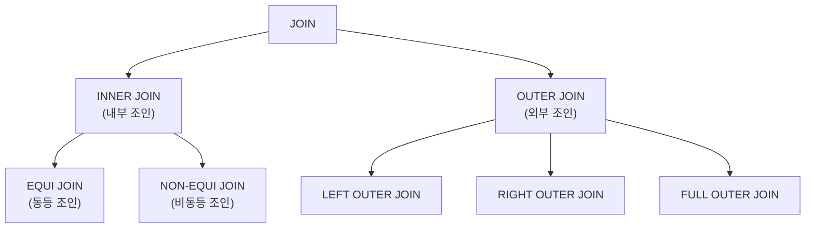

# 정보처리기사 실기 — 08. SQL 응용

> 이 챕터는 **실기에서 배점이 가장 큰 구간**임. 다른 단원이 용어 암기라면 여기는 **직접 쓰는 문제**가 나옴.
> SQL 을 세 갈래(DDL·DCL·DML)로 나누고, SELECT 를 파고든 뒤,
> 절차형 SQL(프로시저·트리거·사용자 정의 함수)과 성능 최적화로 마무리함.
>
> 📌 **JOIN, 그룹 함수, 하위 질의, 트리거** 는 빈칸 채우기로 매번 나옴.
> 문법을 눈으로만 보지 말고 **손으로 써 볼 것**.

---

## (1) SQL의 분류

### SQL(Structured Query Language)

국제 표준 데이터베이스 언어로, 많은 관계형 데이터베이스(RDBMS)가 채택하고 있는 언어.

### 세 가지 분류 ⭐⭐

| 분류 | 이름 | 명령어 | 역할 |
|---|---|---|---|
| **DDL** | 데이터 정의어<br>(Data Define Language) | **CREATE, ALTER, DROP** | 데이터베이스의 **구조를 정의** |
| **DML** | 데이터 조작어<br>(Data Manipulation Language) | **SELECT, INSERT, DELETE, UPDATE** | 데이터를 **검색·삽입·삭제·갱신** |
| **DCL** | 데이터 제어어<br>(Data Control Language) | **COMMIT, ROLLBACK, GRANT, REVOKE** | 데이터의 **보안, 무결성, 회복, 병행 제어** |

> 📌 암기
> - **DDL** : **CREATE(생성) · ALTER(변경) · DROP(삭제)**
> - **DML** : **SELECT(검색) · INSERT(삽입) · DELETE(삭제) · UPDATE(갱신)**
> - **DCL** : **GRANT(부여) · REVOKE(취소) · COMMIT(완료) · ROLLBACK(취소)**

---

## (2) DDL — CREATE

### CREATE SCHEMA

**스키마를 정의**하는 명령문.

```
CREATE SCHEMA 스키마명 AUTHORIZATION 사용자_id;
```

> 예 : 소유권자가 '홍길동'인 스키마 '도서관'을 정의
> `CREATE SCHEMA 도서관 AUTHORIZATION 홍길동;`

### CREATE DOMAIN

**도메인을 정의**하는 명령문. 도메인은 하나의 속성이 취할 수 있는 값의 범위.

```
CREATE DOMAIN 도메인명 [AS] 데이터_타입
    [DEFAULT 기본값]
    [CONSTRAINT 제약조건명 CHECK (범위값)];
```

> 예 : '대출상태'를 문자 4자리로 정의하고, 기본값은 '대출가능', 값은 '대출가능' 또는 '대출중'만 허용
> ```
> CREATE DOMAIN 대출상태 CHAR(4)
>     DEFAULT '대출가능'
>     CONSTRAINT VALID-상태 CHECK(VALUE IN ('대출가능', '대출중'));
> ```

### CREATE TABLE ⭐⭐⭐

**테이블을 정의**하는 명령문.

```
CREATE TABLE 테이블명
    (속성명 데이터_타입 [NOT NULL] [DEFAULT 기본값] [, ...]
    [, PRIMARY KEY(속성명, ...)]
    [, UNIQUE(속성명, ...)]
    [, FOREIGN KEY(속성명, ...) REFERENCES 참조테이블(기본키_속성명, ...)]
        [ON DELETE 옵션]
        [ON UPDATE 옵션]
    [, CONSTRAINT 제약조건명] [CHECK (조건식)]);
```

| 절 | 의미 |
|---|---|
| **PRIMARY KEY** | **기본키**로 사용할 속성을 지정 |
| **UNIQUE** | **대체키**로 사용할 속성을 지정. 중복된 값을 가질 수 없음 |
| **FOREIGN KEY ~ REFERENCES ~** | **외래키**로 사용할 속성을 지정 |
| **CONSTRAINT** | **제약 조건의 이름**을 지정 |
| **CHECK** | 속성 값에 대한 **제약 조건**을 정의 |

**참조 무결성 옵션(ON DELETE / ON UPDATE)** ⭐

| 옵션 | 동작 |
|---|---|
| **NO ACTION** | 참조 테이블에 변화가 있어도 **조취를 취하지 않음** |
| **CASCADE** | 참조 테이블의 튜플이 삭제·변경되면 **관련 튜플도 함께 삭제·변경** |
| **SET NULL** | 참조 테이블에 변화가 있으면 관련 튜플의 속성 값을 **NULL 로 변경** |
| **SET DEFAULT** | 참조 테이블에 변화가 있으면 관련 튜플의 속성 값을 **기본값으로 변경** |

> **예제** — 회원 테이블 생성
> ```
> CREATE TABLE 회원
>     (회원번호 VARCHAR(10) NOT NULL,
>      이름     VARCHAR(20) NOT NULL,
>      연락처   VARCHAR(20),
>      등급     VARCHAR(10) DEFAULT '일반',
>      PRIMARY KEY(회원번호),
>      CHECK (등급 IN ('일반', '우수')));
> ```

**기존 테이블을 이용한 생성**

```
CREATE TABLE 신규테이블 AS SELECT 속성명 FROM 기존테이블;
```

### CREATE VIEW ⭐⭐

**뷰(View)를 정의**하는 명령문.

```
CREATE VIEW 뷰명[(속성명, ...)]
AS SELECT문;
```

- **AS 절에 SELECT 문을 서술**해 뷰를 정의함.
- 서브 쿼리에 **UNION 이나 ORDER BY 절을 사용할 수 없음**.
- 속성명을 기술하지 않으면 SELECT 문의 속성명이 그대로 사용됨.

> 예 : 우수 회원만 보여 주는 뷰
> ```
> CREATE VIEW 우수회원(회원번호, 이름)
> AS SELECT 회원번호, 이름
>    FROM 회원
>    WHERE 등급 = '우수';
> ```

### CREATE INDEX ⭐

**인덱스를 정의**하는 명령문.

```
CREATE [UNIQUE] INDEX 인덱스명
ON 테이블명(속성명 [ASC | DESC] [, ...])
[CLUSTER];
```

| 옵션 | 의미 |
|---|---|
| **UNIQUE** | 생략하면 **중복 값을 허용**, 사용하면 **중복 값을 허용하지 않음** |
| **ASC / DESC** | **오름차순 / 내림차순** 정렬. 생략 시 **오름차순** |
| **CLUSTER** | 지정된 속성을 기준으로 **레코드를 묶음** |

> 예 : `CREATE UNIQUE INDEX 회원_IDX ON 회원(회원번호 ASC);`

---

## (3) DDL — ALTER, DROP

### ALTER TABLE ⭐⭐

**테이블의 구조를 변경**하는 명령문.

```
ALTER TABLE 테이블명 ADD 속성명 데이터_타입 [DEFAULT 기본값];
ALTER TABLE 테이블명 ALTER 속성명 [SET DEFAULT 기본값];
ALTER TABLE 테이블명 DROP COLUMN 속성명 [CASCADE];
```

| 절 | 의미 |
|---|---|
| **ADD** | 새로운 **속성을 추가** |
| **ALTER** | 특정 속성의 **Default 값을 변경** |
| **DROP COLUMN** | 특정 **속성을 삭제** |

> 예 : `ALTER TABLE 회원 ADD 가입일 DATE;`

### DROP ⭐⭐

**스키마, 도메인, 테이블, 뷰, 인덱스를 제거**하는 명령문.

```
DROP SCHEMA  스키마명 [CASCADE | RESTRICT];
DROP DOMAIN  도메인명 [CASCADE | RESTRICT];
DROP TABLE   테이블명 [CASCADE | RESTRICT];
DROP VIEW    뷰명     [CASCADE | RESTRICT];
DROP INDEX   인덱스명 [CASCADE | RESTRICT];
DROP CONSTRAINT 제약조건명;
```

| 옵션 | 의미 |
|---|---|
| **CASCADE** | 제거할 요소를 **참조하는 다른 모든 개체를 함께 제거** (참조 무결성 유지) |
| **RESTRICT** | 다른 개체가 **제거할 요소를 참조 중이면 제거를 취소** |

> ⚠️ **CASCADE = 같이 삭제**, **RESTRICT = 참조 중이면 삭제 안 함**. 매번 나옴.

**DROP vs TRUNCATE vs DELETE** ⭐

| 명령 | 분류 | 동작 |
|---|---|---|
| **DROP** | DDL | 테이블의 **구조와 데이터를 모두 삭제** |
| **TRUNCATE** | DDL | 테이블의 **데이터만 모두 삭제**(구조는 유지). 롤백 불가 |
| **DELETE** | DML | 조건에 맞는 **행(데이터)만 삭제**. 롤백 가능 |

---

## (4) DCL

### DCL(Data Control Language)

데이터의 **보안, 무결성, 회복, 병행 수행 제어** 등을 정의하는 데 사용하는 언어.
데이터베이스 관리자(DBA)가 데이터 관리를 목적으로 사용함.

### GRANT / REVOKE ⭐⭐

데이터베이스 관리자가 사용자에게 **권한을 부여하거나 취소**하기 위한 명령어.

**사용자 등급 지정**

```
GRANT  등급 TO 사용자_id_리스트 [IDENTIFIED BY 암호];
REVOKE 등급 FROM 사용자_id_리스트;
```

| 등급 | 의미 |
|---|---|
| **DBA** | 데이터베이스 **관리자** |
| **RESOURCE** | 데이터베이스 및 **테이블 생성 가능자** |
| **CONNECT** | 단순 **사용자** |

**테이블 및 속성에 대한 권한 부여·취소**

```
GRANT  권한_리스트 ON 개체 TO 사용자 [WITH GRANT OPTION];
REVOKE [GRANT OPTION FOR] 권한_리스트 ON 개체 FROM 사용자 [CASCADE];
```

| 옵션 | 의미 |
|---|---|
| **WITH GRANT OPTION** | 부여받은 권한을 **다른 사용자에게 다시 부여할 수 있는 권한**을 부여 |
| **GRANT OPTION FOR** | **다른 사용자에게 권한을 부여할 수 있는 권한만** 취소 |
| **CASCADE** | 권한 취소 시 **다른 사용자에게 부여된 권한도 연쇄적으로 취소** |

> 예 : 사용자 '홍길동'에게 회원 테이블의 검색 권한을 부여
> `GRANT SELECT ON 회원 TO 홍길동;`
>
> 예 : '홍길동'에게 회원 테이블의 갱신 권한을 다른 사람에게도 줄 수 있게 부여
> `GRANT UPDATE ON 회원 TO 홍길동 WITH GRANT OPTION;`

### TCL(Transaction Control Language) ⭐

**트랜잭션을 제어**하는 명령어. DCL 에 포함되기도 함.

| 명령 | 의미 |
|---|---|
| **COMMIT** | 트랜잭션 처리가 **정상적으로 종료되어 수행한 변경 내용을 DB 에 반영**하는 명령어 |
| **ROLLBACK** | 트랜잭션 처리가 **비정상적으로 종료되어 트랜잭션 처리 과정에서 발생한 변경 내용을 취소**하는 명령어 |
| **SAVEPOINT**<br>(=CHECKPOINT) | 트랜잭션 내에 **ROLLBACK 할 위치인 저장점을 지정**하는 명령어 |

```
SAVEPOINT 저장점명;
ROLLBACK TO 저장점명;
```

> 💡 SAVEPOINT 를 지정하지 않고 `ROLLBACK` 만 하면 **트랜잭션 시작 시점까지** 되돌림.

---

## (5) DML — INSERT, DELETE, UPDATE

### INSERT INTO ⭐⭐

테이블에 **새로운 튜플을 삽입**하는 명령문.

```
INSERT INTO 테이블명([속성명, ...])
VALUES (데이터, ...);
```

- 대응하는 속성과 데이터는 **개수와 데이터 유형이 일치**해야 함.
- 속성명을 생략하면 **테이블 정의 시의 속성 순서대로** 삽입됨.
- SELECT 문을 이용해 **다른 테이블의 검색 결과를 삽입**할 수도 있음.

> 예
> ```
> INSERT INTO 회원(회원번호, 이름, 등급) VALUES ('M004', '최바람', '일반');
> INSERT INTO 우수회원목록 SELECT 회원번호, 이름 FROM 회원 WHERE 등급 = '우수';
> ```

### DELETE FROM ⭐⭐

테이블에서 **특정 튜플(행)을 삭제**하는 명령문.

```
DELETE FROM 테이블명 [WHERE 조건];
```

> ⚠️ **모든 레코드를 삭제해도 테이블 구조는 남아 있음.**
> 테이블 구조까지 지우려면 **DROP** 을 써야 함.

> 예
> ```
> DELETE FROM 회원 WHERE 이름 = '최바람';
> DELETE FROM 회원;              -- 모든 튜플 삭제
> ```

### UPDATE ~ SET ~ ⭐⭐

테이블의 **특정 튜플의 속성 값을 변경**하는 명령문.

```
UPDATE 테이블명
SET 속성명 = 데이터 [, 속성명 = 데이터, ...]
[WHERE 조건];
```

> 예
> ```
> UPDATE 회원 SET 등급 = '우수' WHERE 회원번호 = 'M002';
> UPDATE 회원 SET 연락처 = '010-0000-0000', 등급 = '일반' WHERE 이름 = '김하늘';
> ```

---

## (6) DML — SELECT 기본

### 일반 형식 ⭐⭐⭐

```
SELECT [PREDICATE] [테이블명.]속성명 [AS 별칭][, ...]
    [, 그룹함수(속성명) [AS 별칭]]
FROM 테이블명[, ...]
[WHERE 조건]
[GROUP BY 속성명[, ...]]
[HAVING 조건]
[ORDER BY 속성명 [ASC | DESC]];
```

| 절 | 역할 |
|---|---|
| **SELECT** | 검색할 **속성(열)** 을 지정 |
| **FROM** | 검색할 **테이블**을 지정 |
| **WHERE** | **조건**을 지정 |
| **GROUP BY** | **그룹으로 묶을 기준** 속성을 지정 |
| **HAVING** | **그룹에 대한 조건**을 지정 |
| **ORDER BY** | **정렬** 기준을 지정 |

**PREDICATE**

| 옵션 | 의미 |
|---|---|
| **ALL** | **모든 튜플**을 검색 (기본값) |
| **DISTINCT** | **중복된 튜플을 제거**하고 한 번만 검색 |
| **DISTINCTROW** | 중복된 튜플을 제거하되 **하나의 속성만 지정했을 때** 사용 |

> ⚠️ **실행 순서** — FROM → WHERE → GROUP BY → HAVING → SELECT → ORDER BY

### 조건 연산자 ⭐⭐

**비교 연산자**

| 연산자 | 의미 |
|:---:|---|
| `=` | 같다 |
| `<>` 또는 `!=` | 같지 않다 |
| `>` `>=` `<` `<=` | 크다 / 크거나 같다 / 작다 / 작거나 같다 |

**논리 연산자** — `NOT`, `AND`, `OR`

**기타 연산자** ⭐

| 연산자 | 의미 | 예 |
|---|---|---|
| **BETWEEN A AND B** | A 와 B **사이의 값**(양 끝 포함) | `WHERE 나이 BETWEEN 20 AND 29` |
| **IN (값1, 값2, ...)** | 목록 중 **하나와 일치** | `WHERE 등급 IN ('일반','우수')` |
| **LIKE** | **패턴 일치**. `%` = 임의의 문자열, `_` = 임의의 한 문자 | `WHERE 이름 LIKE '김%'` |
| **IS NULL / IS NOT NULL** | NULL 여부 판단 | `WHERE 연락처 IS NULL` |

> ⚠️ **NULL 은 `= NULL` 로 비교할 수 없음.** 반드시 **IS NULL** 을 써야 함.

### 기본 검색

```
SELECT * FROM 회원;                        -- 전체 조회
SELECT 이름, 등급 FROM 회원;                -- 특정 열만
SELECT DISTINCT 등급 FROM 회원;             -- 중복 제거
SELECT 이름 AS 회원명 FROM 회원;            -- 별칭 부여
```

### 조건 지정 검색

```
SELECT * FROM 회원 WHERE 등급 = '우수';
SELECT * FROM 회원 WHERE 등급 = '우수' AND 가입일 >= '2024-01-01';
SELECT * FROM 도서 WHERE 제목 LIKE '%데이터%';
```

### 정렬 검색

```
SELECT * FROM 회원 ORDER BY 가입일 DESC;
SELECT * FROM 회원 ORDER BY 등급 ASC, 이름 DESC;
```

> 💡 **ASC 는 생략 가능**(기본값). **DESC** 는 반드시 명시해야 함.

---

## (7) DML — 그룹 함수와 그룹 지정 검색

### 그룹(집계) 함수 ⭐⭐⭐

| 함수 | 의미 |
|---|---|
| **COUNT(속성명)** | 그룹별 **튜플 수**를 구함 |
| **SUM(속성명)** | 그룹별 **합계**를 구함 |
| **AVG(속성명)** | 그룹별 **평균**을 구함 |
| **MAX(속성명)** | 그룹별 **최댓값**을 구함 |
| **MIN(속성명)** | 그룹별 **최솟값**을 구함 |
| **STDDEV(속성명)** | 그룹별 **표준편차**를 구함 |
| **VARIANCE(속성명)** | 그룹별 **분산**을 구함 |

> ⚠️ **COUNT(*)** 는 NULL 을 포함해 세지만, **COUNT(속성명)** 은 **NULL 을 제외**하고 셈.
> SUM, AVG 등도 **NULL 은 계산에서 제외**됨.

### 그룹 지정 검색 ⭐⭐

```
SELECT 등급, COUNT(*) AS 인원수, AVG(누적대출수) AS 평균대출
FROM 회원
GROUP BY 등급
HAVING COUNT(*) >= 2
ORDER BY 인원수 DESC;
```

> ⚠️ **WHERE vs HAVING** — 매번 나오는 구분
> - **WHERE** : **그룹으로 묶기 전(개별 행)** 에 대한 조건
> - **HAVING** : **그룹으로 묶은 후(그룹)** 에 대한 조건. **그룹 함수를 조건에 쓸 수 있음**

**ROLLUP / CUBE**

| 함수 | 의미 |
|---|---|
| **ROLLUP(속성명)** | 지정된 속성을 기준으로 **각 그룹의 소계와 전체 합계**를 구함. **계층적**으로 집계 |
| **CUBE(속성명)** | 지정된 속성들의 **모든 조합에 대한 소계와 전체 합계**를 구함 |

---

## (8) DML — 하위 질의와 집합 연산자

### 하위 질의(Sub Query) ⭐⭐

조건절에 **주어진 질의를 먼저 수행**해 그 검색 결과를 조건절의 피연산자로 사용하는 방식.

```
SELECT 이름 FROM 회원
WHERE 회원번호 IN (SELECT 회원번호 FROM 대출 WHERE 연체여부 = 'Y');
```

**하위 질의의 종류**

| 종류 | 설명 |
|---|---|
| **단일행 하위 질의** | 결과가 **한 행**. `=`, `>`, `<` 등 단일행 연산자 사용 |
| **다중행 하위 질의** | 결과가 **여러 행**. **IN, ANY, ALL, EXISTS** 사용 |

| 연산자 | 의미 |
|---|---|
| **IN** | 하위 질의 결과 중 **하나와 일치** |
| **ANY / SOME** | 하위 질의 결과 중 **어느 하나라도 만족** |
| **ALL** | 하위 질의 결과 **모두를 만족** |
| **EXISTS** | 하위 질의 결과가 **존재하면 참** |

### 복수 테이블 검색

```
SELECT 회원.이름, 대출.대출일
FROM 회원, 대출
WHERE 회원.회원번호 = 대출.회원번호;
```

### 집합 연산자를 이용한 통합 질의 ⭐⭐

```
SELECT 속성명 FROM 테이블명
집합연산자
SELECT 속성명 FROM 테이블명;
```

| 연산자 | 의미 | 중복 |
|---|---|---|
| **UNION** | 두 SELECT 문의 결과를 **합침** | **중복 제거** |
| **UNION ALL** | 두 SELECT 문의 결과를 합침 | **중복 포함** |
| **INTERSECT** | 두 SELECT 문의 **공통된 행**만 | 중복 제거 |
| **EXCEPT**(MINUS) | 첫 번째 SELECT 결과에서 **두 번째 결과를 뺀** 행 | 중복 제거 |

> ⚠️ 집합 연산자를 사용하려면 두 SELECT 문의 **속성 개수와 데이터 타입이 일치**해야 함.

---

## (9) DML — JOIN

### JOIN ⭐⭐⭐

**두 개 이상의 테이블을 연결해 데이터를 검색**하는 방법.



### INNER JOIN(내부 조인) ⭐⭐

두 테이블에서 **조건에 맞는 행만** 검색함.

| 종류 | 설명 |
|---|---|
| **EQUI JOIN**(동등 조인) | **공통 속성을 `=` 비교**해 같은 값을 갖는 행을 연결. 가장 일반적 |
| **NON-EQUI JOIN**(비동등 조인) | `=` 이외의 비교 연산자(`>`, `<`, `BETWEEN` 등)를 사용해 조인 |

**EQUI JOIN 표기법 — 두 가지**

```
-- WHERE 절 이용
SELECT 회원.이름, 대출.대출일
FROM 회원, 대출
WHERE 회원.회원번호 = 대출.회원번호;

-- NATURAL JOIN / INNER JOIN ~ ON 이용
SELECT 회원.이름, 대출.대출일
FROM 회원 NATURAL JOIN 대출;

SELECT 회원.이름, 대출.대출일
FROM 회원 INNER JOIN 대출 ON 회원.회원번호 = 대출.회원번호;

SELECT 회원.이름, 대출.대출일
FROM 회원 JOIN 대출 USING(회원번호);
```

> 💡 **자연 조인(NATURAL JOIN)** : EQUI JOIN 에서 **중복된 속성을 한 번만 표기**하는 방법.

### OUTER JOIN(외부 조인) ⭐⭐

INNER JOIN 의 결과에 더해, **조건에 맞지 않는 행까지 포함**해 검색함.

| 종류 | 설명 |
|---|---|
| **LEFT OUTER JOIN** | **왼쪽 테이블의 모든 행**을 포함. 오른쪽에 짝이 없으면 **NULL** |
| **RIGHT OUTER JOIN** | **오른쪽 테이블의 모든 행**을 포함. 왼쪽에 짝이 없으면 **NULL** |
| **FULL OUTER JOIN** | **양쪽 테이블의 모든 행**을 포함 |

```
SELECT 회원.이름, 대출.대출일
FROM 회원 LEFT OUTER JOIN 대출
ON 회원.회원번호 = 대출.회원번호;
```

> 💡 **LEFT OUTER JOIN** 은 "대출 기록이 없는 회원도 보고 싶다"일 때 씀.

### SELF JOIN(자체 조인)

**같은 테이블끼리 조인**하는 방법. 별칭(Alias)을 반드시 사용해야 함.

```
SELECT A.이름, B.이름 AS 추천인
FROM 회원 A, 회원 B
WHERE A.추천인번호 = B.회원번호;
```

### CROSS JOIN(교차 조인)

두 테이블의 **모든 행을 조합**. 결과 행 수는 **두 테이블 행 수의 곱**(교차곱, Cartesian Product).

---

## (10) WINDOW 함수

### WINDOW 함수 ⭐

**그룹 내에서의 순위, 누계 등을 구할 때** 사용하는 함수.
GROUP BY 와 달리 **행의 개수를 줄이지 않고** 집계 결과를 각 행에 붙여 줌.

```
SELECT WINDOW함수(인수) OVER
    ([PARTITION BY 속성명] [ORDER BY 속성명 [ASC|DESC]])
FROM 테이블명;
```

| 절 | 의미 |
|---|---|
| **OVER** | WINDOW 함수임을 나타냄 |
| **PARTITION BY** | **그룹으로 나눌 기준** 속성 |
| **ORDER BY** | 그룹 내에서 **정렬할 기준** 속성 |

### 순위 함수 ⭐⭐

| 함수 | 의미 |
|---|---|
| **ROW_NUMBER()** | 동일한 값이라도 **각기 다른 순위**를 부여 (1, 2, 3, 4) |
| **RANK()** | 동일한 값에 **같은 순위**를 부여하고, **그 개수만큼 다음 순위를 건너뜀** (1, 2, 2, 4) |
| **DENSE_RANK()** | 동일한 값에 **같은 순위**를 부여하고, **순위를 건너뛰지 않음** (1, 2, 2, 3) |

> ⚠️ **RANK 는 건너뛰고, DENSE_RANK 는 안 건너뜀.** 이 차이가 매번 나옴.

```
SELECT 이름, 누적대출수,
       RANK() OVER (ORDER BY 누적대출수 DESC) AS 순위
FROM 회원;
```

### 행 순서 함수

| 함수 | 의미 |
|---|---|
| **FIRST_VALUE()** | 파티션 내에서 **가장 먼저 나온 값** |
| **LAST_VALUE()** | 파티션 내에서 **가장 마지막에 나온 값** |
| **LAG()** | **이전 행**의 값 |
| **LEAD()** | **다음 행**의 값 |

---

## (11) 절차형 SQL — 프로시저

### 절차형 SQL

**SQL 에 절차 지향적인 기능(조건문, 반복문)을 추가**해
SQL 만으로 처리하기 어려운 연속적인 작업을 처리할 수 있게 한 것.

| 종류 | 설명 |
|---|---|
| **프로시저**(Procedure) | 특정 기능을 수행하는 일종의 **트랜잭션 언어**. 호출을 통해 실행되어 미리 저장해 놓은 SQL 작업을 수행 |
| **트리거**(Trigger) | 데이터베이스에 **어떤 이벤트가 발생할 때 자동으로 수행**되는 사용자 정의 프로시저 |
| **사용자 정의 함수** | 프로시저와 유사하지만 **반드시 반환값(RETURN)이 있음** |

### 프로시저의 구성 ⭐

| 구성 | 내용 |
|---|---|
| **DECLARE** | 프로시저의 **명칭, 변수, 인수, 데이터 타입을 정의**하는 선언부 |
| **BEGIN / END** | 프로시저의 **시작과 종료**를 의미 |
| **CONTROL** | **조건문 또는 반복문**이 삽입되어 순차적으로 처리 |
| **SQL** | **DML, DCL** 이 삽입되어 데이터 관리를 위한 조회, 추가, 수정, 삭제 등을 수행 |
| **EXCEPTION** | BEGIN ~ END 안의 구문 실행 시 **예외가 발생하면 처리하는 방법**을 정의 |
| **TRANSACTION** | 수행된 데이터 작업들을 **DB 에 적용할지 취소할지를 결정**하는 처리부 |

### 프로시저 생성 ⭐⭐

```
CREATE [OR REPLACE] PROCEDURE 프로시저명(파라미터)
[지역변수 선언]
BEGIN
    프로시저 BODY;
END;
```

| 파라미터 종류 | 의미 |
|---|---|
| **IN** | 호출 프로그램이 프로시저에게 **값을 전달** |
| **OUT** | 프로시저가 호출 프로그램에게 **값을 반환** |
| **INOUT** | 호출 프로그램이 **값을 전달하고 반환받음** |

> 예 : 회원의 등급을 우수로 변경하는 프로시저
> ```
> CREATE OR REPLACE PROCEDURE 등급변경(i_회원번호 IN VARCHAR2)
> IS
> BEGIN
>     UPDATE 회원 SET 등급 = '우수' WHERE 회원번호 = i_회원번호;
>     COMMIT;
> END;
> ```

### 프로시저 실행 / 제거

```
EXECUTE 프로시저명(파라미터);
EXEC    프로시저명(파라미터);
CALL    프로시저명(파라미터);

DROP PROCEDURE 프로시저명;
```

---

## (12) 절차형 SQL — 트리거

### 트리거(Trigger) ⭐⭐⭐

데이터베이스 시스템에서 데이터의 **삽입(INSERT), 갱신(UPDATE), 삭제(DELETE) 등의 이벤트가
발생할 때마다 자동으로 수행**되는 사용자 정의 프로시저.

- 데이터베이스에 저장되며, **데이터 변경 및 무결성 유지, 로그 메시지 출력** 등의 목적으로 사용됨.
- ⚠️ 트리거의 구문에는 **DCL(COMMIT, ROLLBACK, GRANT, REVOKE)을 사용할 수 없음**.
  DCL 이 포함된 프로시저나 함수를 호출하는 경우에도 오류가 발생함.

### 트리거의 구성

| 구성 | 내용 |
|---|---|
| **DECLARE** | 트리거의 **명칭, 변수, 상수, 데이터 타입을 정의**하는 선언부 |
| **EVENT** | 트리거가 **실행되는 조건**을 명시 |
| **BEGIN / END** | 트리거의 **시작과 종료** |
| **CONTROL** | 조건문 또는 반복문 |
| **SQL** | **DML** 을 삽입해 데이터 관리 |
| **EXCEPTION** | 예외 처리 방법을 정의 |

> ⚠️ 프로시저와 달리 **TRANSACTION 이 없음**(DCL 사용 불가).

### 트리거의 생성 ⭐⭐

```
CREATE [OR REPLACE] TRIGGER 트리거명 [동작시기] [동작]
ON 테이블명
[REFERENCING NEW|OLD AS 테이블명]
[FOR EACH ROW [WHEN 조건식]]
BEGIN
    트리거 BODY;
END;
```

| 옵션 | 의미 |
|---|---|
| **동작시기** | **AFTER**(테이블 조작 후) 또는 **BEFORE**(테이블 조작 전) |
| **동작** | **INSERT / DELETE / UPDATE** 중 어떤 조작에 반응할지 |
| **NEW / OLD** | **변경에 참여할 테이블의 별칭**을 지정.<br>**NEW** = 새로 추가·변경될 데이터, **OLD** = 변경·삭제 전 데이터 |
| **FOR EACH ROW** | **각 행마다** 트리거를 적용 |
| **WHEN 조건식** | 트리거가 실행될 **추가 조건** |

> 예 : 대출이 발생하면 회원의 누적대출수를 1 증가시키는 트리거
> ```
> CREATE OR REPLACE TRIGGER 대출증가 AFTER INSERT ON 대출
> REFERENCING NEW AS 신규
> FOR EACH ROW
> BEGIN
>     UPDATE 회원 SET 누적대출수 = 누적대출수 + 1
>     WHERE 회원번호 = :신규.회원번호;
> END;
> ```

### 트리거의 제거

```
DROP TRIGGER 트리거명;
```

---

## (13) 절차형 SQL — 사용자 정의 함수

### 사용자 정의 함수 ⭐⭐

프로시저와 유사하게 SQL 을 사용해 일련의 작업을 연속적으로 처리하며,
종료 시 **함수를 호출한 곳으로 결과값을 반환**하는 절차형 SQL.

- 데이터베이스에 저장되어 SELECT, INSERT, DELETE, UPDATE 등 **DML 문의 호출에 의해 실행**됨.
- 프로시저와 달리 **DML 을 직접 사용할 수 없고**, **반드시 반환값이 있음**.

> ⚠️ **프로시저 vs 사용자 정의 함수** — 가장 자주 나오는 비교
> | 구분 | 프로시저 | 사용자 정의 함수 |
> |---|---|---|
> | 반환값 | 없거나 여러 개(OUT) | **반드시 하나(RETURN)** |
> | 호출 방법 | EXECUTE / CALL | **SQL 문 내에서 직접 사용** |
> | DML 사용 | 가능 | **불가능(제한적)** |

### 사용자 정의 함수의 구성

**DECLARE → BEGIN/END → CONTROL → SQL → EXCEPTION → RETURN**

> 💡 프로시저의 **TRANSACTION 자리에 RETURN 이 들어감**.

### 생성 / 실행 / 제거 ⭐

```
CREATE [OR REPLACE] FUNCTION 함수명(파라미터)
[지역변수 선언]
BEGIN
    함수 BODY;
    RETURN 반환값;
END;
```

```
-- 실행 : SELECT, INSERT, DELETE, UPDATE 문 안에서 사용
SELECT 함수명(속성명) FROM 테이블명;

-- 제거
DROP FUNCTION 함수명;
```

> 예 : 연체일수를 받아 연체료를 계산하는 함수
> ```
> CREATE OR REPLACE FUNCTION 연체료계산(i_연체일수 IN NUMBER)
> RETURN NUMBER
> IS
>     v_연체료 NUMBER;
> BEGIN
>     v_연체료 := i_연체일수 * 100;
>     RETURN v_연체료;
> END;
> ```

---

## (14) 제어문과 커서

### 제어문 ⭐

**IF 문**

```
IF 조건 THEN
    실행할 문장;
ELSIF 조건 THEN
    실행할 문장;
ELSE
    실행할 문장;
END IF;
```

**LOOP 문**

| 종류 | 형식 |
|---|---|
| **기본 LOOP** | `LOOP 실행문; EXIT WHEN 조건; END LOOP;` |
| **WHILE LOOP** | `WHILE 조건 LOOP 실행문; END LOOP;` |
| **FOR LOOP** | `FOR 변수 IN 시작값..종료값 LOOP 실행문; END LOOP;` |

### 커서(Cursor) ⭐⭐

**쿼리문의 처리 결과가 저장되어 있는 메모리 공간을 가리키는 포인터**.

**커서의 수행 순서** — **OPEN → FETCH → CLOSE**

| 단계 | 의미 |
|---|---|
| **OPEN** | 커서를 **열고 쿼리를 실행**해 결과를 커서에 저장 |
| **FETCH** | 커서에 저장된 결과를 **한 행씩 읽어** 변수에 저장 |
| **CLOSE** | 커서를 **닫고 메모리를 해제** |

### 커서의 종류 ⭐

| 종류 | 설명 |
|---|---|
| **묵시적 커서**<br>(Implicit Cursor) | DBMS 에 의해 **자동으로 생성되어 사용**되는 커서. 커서의 속성을 조회해 **직전 SQL 문의 결과를 알 수 있음** |
| **명시적 커서**<br>(Explicit Cursor) | **사용자가 직접 정의해서 사용**하는 커서. 주로 **여러 개의 행을 처리**하고자 할 때 사용 |

**묵시적 커서의 속성**

| 속성 | 의미 |
|---|---|
| **SQL%FOUND** | 실행 결과가 **1행 이상이면 TRUE** |
| **SQL%NOTFOUND** | 실행 결과가 **0행이면 TRUE** |
| **SQL%ROWCOUNT** | 실행 결과로 **영향을 받은 행의 수** |
| **SQL%ISOPEN** | 커서가 **열려 있으면 TRUE**(묵시적 커서는 항상 FALSE) |

---

## (15) DBMS 접속과 동적 SQL

### DBMS 접속(Connection)

사용자가 데이터를 사용하기 위해 **응용 시스템을 이용해 DBMS 에 접근**하는 것.

### DBMS 접속 기술 ⭐

| 기술 | 설명 |
|---|---|
| **JDBC**(Java DataBase Connectivity) | **Java** 언어로 다양한 종류의 데이터베이스에 접속하고 SQL 문을 수행할 때 사용되는 표준 API |
| **ODBC**(Open DataBase Connectivity) | 데이터베이스에 접근하기 위한 표준 개방형 API. **개발 언어에 관계없이** 사용 가능. **마이크로소프트**에서 개발 |
| **MyBatis** | **JDBC 코드를 단순화**해 사용할 수 있는 **SQL Mapping 기반 오픈 소스 접속 프레임워크**. SQL 문장을 별도의 파일로 분리해 관리 |

### 동적 SQL(Dynamic SQL) ⭐

**개발 언어에 SQL 을 삽입해 사용하는 정적 SQL 과 달리**,
조건에 따라 **SQL 구문을 동적으로 변경해 사용**하는 SQL.

| 구분 | 정적 SQL | 동적 SQL |
|---|---|---|
| SQL 구성 | **프로그램 내에 고정** | **문자열 변수에 담아 실행 시점에 구성** |
| 커서 | 명시적 커서 사용 | 명시적/묵시적 커서 모두 사용 |
| 실행 성능 | **빠름**(사전 컴파일) | 상대적으로 **느림** |
| 사용자 입력 | 제한적 | **자유로움** |
| 보안 | 안전 | **SQL 삽입 공격에 취약** |

---

## (16) SQL 테스트와 ORM

### SQL 테스트

작성된 SQL 이 **목적에 맞게 정상적으로 수행되는지 확인**하는 것.

| 구분 | 방법 |
|---|---|
| **단문 SQL 테스트** | DBMS 의 **명령 프롬프트(콘솔)** 에서 SQL 을 직접 실행해 결과를 확인. 오류가 발생하면 오류 코드와 메시지를 확인 |
| **절차형 SQL 테스트** | 프로시저·트리거·사용자 정의 함수를 실행해 결과를 확인.<br>**디버깅을 통해 오류를 찾고**, **`SHOW ERRORS`** 명령으로 오류 내용을 확인 |

### ORM(Object-Relational Mapping) ⭐

**객체(Object)와 관계형 데이터베이스(Relational Database)의 데이터를 자동으로 연결(Mapping)** 해 주는 기술.

- 객체 지향 프로그래밍 언어의 **객체와 DB 의 테이블을 매핑**함.
- SQL 문을 직접 작성하지 않고 **객체를 통해 데이터를 조작**할 수 있음.
- **개발자가 SQL 을 몰라도** 데이터베이스를 다룰 수 있음.

**ORM 프레임워크** — Java(**Hibernate, JPA**), Python(**Django ORM, SQLAlchemy**),
PHP(Doctrine), .NET(Entity Framework)

**ORM 의 한계** ⭐

- 자동으로 생성되는 SQL 이 **최적화되지 않아 성능이 저하**될 수 있음
- **복잡한 쿼리**를 표현하기 어려움
- **대량의 데이터 처리**에 부적합할 수 있음
- 프레임워크 **학습 비용**이 발생함
- 프로시저가 많은 시스템에서는 **ORM 의 장점을 활용하기 어려움**

---

## (17) 쿼리 성능 최적화

### 쿼리 성능 최적화

데이터 입출력 애플리케이션의 성능 향상을 위해
**SQL 코드를 최적화**하는 것.

**절차** — **성능 측정 도구(APM)로 쿼리 성능 확인 → 문제가 되는 SQL 을 개선**

### 옵티마이저(Optimizer) ⭐⭐

작성된 SQL 이 데이터를 처리하기 위해 **가장 효율적인 경로(실행 계획)를 선택**하도록 해 주는
데이터베이스 엔진의 핵심 모듈.

| 종류 | 설명 |
|---|---|
| **규칙 기반 옵티마이저**<br>(RBO; Rule Based Optimizer) | **미리 정해진 우선순위(규칙)** 에 따라 실행 계획을 생성. 사용자가 원하는 처리 경로로 유도하기 쉬움 |
| **비용 기반 옵티마이저**<br>(CBO; Cost Based Optimizer) | **테이블·인덱스의 통계 정보를 바탕으로 비용을 계산**해 가장 낮은 비용의 실행 계획을 선택. **현대 DBMS 의 기본** |

### 실행 계획(Execution Plan)

DBMS 의 옵티마이저가 수립한 **SQL 코드의 실행 절차와 방법**을 표현한 것.

- 옵티마이저는 파스 트리(Parse Tree)를 이용해 실행 계획을 생성함.
- **`EXPLAIN PLAN`** 또는 **`EXPLAIN`** 명령어로 확인할 수 있음.
- 실행 계획에는 **조인 순서, 조인 기법, 액세스 기법, 최적화 정보, 연산 등**이 표시됨.

### 쿼리 성능 최적화 방법 ⭐

| 방법 | 내용 |
|---|---|
| **적절한 인덱스 사용** | WHERE 절이나 JOIN 조건에 사용되는 컬럼에 인덱스를 생성 |
| **인덱스 컬럼에 함수·연산 사용 금지** | `WHERE SUBSTR(회원번호,1,1)='M'` 처럼 쓰면 **인덱스를 타지 못함** |
| **불필요한 컬럼 조회 지양** | `SELECT *` 대신 **필요한 컬럼만** 명시 |
| **서브 쿼리를 조인으로 변경** | 중첩된 서브 쿼리보다 조인이 유리한 경우가 많음 |
| **DISTINCT 남용 지양** | 정렬 비용이 발생하므로 꼭 필요할 때만 사용 |
| **UNION 대신 UNION ALL** | 중복 제거가 필요 없으면 **UNION ALL** 이 빠름 |
| **적절한 조인 기법 선택** | Nested Loop Join, Sort Merge Join, Hash Join 중 상황에 맞게 |

### 주요 조인 기법

| 기법 | 설명 |
|---|---|
| **Nested Loop Join** | 선행 테이블의 각 행마다 후행 테이블을 반복 탐색. **소량의 데이터**에 유리 |
| **Sort Merge Join** | 두 테이블을 **정렬한 후 병합**. 조인 컬럼에 인덱스가 없을 때 유리 |
| **Hash Join** | 조인 컬럼으로 **해시 테이블을 만들어** 조인. **대량의 데이터**에 유리 |

---

## 📌 부록 — 핵심 암기 요약

| 구분 | 암기 포인트 |
|---|---|
| **DDL** | **CREATE · ALTER · DROP** — 구조 정의 |
| **DML** | **SELECT · INSERT · DELETE · UPDATE** — 데이터 조작 |
| **DCL** | **GRANT · REVOKE · COMMIT · ROLLBACK** — 보안·무결성·회복 |
| **참조 무결성 옵션** | NO ACTION · **CASCADE** · SET NULL · SET DEFAULT |
| **DROP 옵션** | **CASCADE**(같이 삭제) · **RESTRICT**(참조 중이면 취소) |
| **DROP/TRUNCATE/DELETE** | DROP=구조+데이터 / TRUNCATE=데이터만(롤백X) / DELETE=행 단위(롤백O) |
| **사용자 등급** | **DBA · RESOURCE · CONNECT** |
| **GRANT 옵션** | **WITH GRANT OPTION**(재부여 권한까지) |
| **TCL** | **COMMIT · ROLLBACK · SAVEPOINT** |
| **SELECT 절 순서** | SELECT → FROM → WHERE → GROUP BY → HAVING → ORDER BY |
| **SELECT 실행 순서** | **FROM → WHERE → GROUP BY → HAVING → SELECT → ORDER BY** |
| **PREDICATE** | ALL(기본) · **DISTINCT**(중복 제거) |
| **기타 연산자** | BETWEEN · IN · **LIKE(`%` 문자열, `_` 한 문자)** · **IS NULL** |
| **그룹 함수** | COUNT · SUM · AVG · MAX · MIN · STDDEV · VARIANCE |
| **WHERE vs HAVING** | WHERE = **그룹 전(행)**, HAVING = **그룹 후(그룹)** |
| **집합 연산자** | **UNION**(중복 제거) · **UNION ALL**(중복 포함) · INTERSECT · EXCEPT |
| **JOIN 분류** | INNER(EQUI·NON-EQUI) / OUTER(LEFT·RIGHT·FULL) / SELF / CROSS |
| **자연 조인** | EQUI JOIN 에서 **중복 속성을 한 번만** 표기 |
| **순위 함수** | ROW_NUMBER(1,2,3,4) · **RANK(1,2,2,4)** · **DENSE_RANK(1,2,2,3)** |
| **프로시저 구성** | DECLARE · BEGIN/END · CONTROL · SQL · EXCEPTION · **TRANSACTION** |
| **함수 구성** | 프로시저와 같되 TRANSACTION 대신 **RETURN** |
| **트리거** | 이벤트 발생 시 자동 실행. **DCL 사용 불가**. BEFORE/AFTER + NEW/OLD |
| **프로시저 vs 함수** | 함수는 **반드시 RETURN**, SQL 문 내에서 직접 호출 |
| **커서 순서** | **OPEN → FETCH → CLOSE** |
| **커서 종류** | **묵시적**(DBMS 자동) · **명시적**(사용자 정의, 여러 행) |
| **DBMS 접속 기술** | **JDBC**(Java) · **ODBC**(언어 무관, MS) · **MyBatis**(SQL Mapping) |
| **동적 SQL** | 실행 시점에 구성. 유연하나 **느리고 SQL 삽입에 취약** |
| **ORM** | 객체↔테이블 자동 매핑. Hibernate/JPA. 한계는 **성능·복잡 쿼리** |
| **옵티마이저** | **RBO**(규칙 기반) · **CBO**(비용 기반, 통계 정보) |
| **실행 계획 확인** | **EXPLAIN PLAN** |
| **조인 기법** | Nested Loop(소량) · Sort Merge(정렬) · **Hash(대량)** |
