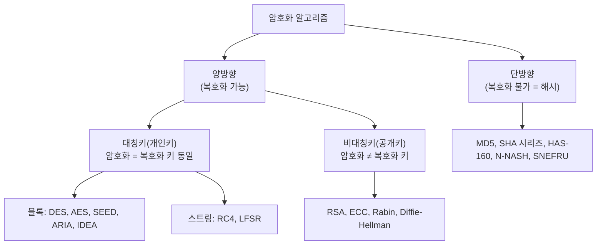

# 정보처리기사 실기 — 09. 소프트웨어 개발 보안 구축

> 이 챕터는 **공격당하지 않는 소프트웨어를 만드는 법**을 다룸.
> 개발 단계마다 보안을 심는 절차(Secure SDLC)를 잡고,
> 소스 코드에서 생기는 약점 7가지를 훑은 뒤, 암호 알고리즘과 공격 유형·보안 솔루션으로 마무리함.
>
> 📌 이 챕터의 3대 단골 —
> **대칭키/비대칭키 알고리즘 분류**, **DoS·DDoS 공격 유형**, **7가지 보안 약점 구분**.
> 특히 알고리즘 이름을 대칭/비대칭/해시로 갈라 내는 문제는 거의 매번 나옴.

---

## (1) Secure SDLC

### Software Development Security(소프트웨어 개발 보안)

소프트웨어 개발 과정에서 개발자의 실수, 논리적 오류 등으로 인해
소프트웨어에 발생할 수 있는 **보안 취약점을 최소화**하여,
사이버 보안 위협에 대응할 수 있는 안전한 소프트웨어를 만들기 위한 일련의 보안 활동.

### 보안의 3대 요소 ⭐⭐

| 요소 | 의미 |
|---|---|
| **기밀성**(Confidentiality) | 인가되지 않은 개인 혹은 시스템의 접근에 따른 **정보 공개 및 노출을 차단**하는 특성 |
| **무결성**(Integrity) | 정당한 방법을 따르지 않고서는 **데이터가 변경될 수 없는** 특성 |
| **가용성**(Availability) | 권한을 가진 사용자나 애플리케이션이 **원하는 서비스를 지속해서 사용할 수 있도록** 보장하는 특성 |

> 📌 암기: **"기무가"** — 기밀성 · 무결성 · 가용성 (CIA)

### Secure SDLC ⭐

**보안상 안전한 소프트웨어를 개발하기 위해** SDLC(소프트웨어 개발 생명주기)에
**보안 강화를 위한 프로세스를 포함**한 것.

**대표적인 방법론**

| 방법론 | 설명 |
|---|---|
| **CLASP** (Comprehensive, Lightweight Application Security Process) | SDLC 의 **초기 단계에서 보안을 강화**하기 위해 개발된 방법론. 이미 운용 중인 시스템에 적용하기 적합함. **활동 중심·역할 기반**의 프로세스로 구성됨 |
| **SDL** (Security Development Lifecycle) | **마이크로소프트 사**에서 개발한 방법론. 전통적인 나선형 모델을 기반으로 함 |
| **Seven Touchpoints** | 소프트웨어 보안의 **모범 사례를 SDLC 에 통합**한 방법론. SDLC 의 각 단계에 **7개의 보안 강화 활동**을 집중적으로 수행 |

### 단계별 보안 활동 ⭐

| 단계 | 보안 활동 |
|---|---|
| **요구사항 분석** | 보안 항목에 해당하는 **요구사항을 식별**하는 작업 수행 |
| **설계** | 식별된 보안 요구사항을 소프트웨어 설계서에 반영하고 **보안 설계서를 작성** |
| **구현** | 표준 코딩 정의서와 **소프트웨어 개발 보안 가이드**를 준수하며 개발. **소스 코드 보안 약점을 진단하고 개선** |
| **테스트** | 설계 단계에서 작성한 **보안 사항이 모두 적용됐는지 확인**. **모의 침투 테스트, 동적 분석**을 통해 취약점 검증 |
| **유지보수** | 이전 과정에서 발견되지 않은 **보안 이슈가 발생할 경우 이를 해결** |

### 소프트웨어 개발 보안 점검 항목 — 7가지 ⭐⭐⭐

**행정안전부의 소프트웨어 개발 보안 가이드**에서 정한 분류.

| 분류 | 내용 |
|---|---|
| **입력 데이터 검증 및 표현** | 입력 데이터로 인해 발생하는 문제. 프로그램 입력값에 대한 검증 누락, 부적절한 검증, 데이터의 잘못된 형식 지정 |
| **보안 기능** | 인증, 접근 제어, 기밀성, 암호화 등 보안 기능을 **부적절하게 구현**한 경우 발생 |
| **시간 및 상태** | **둘 이상의 프로세스가 동작하는 환경**에서 시간과 상태를 부적절하게 관리해 발생 |
| **에러 처리** | 에러를 처리하지 않거나 **불충분하게 처리해** 에러 정보에 중요 정보가 포함될 때 발생 |
| **코드 오류** | 타입 변환 오류, 자원의 부적절한 반환 등 **개발자가 범할 수 있는 코딩 오류** |
| **캡슐화** | 데이터와 데이터 처리 방법을 **부적절하게 캡슐화**해 발생 |
| **API 오용** | 의도된 사용에 부적합한 API 를 사용하거나, **보안에 취약한 API 를 사용**해 발생 |

> 📌 암기: **"입보시에코캡API"**

---

## (2) 입력 데이터 검증 및 표현

### 주요 보안 약점 ⭐⭐⭐

| 보안 약점 | 설명 |
|---|---|
| **SQL 삽입** (SQL Injection) | 웹 응용 프로그램에 **SQL 을 삽입해** 내부 데이터베이스 서버의 데이터를 유출·변조하거나 관리자 인증을 우회 |
| **경로 조작 및 자원 삽입** | 데이터 입출력 경로를 조작해 **서버 자원을 수정·삭제**할 수 있는 보안 약점 |
| **크로스사이트 스크립팅** (XSS; Cross Site Scripting) | 웹 페이지에 **악의적인 스크립트를 삽입**해 방문자들의 정보를 탈취하거나 비정상적인 기능을 수행 |
| **운영체제 명령어 삽입** | 외부 입력값을 통해 **시스템 명령어의 실행을 유도**함으로써 권한을 탈취하거나 시스템 장애를 유발 |
| **위험한 형식 파일 업로드** | 악의적인 명령어가 포함된 **스크립트 파일을 업로드**함으로써 시스템에 손상을 주거나 시스템을 제어 |
| **신뢰되지 않는 URL 주소로 자동 접속 연결** | 입력값으로 사이트 주소를 받는 경우, 이를 조작해 **피싱 공격**에 이용 |
| **메모리 버퍼 오버플로** | 연속된 메모리 공간을 사용하는 프로그램에서 **할당된 메모리의 범위를 넘어선 위치**에 자료를 읽거나 쓰는 취약점 |

### 대응 방안 ⭐

| 보안 약점 | 대응 방안 |
|---|---|
| **SQL 삽입** | **동적 쿼리 대신 정적 쿼리(PreparedStatement)** 를 사용. 입력값 검증 |
| **XSS** | 입력값에 포함된 **HTML 특수문자(`<`, `>`, `&`, `"`)를 치환**하거나 필터링 |
| **운영체제 명령어 삽입** | 웹 인터페이스를 통해 **시스템 명령어가 전달되지 않도록** 하고, 명령어 화이트리스트를 사용 |
| **위험한 형식 파일 업로드** | 업로드 파일의 **확장자·크기·형식을 제한**하고, 실행 권한이 없는 경로에 저장 |
| **버퍼 오버플로** | 메모리 **경계 검사**를 수행하고, 안전한 함수(`strncpy` 등)를 사용 |

> 💡 **SQL 삽입 대응의 핵심 = 정적 쿼리 사용**, **XSS 대응의 핵심 = 특수문자 치환**.

---

## (3) 보안 기능

### 주요 보안 약점 ⭐⭐

| 보안 약점 | 설명 |
|---|---|
| **적절한 인증 없는 중요 기능 허용** | 보안 검사를 우회해 **인증 과정 없이** 중요한 정보에 접근 |
| **부적절한 인가** | **접근 제어 기능이 없는 실행 경로**를 통해 정보 또는 권한을 탈취 |
| **중요한 자원에 대한 잘못된 권한 설정** | 권한 설정이 잘못된 자원에 접근해 **정보를 유출하거나 조작** |
| **취약한 암호화 알고리즘 사용** | **강도가 약한 암호화 알고리즘**을 사용해 암호화된 정보가 해독됨 |
| **중요 정보 평문 저장 및 전송** | 암호화되지 않은 **평문 데이터**를 저장하거나 전송할 때 인가되지 않은 사용자에게 노출 |
| **하드코드된 비밀번호** | 소스 코드 내부에 **비밀번호가 하드코드**되어 있어 노출 |

### 대응 방안

- 중요 기능에는 **반드시 인증 절차**를 거치도록 구현
- 접근 제어는 **서버 측에서** 수행
- 비밀번호는 **소스 코드가 아니라 설정 파일이나 별도의 안전한 저장소**에 보관
- 비밀번호는 **해시(단방향 암호화)** 로 저장하고, **솔트(Salt)** 를 적용
- 안전한 알고리즘(**AES, SHA-256 이상**)을 사용

---

## (4) 시간 및 상태

### 주요 보안 약점 ⭐

| 보안 약점 | 설명 |
|---|---|
| **경쟁 조건** (Race Condition) | **둘 이상의 프로세스나 스레드가 공유 자원에 동시에 접근**할 때 발생하는 오류. **TOCTOU**(Time Of Check to Time Of Use) 경쟁 조건이 대표적 |
| **종료되지 않는 반복문 또는 재귀 함수** | 반복문이나 재귀 함수가 **종료 조건 없이 무한 반복**되어 자원을 고갈시킴 |

### 대응 방안

- 공유 자원에 접근할 때는 **동기화 기법(세마포어, 뮤텍스, 락)** 을 사용
- 반복문과 재귀 함수에는 **반드시 종료 조건**을 둠

### 관련 용어 ⭐

| 용어 | 의미 |
|---|---|
| **세마포어**(Semaphore) | 공유 자원에 대한 접근을 제어하는 **정수형 변수**. 여러 프로세스가 접근 가능 |
| **뮤텍스**(Mutex) | **한 번에 하나의 프로세스만** 공유 자원에 접근하도록 하는 기법 |
| **임계 구역**(Critical Section) | **공유 자원에 접근하는 코드 영역** |
| **교착 상태**(Deadlock) | 둘 이상의 프로세스가 서로 상대방의 자원을 기다리며 **무한정 대기**하는 상태 |

---

## (5) 에러 처리

### 주요 보안 약점 ⭐

| 보안 약점 | 설명 |
|---|---|
| **오류 메시지를 통한 정보 노출** | 오류 발생 시 **시스템 내부 정보(경로, DB 구조, 스택 추적)** 가 노출됨 |
| **오류 상황 대응 부재** | 오류가 발생했는데도 **처리하지 않아** 프로그램이 비정상 동작 |
| **부적절한 예외 처리** | 예외를 잡았으나 **아무 조치 없이 무시**하거나, 너무 광범위하게 처리 |

### 대응 방안

- 오류 메시지는 **사용자에게는 일반적인 문구**만 보여 주고, 상세 내용은 **서버 로그**에만 기록
- 모든 예외 상황을 **빠짐없이 처리**
- 예외를 **구체적인 타입별로** 처리

---

## (6) 코드 오류

### 주요 보안 약점 ⭐

| 보안 약점 | 설명 |
|---|---|
| **널 포인터 역참조** (Null Pointer Dereference) | **NULL 인 포인터를 참조**해 발생. 대부분 예기치 않은 프로그램 종료를 유발 |
| **부적절한 자원 해제** | 사용한 **자원을 반환하지 않아** 자원 누수(Leak)가 발생 |
| **해제된 자원 사용** | 이미 **해제된 메모리를 참조**하는 오류 |
| **초기화되지 않은 변수 사용** | 초기화하지 않은 변수를 사용해 **예상치 못한 값**이 사용됨 |

### 대응 방안

- 포인터 사용 전 **NULL 여부를 검사**
- 자원 사용 후에는 **반드시 반환**(`finally` 블록 활용)
- 변수는 **선언과 동시에 초기화**

---

## (7) 캡슐화

### 주요 보안 약점 ⭐

| 보안 약점 | 설명 |
|---|---|
| **잘못된 세션에 의한 데이터 정보 노출** | **다중 스레드 환경**에서 정보를 저장하는 전역 변수를 사용할 때, 다른 세션의 정보가 노출됨 |
| **제거되지 않고 남은 디버그 코드** | 개발 중 삽입한 **디버그 코드**가 남아 중요 정보가 노출됨 |
| **시스템 데이터 정보 노출** | 시스템의 내부 정보를 **사용자에게 노출** |
| **Public 메소드로부터 반환된 Private 배열** | Private 로 선언된 배열을 **Public 메소드가 그대로 반환**해 외부에서 수정 가능 |
| **Private 배열에 Public 데이터 할당** | Public 으로 선언된 데이터를 **Private 배열에 저장**해 외부에서 값이 변경될 수 있음 |

### 대응 방안

- 세션 간 데이터가 섞이지 않도록 **지역 변수** 사용
- 배포 전 **디버그 코드를 반드시 제거**
- 배열을 반환할 때는 **복사본을 반환**

---

## (8) API 오용

### 주요 보안 약점 ⭐

| 보안 약점 | 설명 |
|---|---|
| **DNS Lookup 에 의존한 보안 결정** | 도메인명을 신뢰해 인증이나 접근 통제 등의 보안 결정을 내리는 경우 발생. **DNS 스푸핑** 공격에 취약 |
| **취약한 API 사용** | **보안 문제로 사용이 금지된 함수**(`strcpy`, `gets` 등)나, 잘못된 방식으로 API 를 사용해 발생 |

### 대응 방안

- 보안 결정은 **DNS 이름이 아니라 IP 주소** 등 신뢰할 수 있는 정보로 판단
- **금지된 함수 대신 안전한 대체 함수** 사용 (`strcpy` → `strncpy`, `gets` → `fgets`)

---

## (9) 암호화 알고리즘

### 암호화(Encryption)

데이터를 **다른 사람이 알아볼 수 없는 형태로 변환**하는 것.

| 용어 | 의미 |
|---|---|
| **평문**(Plaintext) | 암호화 전의 원본 데이터 |
| **암호문**(Ciphertext) | 암호화된 데이터 |
| **암호화**(Encryption) | 평문 → 암호문 |
| **복호화**(Decryption) | 암호문 → 평문 |

### 암호화 알고리즘의 분류 ⭐⭐⭐

### 개인키(대칭키) 암호화 기법 ⭐⭐

**암호화 키와 복호화 키가 같은** 방식. **비밀키 암호화 기법**이라고도 함.

- **속도가 빠름**. 대용량 데이터 암호화에 적합.
- ⚠️ **키를 안전하게 전달하는 것이 어렵고**, 사용자가 많아지면 **관리해야 할 키의 개수가 많아짐**.
- N명이 통신하려면 **N(N−1)/2 개**의 키가 필요함.

| 종류 | 방식 | 알고리즘 |
|---|---|---|
| **블록 암호화 방식** | 한 번에 **하나의 데이터 블록**을 암호화 | **DES, AES, SEED, ARIA, IDEA, SKIPJACK** |
| **스트림 암호화 방식** | 평문과 같은 길이의 키를 생성해 **비트 단위**로 암호화 | **RC4, LFSR** |

**주요 대칭키 알고리즘** ⭐

| 알고리즘 | 특징 |
|---|---|
| **DES**(Data Encryption Standard) | **1975년 미국 NBS**에서 발표한 대칭키 암호화 알고리즘. **블록 크기 64비트, 키 길이 56비트**. 키 길이가 짧아 **현재는 안전하지 않음** |
| **AES**(Advanced Encryption Standard) | **2001년 미국 NIST**에서 발표. DES 의 한계를 극복하기 위해 개발. **블록 크기 128비트**, 키 길이에 따라 **AES-128, AES-192, AES-256** 으로 구분 |
| **SEED** | **1999년 한국인터넷진흥원(KISA)** 에서 개발한 블록 암호화 알고리즘. **블록 크기 128비트**, 키 길이에 따라 128, 256으로 구분 |
| **ARIA**(Academy, Research Institute, Agency) | **2004년 국가정보원과 산학연협회**가 개발한 블록 암호화 알고리즘. **블록 크기 128비트**, 키 길이에 따라 **128, 192, 256** |
| **IDEA**(International Data Encryption Algorithm) | **스위스**에서 DES 를 대체하기 위해 개발. **블록 크기 64비트, 키 길이 128비트** |

> 💡 **국산 알고리즘 둘** — **SEED(KISA)** 와 **ARIA(국가정보원)**. 자주 나옴.

### 공개키(비대칭키) 암호화 기법 ⭐⭐

**암호화 키(공개키)와 복호화 키(비밀키)가 서로 다른** 방식.

- 공개키는 **누구나 알 수 있지만**, 비밀키는 **소유자만** 알고 있음.
- 키 분배가 쉽고 **관리할 키의 개수가 적음**(N명이면 **2N 개**).
- ⚠️ **암호화·복호화 속도가 느림**.

| 알고리즘 | 특징 |
|---|---|
| **RSA**(Rivest Shamir Adleman) | **1978년 MIT**의 세 사람이 제안. **큰 숫자의 소인수분해가 어렵다**는 점을 이용. 가장 널리 사용됨 |
| **ECC**(Elliptic Curve Cryptography) | **타원 곡선 이론**에 기반. RSA 보다 **짧은 키로 동일한 보안 강도**를 제공 |
| **Diffie-Hellman** | **키 교환**을 위한 알고리즘. 이산대수 문제를 이용 |
| **Rabin** | 소인수분해의 어려움에 기반 |
| **DSA**(Digital Signature Algorithm) | **전자 서명** 전용 알고리즘 |

### 해시(Hash) — 단방향 암호화 ⭐⭐

임의의 길이의 입력 데이터를 받아 **고정된 길이의 출력값(해시값)으로 변환**하는 것.

- **복호화가 불가능**한 단방향 암호화임.
- 주로 **비밀번호 저장, 무결성 검증, 전자 서명**에 사용됨.

| 알고리즘 | 특징 |
|---|---|
| **MD5**(Message Digest 5) | **1991년 론 리베스트**가 개발. **128비트** 해시값 생성. **현재는 취약**해 권장하지 않음 |
| **SHA 시리즈** | **1993년 미국 NIST**에서 발표. **SHA-1(160비트)**, **SHA-256/384/512** 등. SHA-1 은 취약 |
| **HAS-160** | **국내 표준 서명 알고리즘(KCDSA)** 을 위해 개발된 해시 함수. **160비트** |
| **N-NASH** | 1989년 일본 전신전화주식회사에서 발표. **128비트** |
| **SNEFRU** | 1990년 랄프 머클이 발표. **128비트 또는 256비트** |

**해시 관련 용어**

| 용어 | 의미 |
|---|---|
| **솔트**(Salt) | 해시 함수에 입력하기 전에 **덧붙이는 무작위 문자열**. **레인보우 테이블 공격을 방지** |
| **레인보우 테이블** | 해시값과 평문의 대응표를 미리 만들어 두고 **역추적**하는 공격 기법 |

> ⚠️ **비밀번호는 반드시 해시 + 솔트로 저장.** 평문 저장이나 양방향 암호화는 안 됨.

---

## (10) 서비스 공격 유형

### DoS(Denial of Service, 서비스 거부) 공격 ⭐⭐

**시스템의 자원을 부족하게 하여 원래 의도된 용도로 사용하지 못하게 하는** 공격.

| 공격 | 설명 |
|---|---|
| **Ping of Death**(죽음의 핑) | **패킷의 크기를 인터넷 프로토콜 허용 범위 이상으로 전송**해 시스템을 마비시킴 |
| **SMURFING**(스머핑) | **IP 나 ICMP 의 특성을 악용**해 대량의 데이터를 한 사이트에 집중적으로 보내 네트워크를 불능 상태로 만듦 |
| **SYN Flooding** | TCP 의 **3-Way-Handshake 과정을 악용**. **SYN 패킷만 보내고 ACK 를 보내지 않아** 서버의 대기 큐를 가득 채움 |
| **TearDrop** | 데이터 송수신 과정에서 **패킷의 Fragment Offset 값을 변경**해 수신 측에서 패킷 재조립 시 오류를 일으킴 |
| **LAND Attack** | 패킷의 **송신 IP 와 수신 IP 를 모두 공격 대상 IP 로 설정**해 자기 자신에게 무한 응답하게 만듦 |
| **DDoS**(분산 서비스 거부) | 여러 대의 컴퓨터(**좀비 PC**)를 **일제히 동작**하게 하여 특정 사이트를 공격 |

> 📌 **SYN Flooding** 은 **3-Way-Handshake**, **LAND** 는 **송·수신 IP 동일**,
> **Ping of Death** 는 **큰 패킷**. 이 셋의 구분이 자주 나옴.

**DDoS 공격 도구**

| 유형 | 도구 |
|---|---|
| **트리누**(Trinoo) | 많은 소스로부터 통합된 UDP flood 서비스 거부 공격 유발 |
| **TFN**(Tribe Flood Network) | UDP flood, TCP SYN flood, ICMP 등 다양한 공격 지원 |
| **스타첼드라트**(Stacheldraht) | 공격자와 마스터 간 통신을 **암호화** |

### 네트워크 침해 공격 ⭐⭐

| 공격 | 설명 |
|---|---|
| **스미싱**(Smishing) | **SMS + Phishing**. 문자 메시지를 이용해 개인 정보를 빼내는 수법 |
| **스피어 피싱**(Spear Phishing) | **특정 대상**에게 지속적으로 이메일을 보내 링크나 첨부파일을 클릭하도록 유도 |
| **APT**(Advanced Persistent Threat, 지능형 지속 위협) | **특정 대상을 목표로 장기간에 걸쳐 다양한 수단**을 총동원하는 지능적 공격 |
| **무작위 대입 공격**(Brute Force Attack) | 암호화된 문서의 **암호키를 찾기 위해 가능한 모든 값을 대입** |
| **큐싱**(Qshing) | **QR 코드 + Phishing**. QR 코드를 통해 악성 앱을 내려받게 유도 |
| **SQL 삽입**(SQL Injection) | 웹 응용 프로그램에 SQL 을 삽입해 데이터를 유출·변조 |
| **XSS**(Cross Site Scripting) | 웹 페이지에 악성 스크립트를 삽입 |

### 정보 보안 침해 공격 ⭐⭐

| 공격 | 설명 |
|---|---|
| **좀비(Zombie) PC** | **악성코드(봇)에 감염되어 다른 프로그램이나 컴퓨터를 조종하도록 만들어진** 컴퓨터 |
| **C&C 서버** | 해커가 **좀비 PC 에 명령을 내리고 악성코드를 제어**하기 위한 서버 |
| **봇넷**(Botnet) | 악성 프로그램에 감염되어 **악의적인 의도로 사용될 수 있는 다수의 컴퓨터들이 네트워크로 연결된 형태** |
| **웜**(Worm) | **네트워크를 통해 스스로 복제·전파**하며 시스템을 파괴하거나 부하를 높이는 악성 프로그램 |
| **제로 데이 공격**(Zero Day Attack) | 보안 취약점이 발견되었을 때 **취약점에 대한 패치가 발표되기도 전에** 이루어지는 공격 |
| **키로거 공격**(Key Logger Attack) | 사용자의 **키보드 입력을 기록**해 개인 정보를 빼냄 |
| **랜섬웨어**(Ransomware) | 사용자의 파일을 **암호화한 뒤 이를 인질로 금전을 요구**하는 악성 프로그램 |
| **백도어**(Back Door) | 시스템 설계자가 **인증되지 않은 사용자가 컴퓨터의 기능을 이용할 수 있도록 몰래 설치한 통신 연결 기능** |
| **트로이 목마**(Trojan Horse) | 정상적인 프로그램으로 위장해 숨어 있다가 **활성화되면 부작용을 일으키는** 프로그램. **자기 복제는 하지 않음** |
| **스니핑**(Sniffing) | 네트워크상의 **데이터를 몰래 엿보는** 수동적 공격 |
| **스푸핑**(Spoofing) | **정보를 위조**해 다른 사람으로 가장하는 공격 (IP 스푸핑, DNS 스푸핑, ARP 스푸핑) |
| **세션 하이재킹**(Session Hijacking) | 이미 인증된 **세션을 가로채는** 공격 |

> 💡 **웜 = 자기 복제 O**, **트로이 목마 = 자기 복제 X**. 이 구분이 자주 나옴.

---

## (11) 서버 인증

### 인증(Authentication) ⭐⭐

다중 사용자 컴퓨터 시스템이나 네트워크 시스템에서
**로그인을 요청한 사용자의 정보를 확인하고 접근 권한을 검증**하는 보안 절차.

### 인증의 주요 유형 ⭐⭐

| 유형 | 기반 | 예 |
|---|---|---|
| **지식 기반 인증** (Something You Know) | 사용자가 **기억하고 있는 정보** | **아이디/패스워드**, i-PIN |
| **소유 기반 인증** (Something You Have) | 사용자가 **소유하고 있는 것** | **신분증, 메모리 카드(토큰), 스마트 카드, OTP** |
| **생체 기반 인증** (Something You Are) | 사용자의 **고유한 생체 정보** | **지문, 홍채, 얼굴, 정맥** |
| **위치 기반 인증** (Somewhere You Are) | 사용자의 **위치 정보** | **GPS, IP 주소** |
| **행위 기반 인증** (Something You Do) | 사용자의 **행동 정보** | **서명, 걸음걸이** |

> 📌 암기: **"지소생위행"**

### 관련 용어

| 용어 | 의미 |
|---|---|
| **OTP**(One Time Password) | **한 번만 사용할 수 있는 비밀번호**. 무작위로 생성되어 재사용이 불가 |
| **SSO**(Single Sign On) | **한 번의 인증**으로 여러 시스템에 접근할 수 있게 하는 통합 인증 |
| **커버로스**(Kerberos) | **대칭키 암호 기법**에 바탕을 둔 **티켓 기반 인증 프로토콜** |
| **다중 요소 인증**(MFA) | 위 유형 중 **둘 이상을 조합**해 인증하는 방식 |

---

## (12) 보안 아키텍처와 보안 프레임워크

### 보안 아키텍처

정보 시스템의 **무결성, 가용성, 기밀성을 확보**하기 위해
보안 요소 및 보안 체계를 **식별하고 이들 간의 관계를 정의한 구조**.

- 보안 아키텍처를 통해 조직의 **보안 정책과 보안 시스템을 일관성 있게** 유지할 수 있음.

### 보안 프레임워크

안전한 정보 시스템 환경을 유지하고, 보안 수준을 지속적으로 향상시키기 위한
**보안 요소들의 표준 구조**.

**대표적인 국제 표준** — **ISO 27001**

| 표준 | 내용 |
|---|---|
| **ISO 27001** | 정보보호 관리 체계(**ISMS**)에 대한 국제 표준이자 **인증 규격**. 정보보호 정책, 자산 관리, 접근 통제 등 여러 통제 항목으로 구성 |
| **ISMS-P** | 국내의 **정보보호 및 개인정보보호 관리체계 인증** 제도 |

---

## (13) 로그 분석

### 로그(Log)

시스템 사용에 대한 모든 내역을 **기록해 놓은 것**.

- 로그를 남기는 것을 **로깅(Logging)** 이라고 함.
- 로그를 분석하면 **시스템 침해 사고의 원인과 경로를 추적**할 수 있음.

### 리눅스의 주요 로그 ⭐

| 로그 파일 | 기록 내용 |
|---|---|
| **utmp** | **현재 로그인한 사용자**의 상태 정보 |
| **wtmp** | 사용자의 **로그인·로그아웃 기록**, 시스템 재부팅 기록 |
| **btmp** | **로그인 실패** 기록 |
| **lastlog** | 사용자의 **마지막 로그인 정보** |
| **secure** | **인증·보안** 관련 기록 (원격 접속 등) |
| **messages** | 시스템 운영에 대한 **전반적인 로그** |

> 💡 **wtmp = 성공 기록**, **btmp = 실패 기록**. 이 대비가 자주 나옴.

### 윈도우의 주요 로그

| 로그 | 내용 |
|---|---|
| **응용 프로그램 로그** | 응용 프로그램이 기록한 이벤트 |
| **보안 로그** | 로그인 시도, 파일 접근 등 **보안 관련 이벤트** |
| **시스템 로그** | 시스템 구성 요소가 기록한 이벤트 |

---

## (14) 보안 솔루션

### 보안 솔루션 ⭐⭐

접근 통제, 침입 차단 및 탐지 등을 수행하여
**외부로부터의 불법적인 침입을 막는 기술 및 시스템**.

| 솔루션 | 설명 |
|---|---|
| **방화벽**(Firewall) | 기업이나 조직 내부의 네트워크와 인터넷 간에 전송되는 정보를 선별해 **수용·거부·수정하는 기능**을 가진 침입 차단 시스템 |
| **침입 탐지 시스템** (IDS; Intrusion Detection System) | 컴퓨터 시스템의 비정상적인 사용, 오용, 남용 등을 **실시간으로 탐지**하는 시스템 |
| **침입 방지 시스템** (IPS; Intrusion Prevention System) | 방화벽과 침입 탐지 시스템을 결합한 것으로, **비정상적인 트래픽을 능동적으로 차단**하고 격리 |
| **데이터 유출 방지** (DLP; Data Loss Prevention) | 내부 정보의 **외부 유출을 방지**하는 솔루션 |
| **웹 방화벽**(Web Firewall) | 일반적인 방화벽이 탐지하지 못하는 **SQL 삽입 공격, XSS 등 웹 기반 공격을 방어** |
| **VPN**(Virtual Private Network, 가상 사설 통신망) | 공중 네트워크와 암호화 기술을 이용해 **사용자가 마치 자신의 전용 회선을 사용하는 것처럼** 해 주는 보안 솔루션 |
| **NAC**(Network Access Control) | 네트워크에 접속하는 **내부 PC 의 MAC 주소를 IP 관리 시스템에 등록**한 후, 일관된 보안 관리 기능을 제공하는 시스템 |
| **ESM**(Enterprise Security Management) | 다양한 보안 장비에서 발생하는 로그 및 보안 이벤트를 **통합해서 관리**하는 솔루션 |
| **SIEM**(Security Information and Event Management) | ESM 에 **빅데이터 분석 기능**을 더해, 장기간의 로그를 수집·분석하는 솔루션 |

### IDS 의 분류 ⭐

**위치에 따른 분류**

| 종류 | 설명 |
|---|---|
| **HIDS**(Host-Based IDS) | **개별 호스트(서버)** 에 설치되어 해당 시스템의 자원 사용 실태를 분석 |
| **NIDS**(Network-Based IDS) | **네트워크 구간**에 설치되어 패킷을 분석 |

**탐지 방법에 따른 분류** ⭐

| 종류 | 설명 |
|---|---|
| **오용 탐지**(Misuse Detection) | **미리 입력해 둔 공격 패턴(시그니처)** 이 감지되면 알림. **알려진 공격에 강함**. 오탐률이 낮음 |
| **이상 탐지**(Anomaly Detection) | **평균적인 시스템 상태를 기준**으로 비정상적인 행위나 자원 사용이 감지되면 알림. **알려지지 않은 공격(제로데이)도 탐지 가능**하나 오탐률이 높음 |

> ⚠️ **오용 탐지 = 알려진 패턴**, **이상 탐지 = 정상에서 벗어난 행위**. 매번 나옴.

---

## (15) 취약점 분석과 평가

### 취약점 분석·평가

**정보 시스템에 존재하는 보안 취약점을 식별하고**,
그 위험도를 평가해 **대응 방안을 마련**하는 활동.

### 수행 절차 ⭐

| 단계 | 내용 |
|---|---|
| **계획 수립** | 수행 주체, 수행 절차, 소요 예산, 산출물 등의 세부 계획을 수립 |
| **대상 선별** | 분석·평가 대상이 되는 **정보 시스템의 자산을 식별하고 목록화** |
| **취약점 분석 수행** | 대상의 **관리적·물리적·기술적 취약점을 진단**하고 결과를 기록 |
| **취약점 평가 수행** | 취약점 분석 결과를 기반으로 **위험도를 산정**하고 개선 방향을 도출 |

### 취약점 점검 도구

| 도구 | 설명 |
|---|---|
| **Nmap** | 네트워크 **포트 스캐닝** 도구. 열린 포트와 서비스를 확인 |
| **Nessus** | 대표적인 **취약점 스캐너**. 시스템의 알려진 취약점을 자동 진단 |
| **Wireshark** | **패킷 캡처 및 분석** 도구 |
| **OWASP ZAP** | **웹 애플리케이션 취약점** 점검 도구 |

> ⚠️ 이러한 도구는 **자신이 소유하거나 명시적으로 점검 권한을 부여받은 시스템**에만 사용해야 함.
> 권한 없는 대상에 대한 사용은 **정보통신망법 위반**임.

---

## 📌 부록 — 핵심 암기 요약

| 구분 | 암기 포인트 |
|---|---|
| **보안 3대 요소** | **기무가** — 기밀성 · 무결성 · 가용성 (CIA) |
| **Secure SDLC 방법론** | **CLASP** · **SDL**(MS) · **Seven Touchpoints** |
| **보안 점검 항목 7** | **입보시에코캡API** — 입력 검증·보안 기능·시간과 상태·에러 처리·코드 오류·캡슐화·API 오용 |
| **입력 검증 약점** | **SQL 삽입 · XSS · 경로 조작 · OS 명령어 삽입 · 위험한 파일 업로드 · 버퍼 오버플로** |
| **SQL 삽입 대응** | **정적 쿼리(PreparedStatement)** 사용 |
| **XSS 대응** | **HTML 특수문자 치환** |
| **시간·상태 약점** | **경쟁 조건(Race Condition, TOCTOU)** · 종료되지 않는 반복문 |
| **코드 오류 약점** | **널 포인터 역참조** · 부적절한 자원 해제 · 초기화되지 않은 변수 |
| **대칭키 블록** | **DES(64/56) · AES(128) · SEED(KISA) · ARIA(국정원) · IDEA(64/128)** |
| **대칭키 스트림** | **RC4 · LFSR** |
| **비대칭키** | **RSA(소인수분해) · ECC(타원곡선) · Diffie-Hellman(키 교환) · Rabin · DSA** |
| **해시(단방향)** | **MD5(128) · SHA(160~512) · HAS-160 · N-NASH · SNEFRU** |
| **키 개수** | 대칭키 **N(N−1)/2**, 공개키 **2N** |
| **DoS 공격** | **Ping of Death**(큰 패킷) · **SMURFING** · **SYN Flooding**(3-Way-Handshake) · TearDrop · **LAND**(송수신 IP 동일) |
| **DDoS 도구** | 트리누 · TFN · 스타첼드라트 |
| **웜 vs 트로이 목마** | 웜 = **자기 복제 O**, 트로이 목마 = **자기 복제 X** |
| **제로 데이 공격** | **패치 발표 전**에 이뤄지는 공격 |
| **스니핑 vs 스푸핑** | 스니핑 = **엿봄**, 스푸핑 = **위조·가장** |
| **인증 유형** | **지소생위행** — 지식·소유·생체·위치·행위 |
| **커버로스** | **대칭키 기반 티켓 인증** 프로토콜 |
| **리눅스 로그** | **wtmp(성공)** · **btmp(실패)** · utmp(현재) · lastlog · secure |
| **보안 솔루션** | 방화벽 · **IDS**(탐지) · **IPS**(차단) · DLP · 웹 방화벽 · VPN · NAC · ESM · **SIEM** |
| **IDS 위치별** | **HIDS**(호스트) · **NIDS**(네트워크) |
| **IDS 탐지별** | **오용 탐지**(알려진 패턴) · **이상 탐지**(정상에서 벗어난 행위) |
| **ISO 27001** | 정보보호 관리 체계(**ISMS**) 국제 표준 |
