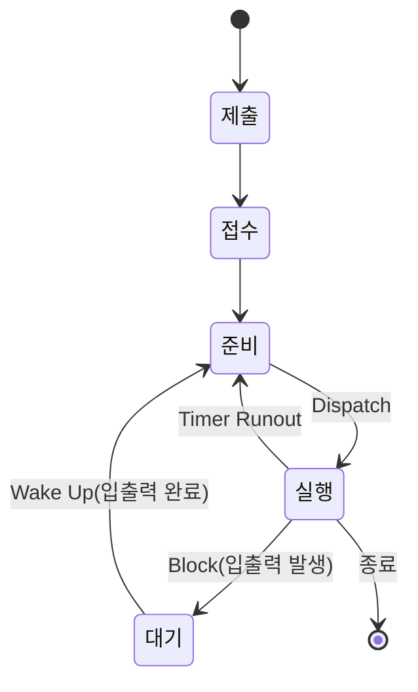

# 정보처리기사 실기 — 11. 응용 SW 기초 기술 활용

> 이 챕터는 **소프트웨어가 올라앉는 바닥**을 다룸. 출제기준의 세부항목 순서대로
> **운영체제 → 데이터베이스 → 네트워크** 순이고, 신기술과 법령은 뒤에 붙임.
> 범위가 12단원 중 가장 넓고 용어가 많지만, 계산이 필요한 곳은 몇 군데뿐임.
>
> 📌 반드시 손으로 풀어 봐야 하는 셋 —
> **페이지 교체 알고리즘(FIFO·LRU·LFU)**, **CPU 스케줄링(SJF·SRT 평균 대기시간)**,
> **서브네팅(IP 주소 분할)**. 나머지는 용어와 계층 대응을 외우면 됨.

---

## (1) 운영체제의 개념과 종류

### 운영체제(OS; Operating System)

컴퓨터 시스템의 **자원들을 효율적으로 관리**하며, 사용자가 컴퓨터를 편리하고 효과적으로
사용할 수 있도록 **환경을 제공**하는 여러 프로그램의 모임.

- 사용자와 하드웨어 사이의 **인터페이스**로 동작하는 **시스템 소프트웨어**임.
- 스케줄링, 자원 관리, 데이터 관리, 입·출력 관리 등을 담당함.

### 운영체제의 목적(성능 평가 기준) ⭐⭐

| 기준 | 의미 |
|---|---|
| **처리 능력**(Throughput) | 일정 시간 내에 시스템이 처리하는 **일의 양**. **향상**되어야 함 |
| **반환 시간**(Turn Around Time) | 시스템에 작업을 의뢰한 시간부터 **완료될 때까지 걸린 시간**. **단축**되어야 함 |
| **사용 가능도**(Availability) | 시스템을 **사용할 필요가 있을 때 즉시 사용 가능한 정도**. **향상**되어야 함 |
| **신뢰도**(Reliability) | 시스템이 주어진 문제를 **정확하게 해결하는 정도**. **향상**되어야 함 |

> 📌 **처리 능력·사용 가능도·신뢰도는 향상**, **반환 시간은 단축**.

### 주요 운영체제의 종류

| OS | 특징 |
|---|---|
| **Windows** | **마이크로소프트**가 개발. **GUI**, **선점형 멀티태스킹**, **PnP(Plug and Play)**, **OLE**(개체 연결 및 삽입), **싱글 유저 시스템** |
| **UNIX** | **AT&T 벨 연구소**에서 개발. **대부분 C 언어로 작성**되어 이식성이 높음. **다중 사용자, 다중 작업**을 지원하며 **계층적 트리 구조 파일 시스템** |
| **LINUX** | **리누스 토발즈**가 개발한 **UNIX 호환 커널**. **오픈 소스**이며 무료 |
| **MacOS** | **애플**이 유닉스 기반으로 개발 |
| **Android** | **구글**이 개발한 **리눅스 커널 기반**의 모바일 운영체제. 개방형 소스 |
| **iOS** | **애플**이 개발한 모바일 운영체제. 유닉스 기반 |

### UNIX 시스템의 구성 ⭐⭐

| 구성 | 역할 |
|---|---|
| **커널**(Kernel) | 하드웨어를 보호하고 **프로그램과 하드웨어 간의 인터페이스 역할**을 담당. **프로세스 관리, 기억장치 관리, 파일 관리, 입출력 관리** 등을 수행 |
| **쉘**(Shell) | **명령어를 해석해 커널로 전달**하는 **명령어 해석기**. 시스템과 사용자 간의 **인터페이스**를 담당. 사용자가 교체 가능 |
| **유틸리티**(Utility) | 사용자 편의를 위한 프로그램. **DOS 의 외부 명령어**에 해당 |

> ⚠️ **커널 = 하드웨어 관리**, **쉘 = 명령어 해석**. 이 구분이 매번 나옴.

---

## (2) 기억장치 관리

### 기억장치 관리 전략 ⭐⭐

보조기억장치의 프로그램이나 데이터를 **주기억장치에 적재시키는 시기, 위치 등을 지정**해
효율적으로 사용하기 위한 전략.

| 전략 | 의미 |
|---|---|
| **반입(Fetch) 전략** | 보조기억장치의 프로그램이나 데이터를 **언제 주기억장치로 적재할 것인지** 결정. **요구 반입**(요구가 있을 때) / **예상 반입**(미리 예상해서) |
| **배치(Placement) 전략** | 새로 반입되는 프로그램이나 데이터를 주기억장치의 **어디에 위치시킬 것인지** 결정. **최초 적합, 최적 적합, 최악 적합** |
| **교체(Replacement) 전략** | 주기억장치의 모든 영역이 사용 중이면 **어느 영역을 교체할 것인지** 결정. **FIFO, LRU, LFU, NUR, OPT, SCR** |

### 배치 전략 ⭐⭐⭐

| 전략 | 의미 |
|---|---|
| **최초 적합**(First Fit) | 프로그램이 들어갈 수 있는 **첫 번째 분할 영역**에 배치 |
| **최적 적합**(Best Fit) | 단편화를 **가장 적게** 남기는 분할 영역에 배치 |
| **최악 적합**(Worst Fit) | 단편화를 **가장 많이** 남기는 분할 영역에 배치 |

**예제** — 빈 영역이 순서대로 **20K, 8K, 30K, 15K** 이고 **12K** 프로그램을 적재할 때

| 전략 | 선택 영역 | 이유 |
|---|---|---|
| **최초 적합** | **20K** | 들어갈 수 있는 첫 번째 영역 |
| **최적 적합** | **15K** | 남는 공간이 3K 로 가장 작음 |
| **최악 적합** | **30K** | 남는 공간이 18K 로 가장 큼 |

### 단편화(Fragmentation) ⭐

| 종류 | 의미 |
|---|---|
| **내부 단편화**(Internal) | 분할된 영역이 프로그램보다 **커서 프로그램 배치 후 남는** 공간 |
| **외부 단편화**(External) | 분할된 영역이 프로그램보다 **작아서 아예 배치될 수 없어 사용되지 못하는** 공간 |

**단편화 해결 방법**

| 방법 | 의미 |
|---|---|
| **통합**(Coalescing) | 인접해 있는 **단편화된 공간을 하나로 합치는** 작업 |
| **압축**(Compaction) | 주기억장치 내에 **분산된 단편화 공간을 모아 하나의 큰 가용 공간을 만드는** 작업. **쓰레기 수집(Garbage Collection)** 이라고도 함 |

---

## (3) 가상기억장치

### 가상기억장치(Virtual Memory) ⭐

**보조기억장치의 일부를 주기억장치처럼 사용**하는 것.
용량이 적은 주기억장치를 **효율적으로 사용**하기 위한 기법.

- 프로그램을 여러 개의 **작은 블록 단위로 나누어** 가상기억장치에 보관해 두고,
  프로그램 실행 시 **요구되는 블록만 주기억장치에 불연속적으로 할당**해 처리함.
- **주소 매핑(Mapping)** 이라는 작업이 필요함.

### 구현 기법 ⭐⭐

| 기법 | 설명 |
|---|---|
| **페이징**(Paging) 기법 | 프로그램과 주기억장치의 영역을 **동일한 크기로 나눈 후** 나눠진 프로그램(**페이지**)을 **프레임**에 적재. **내부 단편화 발생**, 외부 단편화는 발생하지 않음. **페이지 맵 테이블** 필요 |
| **세그먼테이션**(Segmentation) 기법 | 프로그램을 **서로 크기가 다른 논리적인 단위(세그먼트)로 분할**한 후 적재. **외부 단편화 발생**. **세그먼트 맵 테이블** 필요 |

> ⚠️ **페이징 = 같은 크기 → 내부 단편화**, **세그먼테이션 = 다른 크기 → 외부 단편화**.

### 페이지 교체 알고리즘 ⭐⭐⭐

| 알고리즘 | 교체 대상 |
|---|---|
| **OPT**(OPTimal replacement, 최적 교체) | **앞으로 가장 오랫동안 사용하지 않을** 페이지. 이론상 최적이나 **실현 불가능** |
| **FIFO**(First In First Out) | 가장 **먼저 들어와서 오래 있었던** 페이지 |
| **LRU**(Least Recently Used) | **가장 오랫동안 사용하지 않은** 페이지. 각 페이지마다 **계수기나 스택**을 둠 |
| **LFU**(Least Frequently Used) | **사용 빈도가 가장 적은** 페이지 |
| **NUR**(Not Used Recently) | **최근에 사용하지 않은** 페이지. **참조 비트와 변형 비트** 사용 |
| **SCR**(Second Chance Replacement) | **가장 오랫동안 주기억장치에 있던 페이지 중 자주 사용되는 페이지의 교체를 방지**. 참조 비트를 확인해 두 번째 기회를 줌 |

**예제 — FIFO** (페이지 프레임 3개, 참조 순서 `2 3 2 1 5 2 4 5 3 2`)

| 참조 | 2 | 3 | 2 | 1 | 5 | 2 | 4 | 5 | 3 | 2 |
|---|---|---|---|---|---|---|---|---|---|---|
| 프레임1 | 2 | 2 | 2 | 2 | 5 | 5 | 5 | 5 | 3 | 3 |
| 프레임2 | | 3 | 3 | 3 | 3 | 2 | 2 | 2 | 2 | 2 |
| 프레임3 | | | | 1 | 1 | 1 | 4 | 4 | 4 | 4 |
| 부재 | ● | ● | | ● | ● | ● | ● | | ● | |

→ **페이지 부재 7회**

> 💡 **부재(Page Fault)** = 필요한 페이지가 주기억장치에 없어서 새로 가져와야 하는 경우.
> 문제는 대부분 **부재 횟수**를 물음.

### 가상기억장치 기타 관리 사항 ⭐

| 용어 | 의미 |
|---|---|
| **페이지 크기** | **작을 때** : 단편화 감소, 필요한 정보만 적재 가능. 하지만 **매핑 테이블이 커지고 디스크 접근 횟수 증가** **클 때** : 매핑 테이블이 작아지고 디스크 접근 횟수 감소. 하지만 **단편화 증가** |
| **Locality**(국부성) | 프로세스가 실행되는 동안 **일부 페이지만 집중적으로 참조**하는 성질. **시간 구역성**(최근 참조한 것을 다시 참조) / **공간 구역성**(인접한 것을 참조) |
| **워킹 셋**(Working Set) | 프로세스가 일정 시간 동안 **자주 참조하는 페이지들의 집합**. **데닝(Denning)** 이 제안 |
| **스래싱**(Thrashing) | 프로세스의 처리 시간보다 **페이지 교체에 소요되는 시간이 더 많아지는 현상**. **다중 프로그래밍의 정도가 높아질수록** 발생 |

**스래싱 방지 방법**

- 다중 프로그래밍의 정도를 **적정 수준으로 유지**
- **페이지 부재 빈도(PFF)** 를 조절해 사용
- **워킹 셋**을 유지
- 부족한 자원을 **증설**

> ⚠️ **시간 구역성** 예 : 반복(Loop), 스택, 부프로그램, 카운팅, 집계
>
> **공간 구역성** 예 : 배열 순회, 순차적 코드 실행

---

## (4) 프로세스와 스케줄링

### 프로세스(Process) ⭐

**실행 중인 프로그램**. 다음과 같이 여러 가지로 정의됨.

- PCB 를 가진 프로그램
- 실기억장치에 저장된 프로그램
- 프로세서가 할당되는 실체
- 프로시저가 활동 중인 것
- **비동기적 행위**를 일으키는 주체
- 지정된 결과를 얻기 위한 **일련의 계통적 동작**
- 목적 또는 결과에 따라 발생되는 사건들의 과정
- 운영체제가 관리하는 **실행 단위**

### PCB(Process Control Block, 프로세스 제어 블록)

운영체제가 프로세스에 대한 중요한 정보를 저장해 놓는 곳.

**저장되는 정보** — 프로세스의 현재 상태, 고유 식별자(PID), 스케줄링 및 프로세스의 우선순위,
CPU 레지스터 정보, 주기억장치 관리 정보, 입·출력 상태 정보, 계정 정보

### 프로세스 상태 전이 ⭐⭐

| 상태 | 의미 |
|---|---|
| **제출**(Submit) | 작업을 처리하기 위해 **사용자가 시스템에 제출**한 상태 |
| **접수**(Hold) | 제출된 작업이 **스풀 공간인 디스크의 할당 위치에 저장**된 상태 |
| **준비**(Ready) | 프로세스가 프로세서를 **할당받기 위해 기다리고 있는** 상태 |
| **실행**(Run) | 준비 상태 큐에 있는 프로세스가 **프로세서를 할당받아 실행**되는 상태 |
| **대기**(Wait, Block) | 프로세스에 **입·출력 처리가 필요하면** 현재 실행 중인 프로세스가 중단되고 대기하는 상태 |
| **종료**(Terminated) | 프로세스의 실행이 **끝나고 프로세스 할당이 해제**된 상태 |

**상태 전이 관련 용어** ⭐

| 용어 | 의미 |
|---|---|
| **Dispatch** | **준비 → 실행**. 준비 상태의 프로세스 중 하나가 프로세서를 할당받아 실행됨 |
| **Wake Up** | **대기 → 준비**. 입·출력이 완료되어 다시 준비 상태로 |
| **Timer Runout** | **실행 → 준비**. 할당된 시간(Time Slice)이 끝나 준비 상태로 |
| **Block** | **실행 → 대기**. 입·출력이 발생해 대기 상태로 |
| **문맥 교환**(Context Switching) | 하나의 프로세스에서 다른 프로세스로 **CPU 제어권이 넘어가는 과정** |

### 스레드(Thread)

**프로세스 내에서의 작업 단위**로, 시스템의 여러 자원을 할당받아 실행하는 프로그램의 단위.

| 종류 | 설명 |
|---|---|
| **단일 스레드** | 하나의 프로세스에 **하나의 스레드**만 존재 |
| **다중 스레드** | 하나의 프로세스에 **여러 개의 스레드**가 존재 |

**스레드의 장점** — 하드웨어·운영체제의 성능과 응용 프로그램의 처리율 향상,
응용 프로그램의 **응답 시간 단축**, 실행 환경을 **공유**시켜 기억장소의 낭비 감소,
프로세스들 간의 통신 향상, **프로세스의 생성과 문맥 교환 오버헤드 감소**

### 스케줄링(Scheduling) ⭐

프로세스가 생성되어 실행될 때 필요한 **시스템의 여러 자원을 해당 프로세스에게 할당하는 작업**.

| 종류 | 의미 |
|---|---|
| **장기 스케줄링** | 어떤 프로세스가 시스템의 **자원을 차지할 수 있도록 할 것인가**를 결정. **작업 스케줄링, 상위 스케줄링** |
| **중기 스케줄링** | 어떤 프로세스들이 **CPU 를 할당받을 것인지 결정** |
| **단기 스케줄링** | 프로세스가 실행되기 위해 **CPU 를 할당받는 시기와 특정 프로세스를 지정**. **프로세서 스케줄링, 하위 스케줄링** |

### 비선점 vs 선점 스케줄링 ⭐⭐

| 구분 | 비선점(Non-Preemptive) | 선점(Preemptive) |
|---|---|---|
| 의미 | 이미 할당된 CPU 를 **다른 프로세스가 강제로 빼앗을 수 없는** 방식 | 이미 할당된 CPU 를 **다른 프로세스가 강제로 빼앗아 사용**할 수 있는 방식 |
| 응답 시간 | 예측이 **용이** | 예측이 **어려움** |
| 적합 환경 | **일괄 처리** 방식에 적합 | **대화식·시분할·실시간** 시스템에 적합 |
| 종류 | **FCFS, SJF, HRN, 우선순위, 기한부** | **Round Robin, SRT, 다단계 큐, 다단계 피드백 큐, 선점 우선순위** |

### 주요 스케줄링 알고리즘 ⭐⭐⭐

| 알고리즘 | 설명 |
|---|---|
| **FCFS**(First Come First Served) | **먼저 도착한 순서**대로 CPU 를 할당. **FIFO** 라고도 함 |
| **SJF**(Shortest Job First) | **실행 시간이 가장 짧은** 프로세스에게 먼저 CPU 를 할당. **평균 대기 시간이 가장 짧음**. 단, 실행 시간이 긴 작업은 **무한 연기(기아)** 발생 가능 |
| **HRN**(Highest Response-ratio Next) | SJF 의 무한 연기를 보완. **우선순위 = (대기 시간 + 서비스 시간) ÷ 서비스 시간** |
| **Round Robin** | 시분할 시스템을 위해 고안. **동일한 시간 할당량(Time Slice)** 만큼 사용하다가 완료되지 못하면 다음 프로세스에게 넘어감 |
| **SRT**(Shortest Remaining Time) | **남은 실행 시간이 가장 짧은** 프로세스에게 CPU 를 할당. **선점형 SJF** |
| **다단계 큐**(Multi-level Queue) | 프로세스를 특정 그룹으로 분류하고 **각 그룹마다 독자적인 준비 상태 큐**를 사용 |
| **다단계 피드백 큐** | 특정 그룹의 준비 상태 큐에 있는 프로세스가 **다른 준비 상태 큐로 이동할 수 있는** 방식 |

**HRN 우선순위 계산** ⭐

우선순위 =대기 시간 + 서비스 시간서비스 시간값이 클수록 우선순위가 높음

> **예제** : 대기 시간 10, 서비스 시간 5 → (10+5)÷5 = **3**
> 대기 시간 8, 서비스 시간 2 → (8+2)÷2 = **5** → 이쪽이 우선

**SJF 평균 대기 시간 예제**

프로세스 A(6), B(2), C(4) 가 동시에 도착한 경우 (SJF 순서 : B → C → A)

| 프로세스 | 실행 시간 | 대기 시간 |
|---|---|---|
| B | 2 | 0 |
| C | 4 | 2 |
| A | 6 | 6 |

→ 평균 대기 시간 = (0+2+6) ÷ 3 = **2.67**

---

## (5) 교착 상태

### 교착 상태(Dead Lock) ⭐⭐

상호 배제에 의해 나타나는 문제점으로, 둘 이상의 프로세스들이
**서로 다른 프로세스가 점유하고 있는 자원을 요구하며 무한정 기다리는** 현상.

### 교착 상태 발생의 필요 충분 조건 ⭐⭐⭐

**네 가지가 모두 충족되어야** 교착 상태가 발생함.

| 조건 | 의미 |
|---|---|
| **상호 배제**(Mutual Exclusion) | 한 번에 **한 개의 프로세스만** 공유 자원을 사용할 수 있어야 함 |
| **점유와 대기**(Hold and Wait) | **최소한 하나의 자원을 점유하고 있으면서** 다른 프로세스에 할당된 자원을 추가로 점유하기 위해 대기하는 프로세스가 있어야 함 |
| **비선점**(Non-preemption) | 다른 프로세스에 할당된 자원은 사용이 끝날 때까지 **강제로 빼앗을 수 없어야** 함 |
| **환형 대기**(Circular Wait) | 공유 자원과 자원을 사용하기 위해 대기하는 프로세스들이 **원형으로 구성**되어 있어야 함 |

> 📌 암기: **"상점비환"** (상호 배제 · 점유와 대기 · 비선점 · 환형 대기)

### 교착 상태의 해결 방법 ⭐⭐

| 방법 | 내용 |
|---|---|
| **예방**(Prevention) | 교착 상태의 **필요 충분 조건 4가지 중 하나를 제거**함으로써 발생하지 않도록 미리 예방. 자원 낭비가 가장 심함 |
| **회피**(Avoidance) | 교착 상태가 발생할 가능성을 배제하지 않고, 발생하면 **적절히 피해 나가는** 방법. 주로 **은행원 알고리즘(Banker's Algorithm)** 을 사용 |
| **발견**(Detection) | 시스템에 **교착 상태가 발생했는지 점검**해 교착 상태에 있는 프로세스와 자원을 발견. **자원 할당 그래프** 등을 사용 |
| **회복**(Recovery) | 교착 상태를 일으킨 **프로세스를 종료**하거나 **자원을 선점**해 프로세스나 자원을 회복 |

> 💡 **은행원 알고리즘** : **다익스트라(Dijkstra)** 가 제안. 프로세스가 자원을 요구할 때
> 시스템이 **안전 상태(Safe State)를 유지할 수 있는 경우에만** 자원을 할당함.

---

## (6) 환경 변수와 기본 명령어

### 환경 변수(Environment Variable) ⭐

시스템의 속성을 기록한 변수. 시스템의 **기본 정보를 저장**함.

| 구분 | 설명 |
|---|---|
| **시스템 환경 변수** | **시스템 전체**에 적용되는 환경 변수. 관리자가 설정 |
| **사용자 환경 변수** | **특정 사용자**에게만 적용되는 환경 변수 |

**Windows 의 주요 환경 변수** — 변수명을 `%` 로 감쌈

| 변수 | 의미 |
|---|---|
| `%PATH%` | 실행 파일을 찾는 경로 |
| `%TEMP%` / `%TMP%` | 임시 파일이 저장되는 폴더 |
| `%SYSTEMROOT%` | 시스템 폴더(보통 `C:\Windows`) |
| `%USERNAME%` | 현재 사용자 이름 |
| `%HOMEPATH%` | 현재 사용자의 홈 경로 |

**UNIX/LINUX 의 주요 환경 변수** — 변수명 앞에 `$` 를 붙임

| 변수 | 의미 |
|---|---|
| `$PATH` | 실행 파일을 찾는 경로 |
| `$HOME` | 사용자의 홈 디렉터리 |
| `$USER` | 사용자 이름 |
| `$SHELL` | 사용자의 기본 쉘 |
| `$PWD` | 현재 작업 디렉터리 |

**환경 변수 확인 명령** — Windows: `set`, UNIX/LINUX: `env`, `printenv`, `set`

### Windows 기본 명령어 ⭐

| 명령어 | 기능 |
|---|---|
| `DIR` | 현재 디렉터리의 **파일 목록**을 표시 |
| `COPY` | 파일을 **복사** |
| `DEL` | 파일을 **삭제** |
| `TYPE` | 파일의 **내용을 표시** |
| `REN` | 파일의 **이름을 변경** |
| `MD` | **디렉터리를 생성** |
| `CD` | 디렉터리를 **이동** |
| `CLS` | 화면을 **지움** |
| `ATTRIB` | 파일의 **속성을 변경** |
| `FIND` | 파일에서 **문자열을 검색** |
| `CHKDSK` | 디스크 상태를 **점검** |
| `FORMAT` | 디스크를 **초기화** |

### UNIX/LINUX 기본 명령어 ⭐⭐

| 명령어 | 기능 |
|---|---|
| `cat` | 파일 내용을 **화면에 표시** |
| `cd` | 디렉터리 **이동** |
| `chmod` | 파일의 **보호 모드(권한)를 설정** |
| `chown` | 파일의 **소유자를 변경** |
| `cp` | 파일을 **복사** |
| `rm` | 파일을 **삭제** |
| `mv` | 파일을 **이동**하거나 이름을 변경 |
| `ls` | 현재 디렉터리의 **파일 목록**을 표시 |
| `mkdir` / `rmdir` | 디렉터리 **생성 / 삭제** |
| `ps` | 현재 실행 중인 **프로세스를 표시** |
| `kill` | **프로세스를 종료** |
| `fork` | **새로운 프로세스를 생성**(하위 프로세스 호출) |
| `exec` | 새로운 프로세스를 **수행** |
| `wait` | 자식 프로세스가 종료될 때까지 **대기** |
| `pwd` | 현재 **작업 디렉터리를 표시** |
| `find` | 파일을 **검색** |
| `grep` | 파일 내에서 **문자열을 검색** |
| `who` | 현재 **접속한 사용자를 표시** |
| `uname` | **시스템 정보**를 표시 |

**chmod 의 권한 표기** ⭐⭐

권한은 **소유자(User) · 그룹(Group) · 기타(Other)** 순으로 3자리 8진수로 표기함.

| 권한 | 값 |
|---|---|
| **읽기**(Read, r) | **4** |
| **쓰기**(Write, w) | **2** |
| **실행**(eXecute, x) | **1** |

> **예제** : `chmod 755 test.txt`
> - 소유자 : 7 = 4+2+1 = **읽기·쓰기·실행(rwx)**
> - 그룹 : 5 = 4+1 = **읽기·실행(r-x)**
> - 기타 : 5 = 4+1 = **읽기·실행(r-x)**

---

## (7) 회복과 병행 제어

### 회복(Recovery) ⭐

트랜잭션들을 수행하는 도중 장애가 발생해 데이터베이스가 손상되었을 때
**손상되기 이전의 정상 상태로 복구**하는 작업.

**장애의 유형**

| 유형 | 내용 |
|---|---|
| **트랜잭션 장애** | 트랜잭션의 **논리적 오류**나 입력 데이터의 불량 등 |
| **시스템 장애** | 하드웨어의 오동작, **정전** 등 |
| **미디어 장애** | 디스크 헤드 손상 등 **저장 장치의 물리적 손상** |

**회복 기법** — 연기 갱신 기법, 즉각 갱신 기법, 그림자 페이지 대체 기법, 검사점 기법

| 연산 | 의미 |
|---|---|
| **REDO**(재실행) | **완료된** 트랜잭션의 내용을 로그를 이용해 **다시 실행** |
| **UNDO**(취소) | **완료되지 못한** 트랜잭션의 변경 내용을 **취소** |

### 병행 제어(Concurrency Control) ⭐⭐

여러 개의 트랜잭션이 실행될 때 데이터베이스의 **일관성을 유지**하기 위해
**트랜잭션 간의 상호 작용을 제어**하는 것.

**병행 제어를 하지 않을 때 발생하는 문제점** ⭐

| 문제 | 내용 |
|---|---|
| **갱신 분실**(Lost Update) | 두 개 이상의 트랜잭션이 같은 자료를 공유해 갱신할 때 **일부 갱신이 손실**되는 현상 |
| **비완료 의존성**(Uncommitted Dependency) | 하나의 트랜잭션이 **비정상 종료되었는데** 회복되기 전에 다른 트랜잭션이 **참조**하는 현상. **임시 갱신** |
| **모순성**(Inconsistency) | 두 개의 트랜잭션이 병행 수행되면서 **원치 않는 자료를 이용**해 **데이터베이스가 일관성을 잃는** 현상 |
| **연쇄 복귀**(Cascading Rollback) | 병행 수행되던 트랜잭션 중 하나가 실패해 **롤백하면 다른 트랜잭션도 함께 롤백**되는 현상 |

**병행 제어 기법** ⭐

| 기법 | 설명 |
|---|---|
| **로킹**(Locking) | 트랜잭션이 어떤 데이터에 접근하고자 할 때 **잠금(Lock)을 설정**해 다른 트랜잭션이 접근하지 못하게 함. **로킹 단위가 크면** 로크 수가 적어 관리는 쉽지만 **병행성 수준이 낮아짐**. **로킹 단위가 작으면** 병행성 수준이 높아지지만 **관리가 복잡**해짐 |
| **타임 스탬프 순서**(Time Stamp Ordering) | 트랜잭션과 트랜잭션이 읽거나 갱신한 데이터에 대해 **트랜잭션이 실행을 시작하기 전에 타임 스탬프를 부여**해 부여된 시간에 따라 순서대로 처리 |
| **최적 병행 수행**(낙관적 검증) | 트랜잭션 수행 동안은 **어떠한 검사도 하지 않고**, 트랜잭션 종료 시 일괄적으로 검사 |
| **다중 버전 기법** | 트랜잭션이 데이터를 읽을 때 **여러 버전 중 적절한 버전**을 선택해 읽음 |

> ⚠️ **로킹 단위 ↑ → 로크 수 ↓, 병행성 ↓, 오버헤드 ↓**
> **로킹 단위 ↓ → 로크 수 ↑, 병행성 ↑, 오버헤드 ↑**

---

## (8) 데이터 표준화

### 데이터 표준화

시스템별로 산재해 있는 데이터 정보 요소에 대한 **명칭, 정의, 형식, 규칙에 대한 원칙**을 수립해
전사적으로 적용하는 것.

### 데이터 표준화의 구성 요소 ⭐

| 구성 요소 | 내용 |
|---|---|
| **데이터 표준** | **데이터 명칭, 데이터 정의, 데이터 형식, 데이터 규칙** |
| **데이터 관리 조직** | **데이터 관리자(DA)** 를 중심으로 구성 |
| **데이터 표준화 절차** | 데이터 표준화 요구사항 수집 → 표준 정의 → 표준 확정 → 표준 관리 |

**데이터 표준의 세부 요소**

| 요소 | 의미 |
|---|---|
| **데이터 명칭** | 데이터를 **유일하게 구별**해 주는 이름 |
| **데이터 정의** | 데이터가 **의미하는 범위 및 자격 요건** |
| **데이터 형식** | 데이터 표현 형태의 정의. **일관된 형식**을 유지 |
| **데이터 규칙** | 발생 가능한 데이터 값을 사전에 정의 (기본값, 허용값 등) |

### 데이터 관리자(DA; Data Administrator) ⭐

**데이터를 설계·정의·관리**하는 사람 또는 조직.

| 역할 | 내용 |
|---|---|
| **데이터 관계 정의** | 데이터 간의 관계를 정의하고 조정 |
| **데이터 표준 관리** | 데이터 표준을 정의하고 유지·관리 |
| **데이터 표준 준수 검사** | 표준이 지켜지는지 검사 |
| **데이터 표준화 관련 교육** | 관계자에게 표준을 교육 |

> 💡 **DA vs DBA** — **DA 는 데이터의 논리적 설계와 표준**을, **DBA 는 데이터베이스의 물리적 운영과 관리**를 담당함.

---

## (9) 인터넷과 IP 주소

### IP 주소(Internet Protocol Address)

인터넷에 연결된 모든 컴퓨터 자원을 **구분하기 위한 고유한 주소**.

### IPv4 ⭐

**8비트씩 4부분, 총 32비트**로 구성됨.

| 클래스 | 범위 | 용도 |
|---|---|---|
| **A Class** | 0.0.0.0 ~ 127.255.255.255 | **국가나 대형 통신망**에 사용 (16,777,214개 호스트) |
| **B Class** | 128.0.0.0 ~ 191.255.255.255 | **중대형 통신망**에 사용 (65,534개 호스트) |
| **C Class** | 192.0.0.0 ~ 223.255.255.255 | **소규모 통신망**에 사용 (254개 호스트) |
| **D Class** | 224.0.0.0 ~ 239.255.255.255 | **멀티캐스트**용 |
| **E Class** | 240.0.0.0 ~ 255.255.255.255 | **실험적 주소**, 공용되지 않음 |

### IPv6 ⭐⭐

IPv4 의 **주소 부족 문제를 해결**하기 위해 개발됨.

- **128비트**의 긴 주소를 사용함.
- **16비트씩 8부분**으로 나누며, 각 부분을 **콜론(:)** 으로 구분하고 **16진수**로 표현함.
- **인증성, 기밀성, 데이터 무결성**의 지원으로 보안 문제를 해결할 수 있음.
- **주소의 확장성, 융통성, 연동성**이 뛰어나며 **실시간 흐름 제어**로 향상된 멀티미디어 기능을 지원함.

**IPv6 의 주소 체계**

| 종류 | 의미 |
|---|---|
| **유니캐스트**(Unicast) | **단일 송신자와 단일 수신자** 간의 통신 (1:1) |
| **멀티캐스트**(Multicast) | **단일 송신자와 다중 수신자** 간의 통신 (1:N) |
| **애니캐스트**(Anycast) | 단일 송신자와 **가장 가까이 있는 단일 수신자** 간의 통신 |

> ⚠️ **IPv4 는 브로드캐스트가 있지만 IPv6 에는 없음.** 대신 **애니캐스트**가 있음.

### 서브네팅(Subnetting) ⭐⭐

할당된 네트워크 주소를 **여러 개의 작은 네트워크로 나누어 사용**하는 것.

- **서브넷 마스크**를 이용해 나눔.
- 기본 서브넷 마스크 : A 클래스 `255.0.0.0`, B 클래스 `255.255.0.0`, C 클래스 `255.255.255.0`

**예제** — `192.168.1.0/26` 으로 서브네팅할 경우

- `/26` 이므로 **네트워크 비트 26개, 호스트 비트 6개**
- 서브넷 개수 = 2² = **4개** (C 클래스 기본 /24 에서 2비트를 빌림)
- 서브넷당 호스트 수 = 2⁶ − 2 = **62개** (네트워크 주소와 브로드캐스트 주소 제외)
- 서브넷 : `192.168.1.0`, `192.168.1.64`, `192.168.1.128`, `192.168.1.192`

> 💡 **호스트 수 = 2^(호스트 비트) − 2**. 빼는 2는 **네트워크 주소와 브로드캐스트 주소**임.

---

## (10) OSI 참조 모델

### OSI(Open System Interconnection) 참조 모델 ⭐⭐⭐

다른 시스템 간의 원활한 통신을 위해 **ISO(국제표준화기구)** 에서 제안한 **통신 규약(Protocol)**.

| 계층 | 이름 | 역할 | 전송 단위 | 장비 |
|:---:|---|---|---|---|
| **7** | **응용 계층**(Application) | 사용자가 **네트워크에 접근할 수 있도록** 서비스 제공 | 데이터 | – |
| **6** | **표현 계층**(Presentation) | **코드 변환, 데이터 암호화·압축, 구문 검색** | 데이터 | – |
| **5** | **세션 계층**(Session) | **송·수신 측 간의 관련성을 유지**하고 대화 제어를 담당. **동기점** 설정 | 데이터 | – |
| **4** | **전송 계층**(Transport) | **종단 시스템(End-to-End) 간의 신뢰성 있는 데이터 전송**. 오류·흐름 제어 | **세그먼트** | 게이트웨이 |
| **3** | **네트워크 계층**(Network) | **경로 설정(Routing)**, 트래픽 제어, 패킷 정보 전송 | **패킷** | **라우터** |
| **2** | **데이터 링크 계층**(Data Link) | **인접한 두 개의 노드 사이의 신뢰성 있는 전송**. 흐름 제어, 오류 제어, 순서 제어 | **프레임** | **브리지, 스위치** |
| **1** | **물리 계층**(Physical) | 실제 회선 연결을 위한 **전기적·기계적·기능적 특성** 정의 | **비트** | **리피터, 허브** |

> 📌 암기: **"물데네전세표응"** (아래에서 위로) 또는 **"응표세전네데물"** (위에서 아래로)

---

## (11) 네트워크 장비

### 주요 장비 ⭐⭐

| 장비 | 계층 | 기능 |
|---|:---:|---|
| **리피터**(Repeater) | 물리(1) | 신호가 감쇠되는 것을 방지하기 위해 **신호를 증폭·재생**해 전송 |
| **허브**(Hub) | 물리(1) | 여러 대의 컴퓨터를 **연결**해 하나의 네트워크로 만드는 장치 |
| **브리지**(Bridge) | 데이터 링크(2) | **LAN 과 LAN 을 연결**하거나 LAN 안에서 컴퓨터 그룹을 연결 |
| **스위치**(Switch) | 데이터 링크(2) | **브리지와 같은 기능**을 하지만 **전송 속도가 빠르고 포트가 많음** |
| **라우터**(Router) | 네트워크(3) | **최적의 경로를 설정(라우팅)** 해 패킷을 전송 |
| **게이트웨이**(Gateway) | 전송(4) 이상 | **프로토콜이 다른 네트워크를 연결**. 전 계층의 프로토콜 구조가 다를 때 사용 |

### 스위치의 분류 ⭐

| 종류 | 계층 | 설명 |
|---|:---:|---|
| **L2 스위치** | 2 | **MAC 주소**를 기반으로 스위칭. 일반적인 스위치 |
| **L3 스위치** | 3 | **IP 주소**를 기반으로 스위칭. 라우팅 기능 포함 |
| **L4 스위치** | 4 | **TCP/UDP 포트 번호**를 기반으로 스위칭. **로드 밸런싱** 수행 |
| **L7 스위치** | 7 | **패킷의 내용(URL, 쿠키 등)** 을 기반으로 스위칭 |

**스위칭 방식**

| 방식 | 설명 |
|---|---|
| **Store and Forwarding** | 데이터를 **모두 받은 후 스위칭**. 오류 검출 가능하나 지연이 있음 |
| **Cut-Through** | 데이터의 **목적지 주소만 확인하고 즉시 전송**. 빠르나 오류 검출 불가 |
| **Fragment Free** | 프레임의 **앞부분 64바이트를 확인**한 후 전송. 위 두 방식의 절충 |

---

## (12) TCP/IP

### TCP/IP ⭐⭐

인터넷에 연결된 서로 다른 기종의 컴퓨터들이 **데이터를 주고받을 수 있도록** 하는 표준 프로토콜.

### TCP/IP 4계층과 OSI 7계층 대응 ⭐⭐⭐

| TCP/IP | OSI | 주요 프로토콜 |
|---|---|---|
| **응용 계층**(Application) | 응용·표현·세션(5~7) | **HTTP, FTP, SMTP, POP3, TELNET, DNS, SNMP** |
| **전송 계층**(Transport) | 전송(4) | **TCP, UDP, RTCP** |
| **인터넷 계층**(Internet) | 네트워크(3) | **IP, ICMP, IGMP, ARP, RARP** |
| **네트워크 액세스 계층** | 데이터 링크·물리(1~2) | **Ethernet, IEEE 802, HDLC, X.25, RS-232C** |

### TCP vs UDP ⭐⭐⭐

| 구분 | **TCP**(Transmission Control Protocol) | **UDP**(User Datagram Protocol) |
|---|---|---|
| 연결 방식 | **연결형**(Connection-Oriented) | **비연결형**(Connectionless) |
| 신뢰성 | **높음**(전송 보장) | **낮음**(전송 보장 안 함) |
| 속도 | **느림** | **빠름** |
| 흐름 제어 | **있음** | **없음** |
| 오류 제어 | **있음** | 최소한(체크섬만) |
| 헤더 크기 | 20Byte | **8Byte** |
| 용도 | 파일 전송, 이메일, 웹 | **실시간 스트리밍, DNS, 화상 회의** |

> 📌 **TCP = 정확성 우선**, **UDP = 속도 우선**.

### 주요 프로토콜 ⭐⭐

| 프로토콜 | 기능 |
|---|---|
| **IP**(Internet Protocol) | **데이터그램을 기반**으로 하는 **비연결형** 서비스 제공. **패킷의 분해·조립, 주소 지정, 경로 선택** |
| **ICMP**(Internet Control Message Protocol) | IP 와 조합해 **통신 중에 발생하는 오류 처리와 전송 경로 변경 등을 위한 제어 메시지**를 관리. `ping` 이 이용 |
| **IGMP**(Internet Group Management Protocol) | **멀티캐스트**를 지원하는 호스트나 라우터 사이에서 멀티캐스트 그룹 유지를 위해 사용 |
| **ARP**(Address Resolution Protocol) | **IP 주소 → 물리 주소(MAC)** 로 변환 |
| **RARP**(Reverse ARP) | **물리 주소(MAC) → IP 주소**로 변환 |
| **HTTP** | 웹에서 하이퍼텍스트 문서를 교환하기 위한 프로토콜 |
| **FTP** | **파일 전송** 프로토콜 |
| **SMTP** | **메일 송신** 프로토콜 |
| **POP3 / IMAP** | **메일 수신** 프로토콜 |
| **DNS** | **도메인 이름 → IP 주소** 변환 |
| **DHCP** | IP 주소를 **자동으로 할당** |
| **SNMP** | 네트워크 **관리 및 감시** 프로토콜 |
| **TELNET / SSH** | 원격 접속. **SSH 는 암호화**된 원격 접속 |

> ⚠️ **ARP = IP→MAC**, **RARP = MAC→IP**. 방향을 바꿔 내는 문제가 자주 나옴.

---

## (13) 경로 제어와 트래픽 제어

### 경로 제어(Routing) ⭐

송·수신 측 간의 **송신 경로 중에서 최적의 패킷 교환 경로를 결정**하는 기능.

**경로 제어 프로토콜**

| 프로토콜 | 설명 |
|---|---|
| **RIP**(Routing Information Protocol) | **소규모 네트워크**에서 사용. **거리 벡터(Distance Vector)** 알고리즘. **최대 홉 수 15**로 제한 |
| **OSPF**(Open Shortest Path First) | **대규모 네트워크**에서 사용. **링크 상태(Link State)** 알고리즘. RIP 의 단점 보완 |
| **BGP**(Border Gateway Protocol) | **자율 시스템(AS) 간의 경로 정보**를 교환. 인터넷 백본에서 사용 |
| **IGRP / EIGRP** | **시스코**가 개발한 라우팅 프로토콜 |

### 트래픽 제어 ⭐

**전송되는 패킷의 흐름 또는 그 양을 조절**하는 기능.

| 종류 | 설명 |
|---|---|
| **흐름 제어**(Flow Control) | 송·수신 측 사이의 전송되는 **패킷의 양이나 속도를 규제**. **정지-대기(Stop-and-Wait)**, **슬라이딩 윈도우(Sliding Window)** |
| **폭주(혼잡) 제어**(Congestion Control) | **네트워크 내의 패킷 수를 조절**해 오버플로를 방지. **느린 시작(Slow Start)**, **혼잡 회피(Congestion Avoidance)** |
| **교착 상태 방지**(Dead Lock Prevention) | 노드가 다른 노드의 패킷을 받아들이지 못해 **패킷 흐름이 정지되는 상태를 방지** |

---

## (14) 소프트웨어·하드웨어·네트워크 신기술

### 네트워크 관련 신기술 ⭐⭐

| 용어 | 설명 |
|---|---|
| **IoT**(Internet of Things, 사물 인터넷) | 정보 통신 기술을 기반으로 **실세계와 가상 세계의 다양한 사물들을 연결**해 진보된 서비스를 제공 |
| **M2M**(Machine to Machine) | **기계와 기계 사이**에 이루어지는 통신 |
| **메시 네트워크**(Mesh Network) | **기존 무선 랜의 한계 극복**을 위해 등장한 차세대 이동통신 네트워크. 대규모 디바이스의 네트워크 생성에 최적화 |
| **애드혹 네트워크**(Ad-hoc Network) | 재난 현장과 같이 **고정된 인프라 없이** 이동 노드들만으로 자율적으로 구성되는 네트워크 |
| **NFC**(Near Field Communication) | **10cm 이내의 가까운 거리**에서 무선 데이터를 주고받는 통신 기술 |
| **Wi-SUN** | **스마트 그리드**와 같은 장거리 무선 통신을 위한 저전력 근거리 통신 기술 |
| **NDN**(Named Data Networking) | 콘텐츠 자체의 **정보와 라우터 기능만으로 데이터 전송**을 수행하는 기술 |
| **SDN**(Software Defined Networking) | 네트워크를 **제어부와 데이터 전달부로 분리**해 소프트웨어적으로 제어하는 기술 |
| **NFV**(Network Functions Virtualization) | 네트워크 장비의 기능을 **가상화**해 범용 서버에서 소프트웨어로 구현 |
| **UWB**(Ultra WideBand) | 짧은 시간에 **넓은 대역**으로 전송하는 초광대역 무선 기술 |
| **피코넷**(PICONET) | **블루투스** 기술이나 UWB 를 사용해 무선으로 연결하는 개인 통신망 |
| **파장 분할 다중화**(WDM) | 광섬유를 이용한 통신 기술로, **파장이 서로 다른 광선**을 이용해 여러 데이터를 동시에 전송 |
| **BaaS**(Blockchain as a Service) | 블록체인 개발 환경을 클라우드 기반으로 제공하는 서비스 |
| **SSO**(Single Sign On) | 한 번의 로그인으로 여러 시스템에 접근 |

### 소프트웨어 관련 신기술 ⭐⭐

| 용어 | 설명 |
|---|---|
| **인공지능**(AI) | 인간의 두뇌와 같이 **컴퓨터가 사고·학습·자기 개발**을 할 수 있도록 하는 기술 |
| **딥 러닝**(Deep Learning) | 인간의 뉴런과 비슷한 **인공 신경망**을 이용해 정보를 처리하는 기계 학습 기술 |
| **뉴럴링크**(Neuralink) | 뇌에 칩을 이식해 컴퓨터와 연결하는 기술 |
| **블록체인**(Blockchain) | P2P 네트워크를 이용해 온라인 금융 거래 정보를 **분산해 저장**하는 기술 |
| **매시업**(Mashup) | 웹에서 제공하는 정보 및 서비스를 이용해 **새로운 소프트웨어나 서비스를 만드는** 기술 |
| **서비스 지향 아키텍처**(SOA) | 기업의 소프트웨어 인프라인 정보 시스템을 **서비스 단위**로 구축하는 아키텍처 |
| **디지털 트윈**(Digital Twin) | 현실 속의 사물을 **소프트웨어로 가상화한 모델**. 시뮬레이션을 통해 검증 |
| **증강 현실**(AR) | 실제 촬영한 화면에 **가상의 정보를 부가**해 보여 주는 기술 |
| **가상 현실**(VR) | 컴퓨터로 만든 **가상 세계**를 체험하는 기술 |
| **메타버스**(Metaverse) | 현실 세계와 같은 사회·경제·문화 활동이 이뤄지는 **3차원 가상 세계** |
| **온톨로지**(Ontology) | 실세계에 존재하는 **모든 개념과 개념의 속성, 관계 정보를 컴퓨터가 이해할 수 있도록** 서술해 놓은 것 |
| **시맨틱 웹**(Semantic Web) | 컴퓨터가 정보의 **의미를 이해**하고 처리할 수 있는 지능형 웹 |
| **텐서플로**(TensorFlow) | **구글**에서 개발한 **머신러닝 오픈 소스 라이브러리** |
| **도커**(Docker) | **컨테이너 기반**의 오픈 소스 가상화 플랫폼 |
| **쿠버네티스**(Kubernetes) | **컨테이너 오케스트레이션** 도구. 컨테이너의 배포·확장·관리를 자동화 |
| **RPA**(Robotic Process Automation) | 사람이 하던 **반복적인 업무를 소프트웨어 로봇이 자동화** |

### 하드웨어 관련 신기술 ⭐

| 용어 | 설명 |
|---|---|
| **고가용성**(HA; High Availability) | 긴 시간 동안 **안정적인 서비스 운영**을 위해 장애 발생 시 즉시 대체 가동 |
| **3D Printing** | 3차원 모델링 파일을 출력 소스로 활용해 **물체를 만들어 내는** 기술 |
| **RAID**(Redundant Array of Independent Disk) | 여러 개의 하드디스크로 **디스크 배열을 구성**해 파일을 분산 저장 |
| **SSD**(Solid State Drive) | 반도체를 이용해 정보를 저장하는 장치. HDD 보다 **속도가 빠르고 발열·소음이 적음** |
| **N-Screen** | **N 개의 서로 다른 단말기**에서 동일한 콘텐츠를 자유롭게 이용 |
| **Thin Client PC** | 하드디스크나 주변 장치 없이 **서버와 통신해 프로그램을 수행**하는 PC |
| **엔스크린 / 컴패니언 스크린** | TV 방송 시청 시 보조적으로 사용하는 스마트기기 |
| **MEMS**(Micro-Electro Mechanical Systems) | 초정밀 반도체 제조 기술을 바탕으로 만들어진 **초미세 기계 구조물** |
| **트러스트존**(TrustZone) | **하나의 프로세서 내에 일반 구역과 보안 구역을 분리**해 데이터를 보호하는 기술 |

**RAID 의 주요 레벨** ⭐

| 레벨 | 방식 | 특징 |
|---|---|---|
| **RAID 0** | **스트라이핑**(Striping) | 데이터를 분산 저장. **속도 향상**, 안정성 없음 |
| **RAID 1** | **미러링**(Mirroring) | 데이터를 **똑같이 복제**. 안정성 높음, 용량 절반 |
| **RAID 5** | 스트라이핑 + **분산 패리티** | 성능과 안정성 절충. **최소 3개** 디스크 필요 |

### 데이터베이스 관련 신기술 ⭐

| 용어 | 설명 |
|---|---|
| **빅데이터**(Big Data) | 기존의 관리 방법이나 분석 체계로는 처리하기 어려운 **막대한 양의 정형·비정형 데이터** |
| **브로드 데이터**(Broad Data) | 다양한 채널에서 소비자와 상호작용을 통해 생성된 **새로운 데이터** |
| **메타 데이터**(Meta Data) | **데이터에 대한 데이터**. 데이터를 설명해 주는 데이터 |
| **디지털 아카이빙** | 디지털 정보 자원을 장기적으로 **보존하기 위한 작업** |
| **하둡**(Hadoop) | 오픈 소스를 기반으로 한 **분산 컴퓨팅 플랫폼**. 빅데이터 처리에 사용 |
| **맵리듀스**(MapReduce) | 대용량 데이터를 **분산 처리**하기 위한 프로그래밍 모델. **Map(분산) + Reduce(취합)** |
| **타조**(Tajo) | 오픈 소스 기반 **분산 컴퓨팅 플랫폼**. 국내 개발 |
| **데이터 마이닝**(Data Mining) | 대량의 데이터에서 **유용한 정보를 추출**하는 기술 |
| **OLAP**(Online Analytical Processing) | 다차원으로 이루어진 데이터로부터 **통계적인 요약 정보를 분석**해 의사결정에 활용 |
| **데이터 웨어하우스**(DW) | 여러 시스템에 분산된 데이터를 **주제별로 통합**해 저장한 데이터베이스 |
| **데이터 마트**(Data Mart) | 데이터 웨어하우스에서 **특정 주제나 부서 중심으로 추출**한 소규모 데이터 웨어하우스 |
| **NoSQL** | 관계형 데이터 모델을 사용하지 않는 데이터베이스. **대규모 데이터 처리**에 적합 |

**OLAP 연산** ⭐

| 연산 | 의미 |
|---|---|
| **Roll-up** | 세부 → **요약**으로 집계 수준을 올림 |
| **Drill-down** | 요약 → **세부**로 상세 수준을 내림 |
| **Slicing** | 큐브에서 **한 조각을 선택**해 부분 집합을 봄 |
| **Dicing** | 큐브에서 **여러 차원을 잘라** 부분 큐브를 만듦 |
| **Pivoting** | 데이터의 **행과 열을 바꿔** 다른 관점에서 봄 |

---

## (15) 소프트웨어 개발 보안과 관련 법령

### 소프트웨어 개발 보안

소프트웨어 개발 과정에서 발생할 수 있는 **보안 취약점을 최소화**하기 위한 활동.

**소프트웨어 개발 보안 관련 기관**

| 기관 | 역할 |
|---|---|
| **행정안전부** | 소프트웨어 개발 보안 **정책을 총괄** |
| **한국인터넷진흥원(KISA)** | 소프트웨어 개발 보안 **기술 지원 및 가이드 개발** |
| **발주기관 / 사업자** | 개발 보안을 **적용해 개발**하고 진단 |

### 관련 법령 ⭐

| 법령 | 내용 |
|---|---|
| **개인정보 보호법** | 개인정보의 수집·이용·제공 등 처리에 관한 사항을 규정. **정보 주체의 권리**를 보호 |
| **정보통신망 이용촉진 및 정보보호 등에 관한 법률** | 정보통신망의 이용을 촉진하고 정보통신 서비스를 이용하는 자의 개인정보를 보호 |
| **신용정보의 이용 및 보호에 관한 법률** | 신용정보의 오·남용을 방지 |
| **위치정보의 보호 및 이용 등에 관한 법률** | 개인 위치정보의 유출·오용을 방지 |

**개인정보의 분류**

| 구분 | 예 |
|---|---|
| **일반 정보** | 이름, 주민등록번호, 주소, 연락처, 생년월일 |
| **민감 정보** | 사상·신념, 노동조합 가입, 정치적 견해, 건강, 성생활, **유전정보, 범죄경력** |
| **고유식별정보** | **주민등록번호, 여권번호, 운전면허번호, 외국인등록번호** |

### Secure OS ⭐

기존의 운영체제에 내재된 보안 취약점을 해소하기 위해
**보안 기능을 갖춘 커널을 이식**해 여러 위협으로부터 시스템을 보호하는 운영체제.

**보안 기능** — 식별 및 인증, 임의적/강제적 접근통제, 객체 재사용 보호,
완전한 조정, 신뢰 경로, 감사 및 감사기록 축소

**참조 모니터(Reference Monitor)**

- 보호 대상 객체에 대한 **접근 통제를 수행하는 추상 머신**
- 보안 커널 데이터베이스(SKDB)를 참조해 객체에 대한 접근 허용 여부를 결정함
- 요건 : **격리성, 검증 가능성, 완전성**

---

## 📌 부록 — 핵심 암기 요약

| 구분 | 암기 포인트 |
|---|---|
| **OS 성능 평가** | **처리 능력·사용 가능도·신뢰도는 향상**, **반환 시간은 단축** |
| **UNIX 구성** | **커널**(하드웨어 관리) · **쉘**(명령어 해석) · 유틸리티 |
| **기억장치 전략** | **반입 · 배치 · 교체** |
| **배치 전략** | **최초 적합 · 최적 적합**(단편화 최소) · **최악 적합**(단편화 최대) |
| **단편화** | 내부(남는 공간) / 외부(못 들어감). 해결 = **통합 · 압축** |
| **가상기억장치** | **페이징**(같은 크기, 내부 단편화) / **세그먼테이션**(다른 크기, 외부 단편화) |
| **페이지 교체** | **OPT · FIFO · LRU · LFU · NUR · SCR** |
| **Locality** | **시간 구역성**(반복·스택) / **공간 구역성**(배열·순차) |
| **스래싱** | 페이지 교체 시간 > 처리 시간. **워킹 셋·PFF** 로 방지 |
| **프로세스 상태 전이** | **Dispatch**(준비→실행) · **Timer Runout**(실행→준비) · **Block**(실행→대기) · **Wake Up**(대기→준비) |
| **비선점 스케줄링** | **FCFS · SJF · HRN · 우선순위 · 기한부** |
| **선점 스케줄링** | **Round Robin · SRT · 다단계 큐 · 다단계 피드백 큐** |
| **HRN 공식** | **(대기 시간 + 서비스 시간) ÷ 서비스 시간**. 클수록 우선 |
| **chmod** | **r=4, w=2, x=1**. 소유자·그룹·기타 순 |
| **IPv6** | **128비트**, 16비트 8부분, 콜론 구분. **유니·멀티·애니캐스트**(브로드캐스트 없음) |
| **호스트 수** | **2^(호스트 비트) − 2** |
| **OSI 7계층** | **물데네전세표응** |
| **계층별 장비** | 물리(**리피터·허브**) · 데이터링크(**브리지·스위치**) · 네트워크(**라우터**) · 전송 이상(**게이트웨이**) |
| **TCP vs UDP** | TCP = **연결형·신뢰성·느림** / UDP = **비연결형·빠름·8Byte 헤더** |
| **ARP / RARP** | **ARP = IP→MAC**, **RARP = MAC→IP** |
| **경로 제어** | **RIP**(소규모, 거리 벡터, 홉 15) · **OSPF**(대규모, 링크 상태) · **BGP**(AS 간) |
| **트래픽 제어** | 흐름 제어(**슬라이딩 윈도우**) · 폭주 제어 · 교착 상태 방지 |
| **RAID** | 0(스트라이핑·속도) · 1(미러링·안정) · 5(분산 패리티, 최소 3개) |
| **OLAP 연산** | **Roll-up · Drill-down · Slicing · Dicing · Pivoting** |
| **맵리듀스** | **Map(분산) + Reduce(취합)** |
| **고유식별정보** | **주민등록번호 · 여권번호 · 운전면허번호 · 외국인등록번호** |
| **병행 제어 문제** | **갱신 분실 · 비완료 의존성 · 모순성 · 연쇄 복귀** |
| **병행 제어 기법** | **로킹 · 타임 스탬프 · 최적 병행 수행 · 다중 버전** |
| **로킹 단위** | 크면 **병행성 ↓ 오버헤드 ↓**, 작으면 **병행성 ↑ 오버헤드 ↑** |
| **교착 상태 4조건** | **상점비환** — 상호 배제·점유와 대기·비선점·환형 대기 |
| **교착 상태 해결** | **예방 · 회피(은행원 알고리즘) · 발견 · 회복** |
| **데이터 표준** | 데이터 **명칭 · 정의 · 형식 · 규칙** |
